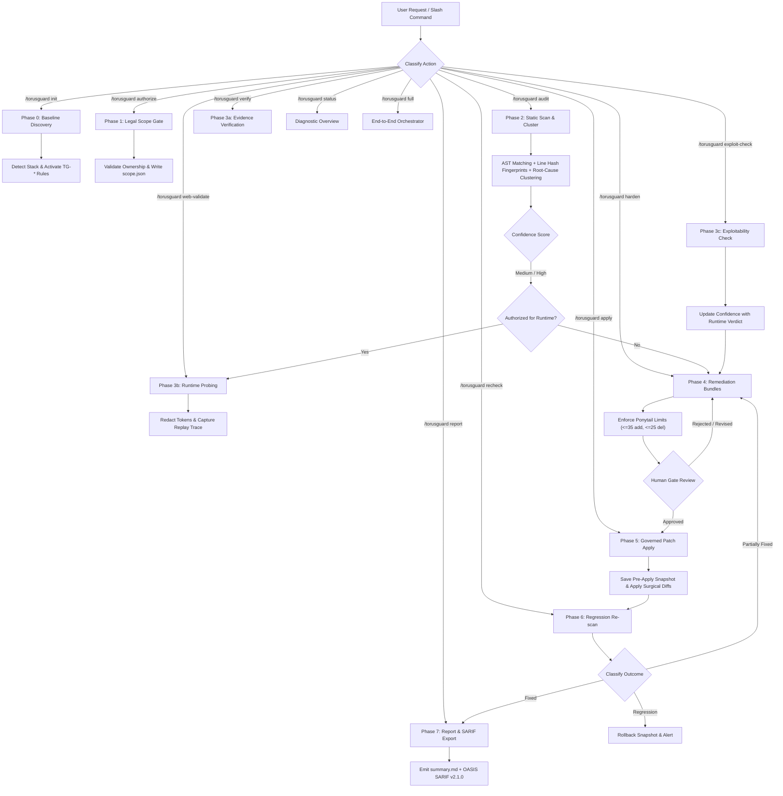

# 🛡️ TorusGuard Security Kit v0.9.1 — System Architecture

TorusGuard works natively in **Antigravity**, **Cursor**, **Windsurf**, **Claude Code**, **Cline**, and any AI IDE or coding assistant that indexes workspace security guardrails.

---

## 1. System Flow & Execution Lifecycle

Every security operation, static scan, runtime probe, and remediation patch progresses through an auditable, deterministic 7-stage closed-loop pipeline:



---

## 2. Decoupled Specialist Skills & Lazy Routing

TorusGuard enforces **strict context budget discipline**. Rather than dumping monolithic rules into the LLM context, each task routes to an atomic specialist skill:

- **Startup Overhead**: ~50–150 tokens per specialized task vs 85,000+ tokens for full-repo manual review.
- **Zero Hallucination Grounding**: Every specialist skill embeds its own execution steps, safety constraints, and scoring models inline.
- **Lazy Resolution**: The root `torusguard` router intercepts commands and loads exclusively the matching specialist file.

| Specialist Skill | Agent Role | Focus Area | Context Budget |
| :--- | :--- | :--- | :---: |
| `torusguard-init` | `profiler` | Framework & data layer discovery | 120 lines |
| `torusguard-authorize` | `reviewer` | Ownership confirmation & scope limits | 94 lines |
| `torusguard-audit` | `auditor` | Static AST scanning & root-cause clustering | 150 lines |
| `torusguard-verify` | `validator` | Fresh disk state check & score computation | 90 lines |
| `torusguard-web-validate`| `validator` | Bounded HTTP probing & token redaction | 124 lines |
| `torusguard-exploit-check`| `validator` | Safe canary verification for SQLi/XSS/SSRF | 100 lines |
| `torusguard-harden` | `remediator` | Ponytail-bounded remediation bundles | 105 lines |
| `torusguard-apply` | `remediator` | Pre-apply snapshots & surgical application | 71 lines |
| `torusguard-recheck` | `reviewer` | Differential regression detection | 89 lines |
| `torusguard-report` | `reviewer` | Executive posture & OASIS SARIF v2.1.0 | 102 lines |
| `torusguard-status` | *System* | Read-only configuration & history ledger | 80 lines |
| `torusguard-full` | *All Roles* | 7-stage master pipeline orchestrator | 165 lines |

---

## 3. Authority Separation & Role Handoff Contracts

To prevent self-confirming bias, security responsibilities are divided across 5 formal roles:

1. **Profiler (`profiler.md`)**:
   - Discovers project languages, frameworks, dependency manifests, and database layers.
   - *Authority Boundary*: Read-only inspection; never alters source code.
2. **Auditor (`auditor.md`)**:
   - Scans source ASTs, computes line-shift invariant fingerprints, groups findings by root-cause cluster, and scores initial confidence.
   - *Authority Boundary*: Read-only; cannot mark findings as "Confirmed" without exact AST source citations.
3. **Validator (`validator.md`)**:
   - Executes authorized runtime HTTP probes, performs safe canary checks, redacts secrets, and assigns exploitability verdicts.
   - *Authority Boundary*: Bound strictly by `scope.json`; cannot execute destructive write mutations.
4. **Remediator (`remediator.md`)**:
   - Packages minimal unified diffs constrained by Ponytail Protocol bounds and applies governed patches.
   - *Authority Boundary*: Must obtain Human Gate approval before disk modification; must save pre-apply snapshots.
5. **Reviewer (`reviewer.md`)**:
   - Re-scans modified files to verify fix integrity, audits evidence sufficiency, detects regressions, and exports SARIF logs.
   - *Authority Boundary*: Independent audit of remediator outputs; cannot apply code modifications.

---

## 4. Governance & Safety Enforcement

### The Ponytail Protocol
```
┌────────────────────────────────────────────────────────┐
│               PONYTAIL PROTOCOL BOUNDS                 │
├────────────────────────────────────────────────────────┤
│ • Additions: <= 35 lines per bundle                    │
│ • Deletions: <= 25 lines per bundle                    │
│ • Zero full-file rewrites                              │
│ • Preserve all existing tenant isolation & auth checks │
│ • Preserve all existing logging & error handling       │
└────────────────────────────────────────────────────────┘
```
Any remediation exceeding these thresholds is partitioned into sequential atomic sub-bundles or flagged as `Requires Manual Architectural Refactor`.

### Universal Safety Constraints
- **Folder-Per-Run Isolation**: All logs, findings, bundles, and reports are saved to `.torusguard/runs/<run-id>/`. The project root is never polluted.
- **Rollback Assurance**: A byte-for-byte pre-apply snapshot is archived in `patches/<bundle-id>/pre_apply/` prior to any code edit.
- **Credential Redaction**: Raw secrets, Bearer JWTs, and database credentials are automatically redacted with SHA-256 prefix digests before disk persistence.

---

## 5. Objective 0–100 Confidence Scoring Rubric

Finding confidence is scored objectively across 5 verifiable factors:

| Dimension | Max Points | Criteria |
| :--- | :---: | :--- |
| **Evidence Quality** | **35** | Exact AST match (35) · Regex pattern (20) · Indirect indicator (10) |
| **Reproduction Success** | **25** | Deterministic test reproduction (25) · Partial trace (15) · Static only (0) |
| **Independent Confirmations** | **15** | Corroborated in 3+ files (15) · 2 files (10) · Single file (5) |
| **Environmental Clarity** | **15** | Direct route mapping (15) · Minor ambiguity (8) · Complex unknown proxy (0) |
| **Manual Review Status** | **10** | Security engineer verified (10) · Secondary agent consensus (5) · Unreviewed (0) |

- **`90–100` (`Confirmed`)**: Indisputable proof with code citation or deterministic trace.
- **`70–89` (`High Confidence`)**: Strong direct indicators; prioritized remediation.
- **`50–69` (`Medium Confidence`)**: Probable flaw; runtime confirmation recommended.
- **`< 50` (`Needs Review`)**: Architectural ambiguity or potential delegated control.

---

## 6. Directory Topology

```text
.torusguard/
├── TORUSGUARD.md                      # Master always-on security rules
├── ARCHITECTURE.md                    # System architecture & lifecycle blueprint
├── .manifest.json                     # Cryptographic SHA-256 integrity ledger
├── config/                            # Project configuration & command registry
├── agents/                            # 5 Specialist AI Agent definitions
├── workflows/                         # 11 Slash command execution guides
├── scripts/                           # 5 Pure Python automation utilities
├── skills/                            # Mirrored specialist skills
├── templates/                         # 4 Standard Markdown report templates
├── schemas/                           # 9 Validated JSON Schemas
├── references/                        # 10 Framework security reference guides
├── rules/                             # Rule taxonomy & active tailored rules
│   ├── active/                        # Project-tailored rules
│   ├── README.md                      # Rule catalog & guide
│   └── TORUSGUARD.md                  # Dual-path master rules copy
└── runs/                              # Execution artifacts directory (gitignored)
```
