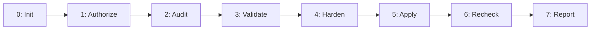

# TorusGuard Full — Master 7-Stage Pipeline Orchestrator

## Objective
Execute the full, closed-loop TorusGuard security lifecycle from initial stack discovery through static scanning, runtime validation, Ponytail-governed remediation, differential re-check, and SARIF export under unified governance and strict Human Gate control.

---

## 7-Stage Security Pipeline



---

## Specialist Skill Routing

During execution, `torusguard-full` orchestrates the individual specialist skills:

| Phase | Stage Name | Specialist Skill | Primary Agent |
| :---: | :--- | :--- | :--- |
| **0** | Baseline Setup | `torusguard-init` | `profiler` |
| **1** | Legal Scope Gate | `torusguard-authorize` | `reviewer` |
| **2** | Static Audit & Clustering | `torusguard-audit` | `auditor` |
| **3** | Evidence & Exploit Validation | `torusguard-verify` / `exploit-check` | `validator` |
| **4** | Governed Remediation | `torusguard-harden` | `remediator` |
| **5** | Governed Apply | `torusguard-apply` | `remediator` |
| **6** | Targeted Recheck | `torusguard-recheck` | `reviewer` |
| **7** | Reporting & SARIF | `torusguard-report` | `reviewer` |

---

## Pipeline Execution Instructions

### Phase 0: Baseline Discovery
Run stack detection. Activate framework-tailored rules in `.torusguard/rules/active/`. Verify `SECURITY.md`.

### Phase 1: Authorization Gate
Confirm legal scope in `.torusguard/config/scope.json`. Validate target ownership and ensure TTL is active.

### Phase 2: Static Code Audit
Scan ASTs against active rules. Generate line-shift invariant fingerprints. Cluster findings by root cause.

### Phase 3: Validation & Scoring
Audit evidence sufficiency using the 5-factor rubric. If authorized for runtime, execute bounded canary checks to confirm exploitability.

### Phase 4: Governed Remediation
Formulate minimal unified diffs adhering to the Ponytail Protocol ($\le 35$ additions, $\le 25$ deletions). Package into 4-artifact remediation bundles.

### Phase 5: Governed Apply (HUMAN GATE)
Present diff preview to the operator. Capture `pre_apply/<file>.bak` snapshot. Apply surgical modification upon approval.

### Phase 6: Targeted Recheck
Re-scan modified source files for the original finding and neighboring regressions. Verify closure state (`Confirmed Fixed`).

### Phase 7: Reporting & Export
Render canonical 9-section executive markdown report. Export OASIS SARIF v2.1.0 log.

---

## Confidence Scoring Rubric
Findings are evaluated using the standard 0–100 rubric:
- Evidence Quality (35) + Reproduction Success (25) + Confirmations (15) + Clarity (15) + Review Status (10).
- Scores $\ge 90$ qualify as `Confirmed`.

---

## Safety & Governance
- **Zero Automated Code Writes**: Disk modifications are strictly gated by explicit operator approval during Phase 5.
- **Rollback Assurance**: A full pre-apply backup is saved prior to every file change.
- **Strict Ponytail Bounds**: No remediation bundle may exceed 35 additions or 25 deletions.
- **Secret Masking**: All tokens and keys are redacted before persistence.

---

## Output Format
```markdown
🛡️ [TorusGuard] Full 7-Stage Pipeline Completed Successfully
- Pipeline Stages: 7 of 7 executed
- Total Findings Detected: <Count>
- Patches Formulated & Applied: <Count>
- Fixes Verified Closed: <Count>
- Regressions Detected: 0
- Executive Posture: 🟢 SECURE
- SARIF v2.1.0 Artifact: .torusguard/runs/<run-id>/results.sarif
- Executive Report: .torusguard/runs/<run-id>/report.md
```
