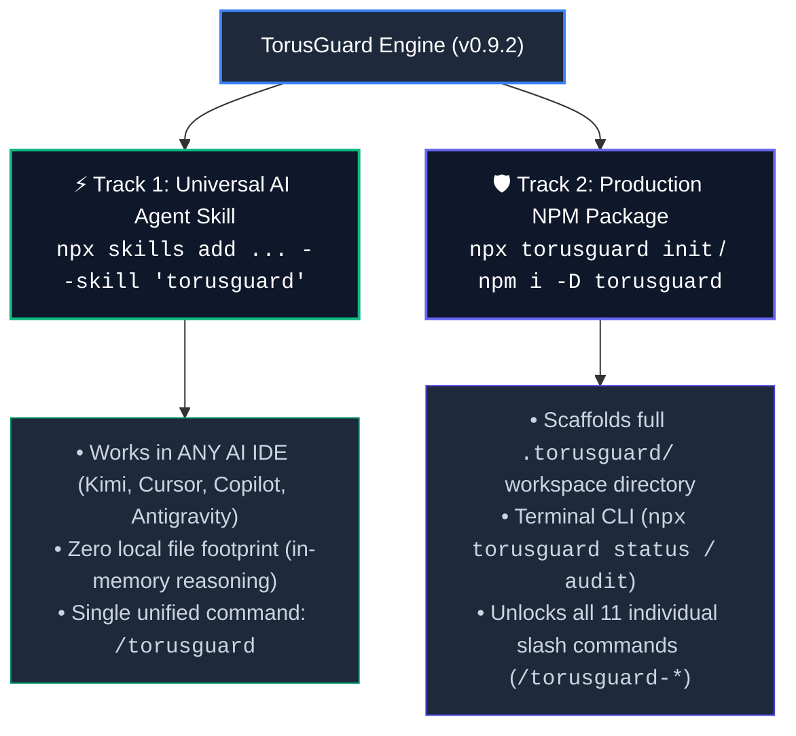
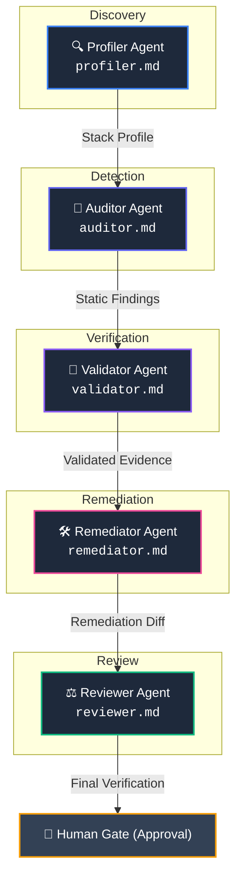

<div align="center">
  

  # TorusGuard

  **Security guardrails, governed remediation, and authorized runtime validation for AI-built web applications.**

  [](https://www.npmjs.com/package/torusguard)
  [](https://github.com/githubmofo/TorusGuard/releases/latest)
  [](LICENSE)
  [](https://python.org)
  [](https://nodejs.org)
  [](schemas/)
  [](.torusguard/.manifest.json)
  [](docs/architecture/SECURITY_ARCHITECTURE.md)
</div>

---

## 💡 Executive Summary

Modern AI coding agents generate full-stack applications with remarkable speed. However, they frequently introduce severe security flaws—leaking service-role credentials to client bundles, bypassing multi-tenant query boundaries, omitting CSRF defenses, or exposing unsandboxed shell dispatch tools.

**TorusGuard** is an autonomous application security co-pilot specifically designed for AI-built software. It integrates directly into your AI coding workflows (Antigravity, Cursor, Claude Code, VS Code Copilot, Kimi, Windsurf, Cline) to:

1. **Detect Real Vulnerabilities:** Statically scan source code across Python and TypeScript using 71 specialized security rules.
2. **Validate Exploitability:** Perform authorized, non-destructive runtime probes to eliminate false positives before generating alerts.
3. **Govern Remediation:** Generate minimal, surgically bounded patches ($\le 35$ additions, $\le 25$ deletions) using the **Ponytail Protocol** to eliminate code regressions.
4. **Export Open Standards:** Emit OASIS SARIF v2.1.0 telemetry with stable AST line hashes for seamless GitHub Code Scanning integration.

### 🌐 The Core Principle: The Browser-Code Truth
> **"If the browser receives it, users can inspect it."**  
> Client-side code, frontend environment variables, network bundles, and React Server Action payloads cannot hide secrets. TorusGuard enforces that database credentials, private API keys, and authorization checks must reside strictly on trusted server boundaries.

---

## ⚡ Dual-Track Distribution Architecture

To provide maximum developer flexibility, TorusGuard is decoupled into **two clean, independent tracks** that live peacefully in the same repository without conflict:



### Track Comparison Matrix

| Feature | ⚡ Track 1: Universal AI Agent Skill | 🛡️ Track 2: Production NPM Package |
| :--- | :--- | :--- |
| **Installation** | `npx skills add https://github.com/githubmofo/TorusGuard --skill "torusguard"` | `npx torusguard init` or `npm install -D torusguard` |
| **Target IDEs** | All AI Agents (Kimi, Antigravity, VS Code, Cursor, Claude Code, Windsurf) | Any Node/Python repo, CI/CD pipelines, Antigravity, Cursor |
| **Filesystem Footprint** | Pure in-memory context (`.agents/skills/torusguard/` only) | Complete local workspace (`.torusguard/` with config, rules, runs) |
| **Slash Commands** | Single clean router: `/torusguard` | Full granular suite: `/torusguard-*` (11 commands) |
| **Prerequisites** | None (pure AI agent execution) | Node.js 18+ (and Python 3.10+ for native scripts) |
| **Best For** | Instant zero-setup security advice in chat | Production repositories, CI/CD SARIF reports, offline scans |

---

## 🚀 Installation & Quick Start

Choose the path that fits your development workflow:

### Track 1: Universal AI Agent Skill (Zero Setup)
Install directly into any AI assistant compatible with the Open Agent Skills standard:
```bash
npx skills add https://github.com/githubmofo/TorusGuard --skill "torusguard"
```
* Once installed, simply type `/torusguard` in chat or ask: *"Audit this component for security flaws"*.
* Operates immediately with zero project configuration required.

### Track 2: Production NPM Package (Full Governance)
Scaffold your repository with full local governance and terminal automation:
```bash
# Direct runner (recommended):
npx torusguard init

# Or install as a dev dependency:
npm install -D torusguard
```
* Creates the `.torusguard/` workspace directory.
* Automatically populates the IDE slash command palette with all 11 individual `/torusguard-*` workflows.
* Run direct terminal checks anytime:
  ```bash
  npx torusguard status
  npx torusguard audit
  ```

### Standalone Python Installer (Alternative)
For Python-only environments, Docker containers, or air-gapped CI/CD runners:
```bash
# Cloned repo:
python install.py

# Or via remote one-liner:
curl -sSL https://raw.githubusercontent.com/githubmofo/TorusGuard/main/install.py | python
```

---

## 📋 Comprehensive Command Catalog

When Track 2 is initialized, the complete 11-command palette becomes available in your IDE (`.agent/workflows/`, `.agents/workflows/`, `.claude/commands/`, `.cursor/rules/`):

| Slash Command | Specialist Skill | Lifecycle Phase | Action Description | Code Changed? |
| :--- | :--- | :---: | :--- | :---: |
| `/torusguard` | `skills/torusguard` | Router | Master natural-language command dispatcher and prompt auditor. | No |
| `/torusguard init`<br>*(or `/torusguard-init`)* | `skills/torusguard-init` | Phase 0 | Profiles repository stack, discovers frameworks, and enables matching rules. | Yes (`.torusguard/`) |
| `/torusguard authorize`<br>*(or `/torusguard-authorize`)* | `skills/torusguard-authorize` | Phase 1 | Establishes target ownership, scopes URL boundaries, and sets scan rate limits. | Yes (`scope.json`) |
| `/torusguard audit`<br>*(or `/torusguard-audit`)* | `skills/torusguard-audit` | Phase 2 | Scans source code and clusters repeated alerts by root-cause identity. | No |
| `/torusguard verify`<br>*(or `/torusguard-verify`)* | `skills/torusguard-verify` | Phase 3 | Scores findings across a 5-factor mathematical rubric (0–100) to purge false alarms. | No |
| `/torusguard web-validate`<br>*(or `/torusguard-web-validate`)* | `skills/torusguard-web-validate` | Phase 3 | Dispatches authorized, non-destructive HTTP requests with transparent audit headers. | No |
| `/torusguard exploit-check`<br>*(or `/torusguard-exploit-check`)* | `skills/torusguard-exploit-check` | Phase 3 | Validates exploitability safely into 5 formal verification statuses. | No |
| `/torusguard harden`<br>*(or `/torusguard-harden`)* | `skills/torusguard-harden` | Phase 4 | Packages 4-artifact Remediation Bundles with framework-idiomatic fixes. | No |
| `/torusguard apply`<br>*(or `/torusguard-apply`)* | `skills/torusguard-apply` | Phase 5 | Applies surgical patches bounded by Ponytail limits ($\le 35$ additions, $\le 25$ deletions). | **Yes (Patch)** |
| `/torusguard recheck`<br>*(or `/torusguard-recheck`)* | `skills/torusguard-recheck` | Phase 6 | Executes differential re-audit strictly on modified files to verify fix closure. | No |
| `/torusguard report`<br>*(or `/torusguard-report`)* | `skills/torusguard-report` | Phase 7 | Emits executive summary markdown and OASIS SARIF v2.1.0 CI artifacts. | No |
| `/torusguard status`<br>*(or `/torusguard-status`)* | `skills/torusguard-status` | Diagnostic | Inspects active security posture, thresholds, and recent run history. | No |
| `/torusguard full` | `skills/torusguard-full` | End-to-End | Orchestrates the entire 7-stage security cycle in one coordinated sequence. | **Yes (Governed)** |

---

## 🔄 The 7-Stage Closed-Loop Finding Lifecycle

Every candidate vulnerability transitions through an auditable, deterministic state machine:


1. **Detect:** AST and regex heuristics scan source code, manifests, and configurations.
2. **Classify:** Computes line-shift invariant `primaryLocationLineHash` fingerprints and collapses repeated alerts into systemic root-cause clusters.
3. **Verify:** Scores evidence quality across a 5-factor mathematical rubric (0–100) and executes safe, bounded runtime probes.
4. **Remediate:** Formulates self-contained Remediation Bundles with framework-idiomatic Before/After fixes.
5. **Apply:** Employs the **Ponytail engine** to apply surgical patches governed by strict line churn limits ($\le 35$ additions, $\le 25$ deletions).
6. **Recheck:** Scopes differential re-audits strictly to modified files, confirming fix closure with zero regression.
7. **Report:** Generates human-first markdown summaries and OASIS SARIF v2.1.0 payloads for CI/CD pipelines.

---

## 🎯 Specialist Agents & Authority Separation

To eliminate AI confirmation bias, security responsibilities are divided across **5 formal, isolated roles**:



* **No Self-Review:** The agent that proposes a patch (`Remediator`) can never approve its application (`Reviewer` + Human Gate required).
* **Deterministic Handoffs:** Every transition is recorded in `role-audit.json` with cryptographic provenance.

---

## 🛡️ Rule Catalog & Detection Families (71 Canonical Rules)

TorusGuard enforces 71 rules across modern application stacks:

| Rule Family | Domain | Key Invariants & Detection Scope |
| :--- | :--- | :--- |
| **`TG-SEC-*`** | Secrets & Credentials | Blocks exposed API keys, private certs, Supabase service roles, and hardcoded tokens. |
| **`TG-DB-*`** | Database & Queries | Parameterized query enforcement, multi-tenant isolation filters (`.filter(tenant=...)`). |
| **`TG-INPUT-*`** | Input Validation | Pydantic/Zod boundary validation, path traversal prevention, command injection blocks. |
| **`TG-AUTH-*`** | Authentication & RBAC | Server-side route guards, session expiry, mass-assignment protection, IDOR prevention. |
| **`TG-CLIENT-*`** | Client Bundle Leaks | Blocks server-side environment variables (`SUPABASE_KEY`, `DATABASE_URL`) from browser bundles. |
| **`TG-DIFF-*`** | Diff Line Inspection | Evaluates patch additions/deletions for auth bypass comments (`// nosec`), disabled TLS, or filter removals. |
| **`TG-AGENT-*`** | AI Agent & MCP Security | Prompt injection boundaries in system prompts, unsandboxed tool execution, excessive tool permissions. |
| **`TG-EDGE-*`** | Serverless & Edge | Global memory leakage in V8 isolates (Cloudflare Workers), ephemeral cold-start leakage in AWS Lambda. |
| **`TG-SUPPLY-*`** | Supply Chain & CI/CD | GitHub Actions least privilege, container build secret mounts, destructive package upgrades. |
| **`TG-SSRF-*`** | Outbound Networking | Webhook signature validation, SSRF DNS re-binding protection, internal subnet blocking. |
| **`TG-BIZ-*`** | Business Logic | Multi-step transaction consistency, race condition guards, financial rounding integrity. |

---

## 🔬 Content-Aware Diff Line Scanner (`diff_guard.py`)

Every patch generated by TorusGuard (or submitted via pull request) is verified against unified diff invariants:
* **`TG-DIFF-001` (Bypass Markers):** Flags additions containing `# bypass auth`, `// nosec`, or `verify=False`.
* **`TG-DIFF-002` (Credential Ingestion):** Rejects additions introducing live JWTs, Bearer tokens, or API keys.
* **`TG-DIFF-003` (Tenant Removal):** Rejects deletions removing tenant isolation clauses (`.filter(tenant=...)`, `where tenant_id`).

---

## 🏢 Monorepo Sub-Scope Orchestration (`monorepo_detector.py`)

TorusGuard automatically detects and profiles complex multi-package repositories:
* **Package Managers:** Turborepo, pnpm workspaces, npm/yarn workspaces, Lerna.
* **Service Resolution:** Profiles backend services (FastAPI/Django) and frontend apps (Next.js/React) independently.
* **Targeted Scoping:** Run audits across the entire workspace or focus strictly on a sub-package (`--target apps/backend`).

---

## 🎮 Interactive Multi-Stack Playground (`demo/playground/`)

Test TorusGuard against real, runnable vulnerable applications without putting production code at risk:
```bash
# Explore FastAPI playground:
python demo/playground/vulnerable_fastapi/main.py

# Run TorusGuard audit on the playground:
npx torusguard audit --target demo/playground/vulnerable_fastapi
```
* **FastAPI Playground:** Demonstrates SQL injection, unauthenticated endpoints, and missing tenant scopes.
* **Next.js Playground:** Demonstrates Next.js Server Action data leaks, prompt injection sinks, and exposed client secrets.

---

## 🧪 Comprehensive Verification Suite (11/11 Passed)

TorusGuard maintains zero-compromise test discipline. Every release must pass 100% of our regression suites:

```bash
# Run the complete test battery:
python harness/validate_v0_9_2_dual_track.py
python harness/validate_v0_9_2_diff_and_monorepo.py
python harness/validate_v0_9_2_workflows_and_skills.py
python .torusguard/scripts/manifest_builder.py --check
python harness/validate_v0_9_1_installer.py
python harness/validate_v0_9_0_skills.py
python harness/runner.py
python harness/validate_v0_7_0_runtime.py
python harness/validate_v0_8_0_part1.py
python harness/validate_v0_8_0_part2.py
python harness/validate_v0_8_0_part3.py
```

* **Cryptographic Integrity:** All workspace templates are verified against SHA-256 signatures in `.torusguard/.manifest.json`.
* **Token Budget Guarantee:** All skills and workflows strictly respect a **1,000–1,500 token budget** to prevent AI context degradation.

---

## 📄 License & Community

TorusGuard is open-source software licensed under the [MIT License](LICENSE).

* **Author:** Jenish Lad ([@githubmofo](https://github.com/githubmofo))
* **Repository:** [https://github.com/githubmofo/TorusGuard](https://github.com/githubmofo/TorusGuard)
* **NPM Package:** [https://www.npmjs.com/package/torusguard](https://www.npmjs.com/package/torusguard)
* **Bug Reports & Issues:** [https://github.com/githubmofo/TorusGuard/issues](https://github.com/githubmofo/TorusGuard/issues)
