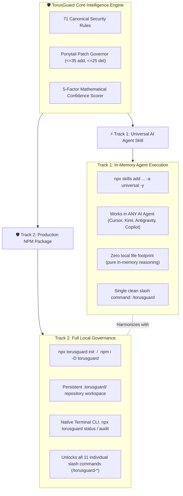
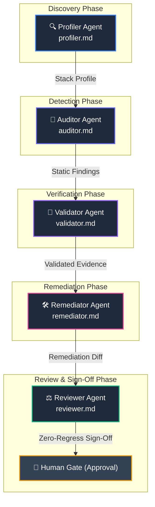

<div align="center">
  

  # TorusGuard

  **Autonomous Security Guardrails, Governed Remediation, and Authorized Runtime Validation for AI-Built Web Applications.**

  [](https://www.npmjs.com/package/torusguard)
  [](https://github.com/githubmofo/TorusGuard/pkgs/npm/torusguard)
  [](https://github.com/githubmofo/TorusGuard/releases/latest)
  [](LICENSE)
  [](https://python.org)
  [](https://nodejs.org)
  [](.torusguard/schemas/)
  [](.torusguard/.manifest.json)
  [](docs/architecture/SECURITY_ARCHITECTURE.md)
</div>

---

## 💡 Executive Summary

Modern AI coding agents generate full-stack web applications at unprecedented velocity. However, they consistently introduce critical security anti-patterns: leaking service-role credentials to browser bundles, omitting multi-tenant query boundaries, disabling CSRF defenses, or granting unconstrained tool permissions.

**TorusGuard** is an autonomous application security co-pilot specifically engineered for AI-built software. It integrates natively into your development environment (Antigravity, Cursor, Claude Code, VS Code Copilot, Kimi, Windsurf, Cline) to deliver:

1. **Deterministic Static Auditing:** Scan Python and TypeScript source code using 71 specialized security rules across 11 families.
2. **Authorized Runtime Validation:** Execute bounded, non-destructive HTTP probes to eliminate false alarms and confirm real exploitability.
3. **Governed Minimal Remediation:** Generate surgical, reviewable patches constrained by the **Ponytail Protocol** ($\le 35$ additions, $\le 25$ deletions) to eliminate unintended regressions.
4. **Open Industry Standards:** Emit OASIS SARIF v2.1.0 telemetry with stable AST line-shift invariant hashes for native GitHub Code Scanning integration.

### 🌐 The Core Invariant: The Browser-Code Truth
> **"If the browser receives it, users can inspect it."**  
> Frontend environment variables, JavaScript network bundles, and React Server Action payloads cannot conceal secrets. TorusGuard strictly enforces that database credentials, private API keys, and authorization barriers remain exclusively on trusted server boundaries.

---

## ⚡ Dual-Track Distribution Architecture

TorusGuard features a decoupled **Dual-Track Architecture** allowing teams to choose between zero-setup in-memory agent intelligence and full repository governance:



### Track Comparison Matrix

| Capability | ⚡ Track 1: Universal AI Agent Skill | 🛡️ Track 2: Production NPM Package |
| :--- | :--- | :--- |
| **Primary Command** | `npx skills add https://github.com/githubmofo/TorusGuard -a universal -y` | `npx torusguard init` or `npm install -D torusguard` |
| **Supported Agents** | All AI Agents (Antigravity, Cursor, Claude Code, Copilot, Kimi, Windsurf) | Any Node/Python repository, GitHub Actions CI/CD, Antigravity, Cursor |
| **Disk Footprint** | In-memory agent context (`.agents/skills/torusguard/` only) | Complete local workspace (`.torusguard/` with config, rules, schemas, runs) |
| **Slash Commands** | Single master dispatcher: `/torusguard` | Full 11-command palette: `/torusguard-audit`, `/torusguard-apply`, etc. |
| **Terminal CLI** | None (AI chat-driven) | Native terminal runner: `npx torusguard status`, `npx torusguard audit` |
| **Prerequisites** | None (pure AI agent execution) | Node.js 18+ (and Python 3.10+ for native verification scripts) |
| **Best For** | Instant zero-setup security advice in chat | Production repositories, team compliance, CI/CD SARIF exports |

---

## 🚀 Installation & Quick Start

### Track 1: Universal AI Agent Skill (Zero Setup)
Install directly into any AI assistant adhering to the Open Agent Skills standard:
```bash
# Recommended one-liner (silent, zero-prompts, targets all IDE agents):
npx skills add https://github.com/githubmofo/TorusGuard -a universal -y
```
* **`-a universal`**: Automatically registers the skill for Antigravity, Cursor, Gemini CLI, Claude Code, VS Code Copilot, and Kimi without prompt friction.
* **`-y`**: Bypasses interactive confirmation prompts and completes in **under 2 seconds**.
* Once installed, simply type `/torusguard` in chat or ask: *"Audit this component for security flaws"*.

### Track 2: Production NPM Package (Full Governance)
Scaffold your repository with local configuration, offline scripts, and granular workflows:
```bash
# Direct runner (recommended):
npx torusguard init

# Or install as a development dependency:
npm install -D torusguard
```
* Generates the `.torusguard/` workspace directory.
* Populates your IDE command palette with all 11 individual `/torusguard-*` workflows.
* Run instant terminal checks anytime:
  ```bash
  npx torusguard status
  npx torusguard audit
  ```

### Standalone Python Installer (Alternative)
For Python-only environments, Docker containers, or air-gapped CI/CD runners:
```bash
# From cloned repository:
python install.py

# Or via remote one-liner:
curl -sSL https://raw.githubusercontent.com/githubmofo/TorusGuard/main/install.py | python
```

---

## 📋 Comprehensive Command Catalog

When Track 2 is initialized, the complete 11-command palette becomes available in your IDE (`.agent/workflows/`, `.agents/workflows/`, `.claude/commands/`, `.cursor/rules/`):

| Slash Command | Specialist Skill | Lifecycle Phase | Operational Description | Code Changed? |
| :--- | :--- | :---: | :--- | :---: |
| `/torusguard` | `skills/torusguard` | Router | Master natural-language command dispatcher and prompt auditor. | No |
| `/torusguard init`<br>*(or `/torusguard-init`)* | `skills/torusguard-init` | Phase 0 | Profiles repository stack, discovers frameworks, and enables matching rules. | Yes (`.torusguard/`) |
| `/torusguard authorize`<br>*(or `/torusguard-authorize`)* | `skills/torusguard-authorize` | Phase 1 | Establishes target ownership, scopes URL boundaries, and sets scan rate limits. | Yes (`scope.json`) |
| `/torusguard audit`<br>*(or `/torusguard-audit`)* | `skills/torusguard-audit` | Phase 2 | Scans source code and clusters repeated alerts by root-cause identity. | No |
| `/torusguard verify`<br>*(or `/torusguard-verify`)* | `skills/torusguard-verify` | Phase 3 | Scores findings across a 5-factor mathematical rubric (0–100) to purge false alarms. | No |
| `/torusguard web-validate`<br>*(or `/torusguard-web-validate`)* | `skills/torusguard-web-validate` | Phase 3 | Dispatches authorized, non-destructive HTTP requests with transparent audit headers. | No |
| `/torusguard exploit-check`<br>*(or `/torusguard-exploit-check`)* | `skills/torusguard-exploit-check` | Phase 3 | Validates exploitability safely into 5 formal verification statuses. | No |
| `/torusguard harden`<br>*(or `/torusguard-harden`)* | `skills/torusguard-harden` | Phase 4 | Packages 4-artifact Remediation Bundles with framework-idiomatic fixes. | No |
| `/torusguard apply`<br>*(or `/torusguard-apply`)* | `skills/torusguard-apply` | Phase 5 | Applies surgical patches bounded by Ponytail limits ($\le 35$ additions, $\le 25$ deletions). | **Yes (Patch)** |
| `/torusguard recheck`<br>*(or `/torusguard-recheck`)* | `skills/torusguard-recheck` | Phase 6 | Executes differential re-audit strictly on modified files to verify fix closure. | No |
| `/torusguard report`<br>*(or `/torusguard-report`)* | `skills/torusguard-report` | Phase 7 | Emits executive summary markdown and OASIS SARIF v2.1.0 CI artifacts. | No |
| `/torusguard status`<br>*(or `/torusguard-status`)* | `skills/torusguard-status` | Diagnostic | Inspects active security posture, thresholds, and recent run history. | No |
| `/torusguard memory` | `skills/torusguard` | Intelligence | Inspects, exports, imports, or compacts persistent security memory context. | Yes (`.torusguard/memory/`) |
| `/torusguard full` | `skills/torusguard-full` | End-to-End | Orchestrates the entire 7-stage security cycle in one coordinated sequence. | **Yes (Governed)** |

---

## 🔄 The 7-Stage Closed-Loop Finding Lifecycle

Every candidate vulnerability transitions through an auditable, deterministic state machine with zero regression tolerance:

```mermaid
flowchart LR
    Detect["1. Detect<br>/torusguard audit"] --> Classify["2. Classify<br>AST Line Hashing"]
    Classify --> Verify["3. Verify<br>verify / web-validate"]
    Verify --> Remediate["4. Remediate<br>/torusguard harden"]
    Remediate --> Apply["5. Apply<br>/torusguard apply"]
    Apply --> Recheck["6. Recheck<br>/torusguard recheck"]
    Recheck --> Report["7. Report<br>/torusguard report"]

    style Detect fill:#1e293b,stroke:#3b82f6,stroke-width:2px,color:#fff
    style Classify fill:#1e293b,stroke:#6366f1,stroke-width:2px,color:#fff
    style Verify fill:#1e293b,stroke:#8b5cf6,stroke-width:2px,color:#fff
    style Remediate fill:#1e293b,stroke:#ec4899,stroke-width:2px,color:#fff
    style Apply fill:#1e293b,stroke:#f59e0b,stroke-width:2px,color:#fff
    style Recheck fill:#1e293b,stroke:#10b981,stroke-width:2px,color:#fff
    style Report fill:#1e293b,stroke:#06b6d4,stroke-width:2px,color:#fff
```



### Lifecycle Stage Breakdown

| Stage | Command | Responsible Agent | Primary Activity & Invariant Guarantee |
| :---: | :--- | :---: | :--- |
| **1. Detect** | `/torusguard audit` | `auditor` | Static AST and regex inspection flags potential vulnerabilities across Python and TypeScript. |
| **2. Classify** | *(automatic)* | `auditor` | Computes line-shift invariant `primaryLocationLineHash` fingerprints and clusters repeated instances into root causes. |
| **3. Verify** | `/torusguard verify` | `validator` | Applies a 5-factor mathematical scoring model (0–100) and executes authorized, bounded runtime HTTP probes. |
| **4. Remediate** | `/torusguard harden` | `remediator` | Generates self-contained Remediation Bundles containing unified diffs and rollbacks. |
| **5. Apply** | `/torusguard apply` | `remediator` | Takes pre-apply file snapshots and enforces **Ponytail bounds** ($\le 35$ additions, $\le 25$ deletions). |
| **6. Recheck** | `/torusguard recheck` | `reviewer` | Performs differential re-audit strictly on modified files to verify fix closure without introducing new flaws. |
| **7. Report** | `/torusguard report` | `reviewer` | Synthesizes an executive Markdown summary and exports an OASIS SARIF v2.1.0 file for CI/CD tracking. |

---

## 🎯 Specialist Agents & Authority Separation

To eliminate AI confirmation bias, security responsibilities are divided across **5 formal, isolated roles**:



### Agent Responsibilities & Isolation Rules

| Agent | Specification | Dedicated Purpose | Anti-Bias Isolation Rule |
| :--- | :--- | :--- | :--- |
| **🔍 Profiler** | `.torusguard/agents/profiler.md` | Discovers frameworks, ORMs, and packages. | Cannot conduct vulnerability detection. |
| **🔎 Auditor** | `.torusguard/agents/auditor.md` | AST pattern matching and root-cause clustering. | Cannot propose code modifications or execute probes. |
| **🧪 Validator** | `.torusguard/agents/validator.md` | Bounded runtime HTTP validation and scoring. | Bound by `scope.json` authorization boundaries. |
| **🛠️ Remediator** | `.torusguard/agents/remediator.md` | Formulates surgical, minimal code patches. | **Cannot approve its own patch.** |
| **⚖️ Reviewer** | `.torusguard/agents/reviewer.md` | Pre-flight verification and compliance sign-off. | **Must be independent from Remediator.** |

* **Zero Self-Review:** The agent that writes a patch (`Remediator`) can never sign off on its merge (`Reviewer` + Human Gate required).
* **Cryptographic Provenance:** Every role handoff is recorded in `role-audit.json` with SHA-256 signatures.

---

## 🛡️ Core Innovation Highlights

### 1. The Ponytail Protocol (Minimal Patch Churn Bounds)
Unbounded AI code generators frequently rewrite adjacent business logic, introduce accidental syntax errors, or strip comments. TorusGuard strictly enforces the **Ponytail Protocol**:
* **$\le 35$ Additions** per remediation patch.
* **$\le 25$ Deletions** per remediation patch.
* **Deterministic Single Responsibility:** Every patch resolves exactly one root-cause cluster without side effects.

### 2. Auditable Mathematical Confidence Scoring (0–100)
TorusGuard computes confidence scores using a formal 5-factor mathematical formula before escalating findings to developers:
$$\text{Score} = (w_d \cdot D) + (w_e \cdot E) + (w_c \cdot C_{ast}) - P_{fp} - P_{drift}$$
* **$D$ (Detection Determinism, 30%):** Exact string/AST regex matches vs speculative patterns.
* **$E$ (Runtime Evidence, 25%):** Confirmed HTTP exploitability response status.
* **$C_{ast}$ (AST Contextuality, 25%):** Direct assignment in critical execution path vs commented code.
* **$P_{fp}$ (False Positive Penalty, up to -20):** Safe wrapper detection (e.g. parameterized queries, sanitizers).
* **$P_{drift}$ (Line Drift Penalty, up to -10):** Unmatched surrounding file context.

### 3. Stable Line-Shift Invariant Fingerprinting (`primaryLocationLineHash`)
Traditional static tools break finding identity when a developer inserts 2 lines at the top of a file. TorusGuard computes a stable SHA-256 hash across the AST node content, enclosing function scope, and syntactic tokens. Findings maintain permanent tracking identity across Git commits and branch renames.

### 4. Adaptive Security Memory Engine (`.torusguard/memory/`)
Traditional scanners are stateless — they scan, report, and forget. TorusGuard v1.0.0 introduces persistent, local-first intelligence that learns from every audit, fix, and verification:
* **4-Tier Intelligence Architecture:** Raw event append-log (`events/`) ──► Distilled pattern store (`patterns.json`) ──► Pre-computed context window (`context.json`) ──► Project security profile (`profile.json`).
* **Structured JSON Cards:** Pre-computes context cards within a strict $\le 2,000$ token budget for instant, hallucination-free injection into AI coding agent prompts.
* **Confidence Amplification & TTL Decay:** Multi-file fix verifications boost pattern confidence up to 98%, while unconfirmed patterns decay gracefully over 90 days.
* **Zero-Leakage Guarantee:** Memory is strictly gitignored (`*`), excluded from npm distribution tarballs, and stored only in the user's project.
* **CLI Memory Management:** Inspect, export, import, or compact memory via `npx torusguard memory`.

---

## 🛡️ Rule Catalog & Detection Families (71 Canonical Rules)

TorusGuard enforces 71 rules across modern application stacks:

| Rule Family | Target Domain | Invariant Guarantees & Detection Scope |
| :--- | :--- | :--- |
| **`TG-SEC-*`** | Secrets & Credentials | Blocks exposed API keys, private certs, Supabase service roles, and hardcoded tokens. |
| **`TG-DB-*`** | Database & Queries | Enforces parameterized SQL queries and mandatory multi-tenant isolation filters (`.filter(tenant=...)`). |
| **`TG-INPUT-*`** | Input Validation | Validates Pydantic/Zod boundaries, prevents path traversal, and blocks unsanitized command execution. |
| **`TG-AUTH-*`** | Authentication & RBAC | Requires server-side route guards, enforces session TTLs, stops mass-assignment, and guards against IDOR. |
| **`TG-CLIENT-*`** | Client Bundle Leaks | Blocks server-side environment variables (`SUPABASE_KEY`, `DATABASE_URL`) from browser bundles. |
| **`TG-DIFF-*`** | Diff Line Inspection | Evaluates patch additions/deletions for auth bypass comments (`// nosec`), disabled TLS, or filter removals. |
| **`TG-AGENT-*`** | AI Agent & MCP Security | Enforces prompt injection delimiters, sandboxes tool execution, and restricts destructive tool capabilities. |
| **`TG-EDGE-*`** | Serverless & Edge | Prevents global memory leakage in V8 isolates (Cloudflare Workers) and cold-start state bleed in AWS Lambda. |
| **`TG-SUPPLY-*`** | Supply Chain & CI/CD | Enforces GitHub Actions least-privilege permissions, validates Docker build secrets, and flags risky deps. |
| **`TG-SSRF-*`** | Outbound Networking | Enforces webhook HMAC signature verification, prevents SSRF DNS rebinding, and blocks internal subnets. |
| **`TG-BIZ-*`** | Business Logic | Protects multi-step financial transactions, race conditions, and currency rounding precision. |

---

## 🔬 Content-Aware Diff Line Scanner (`diff_guard.py`)

Every patch generated by TorusGuard (or submitted via Pull Request) is analyzed by our unified diff inspector:
* **`TG-DIFF-001` (Bypass Markers):** Detects bypass comments (`# bypass auth`, `// nosec`) and disabled TLS verification (`verify=False`).
* **`TG-DIFF-002` (Credential Ingestion):** Intercepts live JWTs, Bearer tokens, or high-entropy secrets introduced in additions.
* **`TG-DIFF-003` (Tenant Removal):** Blocks deletions that strip tenant isolation clauses (`.filter(tenant=...)`, `where tenant_id`).

---

## 🏢 Monorepo Sub-Scope Orchestration (`monorepo_detector.py`)

TorusGuard natively discovers and isolates sub-projects in complex monorepos:
* **Package Managers:** Turborepo, pnpm workspaces, npm/yarn workspaces, Lerna.
* **Service Independence:** Profiles backend services (FastAPI/Django) and frontend applications (Next.js/React) separately.
* **Targeted Scanning:** Audit the entire repository or focus strictly on a specific service:
  ```bash
  npx torusguard audit --target apps/api
  ```

---

## 🎮 Interactive Multi-Stack Playground (`demo/playground/`)

Test TorusGuard against real, runnable vulnerable applications without exposing production code:
```bash
# Explore FastAPI playground:
python demo/playground/vulnerable_fastapi/main.py

# Run TorusGuard audit against the playground:
npx torusguard audit --target demo/playground/vulnerable_fastapi
```
* **FastAPI Playground:** Demonstrates raw SQL string formatting, unauthenticated routes, and missing tenant scopes.
* **Next.js Playground:** Demonstrates Next.js Server Action data leaks, prompt injection sinks, and exposed client secrets.

---

## 🚀 GitHub Actions CI/CD Integration

Integrate TorusGuard directly into your GitHub Actions workflow to scan pull requests and export OASIS SARIF v2.1.0 to GitHub Advanced Security:

```yaml
name: TorusGuard Security Scan

on:
  push:
    branches: [main]
  pull_request:
    branches: [main]

jobs:
  security-audit:
    runs-on: ubuntu-latest
    steps:
      - name: Checkout Code
        uses: actions/checkout@v4

      - name: Setup Node.js
        uses: actions/setup-node@v4
        with:
          node-version: 18

      - name: Setup Python
        uses: actions/setup-python@v5
        with:
          python-version: '3.11'

      - name: Initialize TorusGuard
        run: npx torusguard init --force

      - name: Execute Security Audit
        run: npx torusguard audit

      - name: Generate SARIF Telemetry
        run: npx torusguard report

      - name: Upload SARIF to GitHub Code Scanning
        uses: github/codeql-action/upload-sarif@v3
        with:
          sarif_file: .torusguard/runs/latest/report.sarif
        if: always()
```

---

## 🧪 Comprehensive Verification Battery (11/11 Passed)

TorusGuard enforces strict testing standards. Every release must achieve a **100% pass rate** across our entire test suite:

```bash
python harness/validate_v0_9_2_dual_track.py
python harness/validate_v0_9_2_diff_and_monorepo.py
python harness/validate_v0_9_2_workflows_and_skills.py
python .torusguard/scripts/manifest_builder.py --check
python harness/validate_v0_9_1_installer.py
python harness/validate_v0_9_0_skills.py
python harness/runner.py
python harness/validate_v0_7_0_runtime.py
python harness/validate_v0_8_0_part1.py
python harness/validate_v0_8_0_part2.py
python harness/validate_v0_8_0_part3.py
```

* **Cryptographic Manifest:** All workspace templates are verified against SHA-256 signatures in `.torusguard/.manifest.json`.
* **Token Budget Guarantee:** All skills and workflows strictly respect a **1,000–1,500 token budget** to avoid AI context bloat.

---

## 📄 License & Community

TorusGuard is open-source software licensed under the [MIT License](LICENSE).

* **Author:** Jenish Lad ([@githubmofo](https://github.com/githubmofo))
* **Repository:** [https://github.com/githubmofo/TorusGuard](https://github.com/githubmofo/TorusGuard)
* **NPM Package:** [https://www.npmjs.com/package/torusguard](https://www.npmjs.com/package/torusguard)
* **Bug Reports & Issues:** [https://github.com/githubmofo/TorusGuard/issues](https://github.com/githubmofo/TorusGuard/issues)
* **Security Policy:** [SECURITY.md](SECURITY.md)
* **Contributing Guide:** [CONTRIBUTING.md](CONTRIBUTING.md)
* **Maintainer Hygiene:** [MAINTAINERS.md](MAINTAINERS.md)
