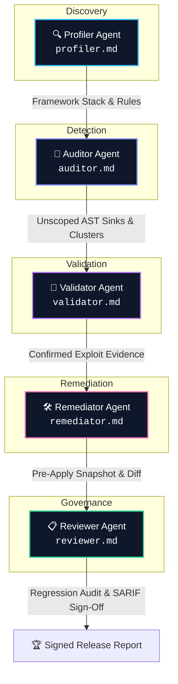

<div align="center">
  

  # TorusGuard

  **Security guardrails, governed remediation, and authorized runtime validation for AI-built web applications.**

  [](https://github.com/githubmofo/TorusGuard/releases/latest)
  [](LICENSE)
  [](schemas/)
  [](.torusguard/.manifest.json)
  [](docs/architecture/SECURITY_ARCHITECTURE.md)
</div>

---

## 💡 Executive Summary

AI coding assistants write code fast, but they often make dangerous security mistakes—like putting database keys in frontend code, skipping permission checks, or trusting raw input headers.

**TorusGuard** is an automated security co-pilot for AI-built applications. It runs directly inside your IDE (Cursor, Claude Code, Antigravity, VS Code) to:
- **Find real vulnerabilities:** Scan your codebase against 71 security rules across Python, TypeScript, and modern frameworks.
- **Confirm exploitability:** Verify whether weaknesses are truly reachable before creating noise.
- **Patch safely:** Generate and apply minimal, surgical fixes that resolve flaws without breaking existing functionality.

### 🌐 The Core Principle: The Browser-Code Truth
> **"If the browser receives it, users can inspect it."**  
> DevTools, Inspect Element, and network breakpoints cannot be blocked. TorusGuard enforces that database credentials, sensitive business logic, and authorization checks must always live safely on the server.

---

## 🔄 The 7-Stage Closed-Loop Finding Lifecycle

Every candidate vulnerability transitions through an auditable, deterministic state machine:

```mermaid
flowchart LR
    A["1. Detect<br><code>/torusguard audit</code>"] --> B["2. Classify<br>AST Line Hashing"]
    B --> C["3. Verify<br><code>verify / web-validate</code>"]
    C --> D["4. Remediate<br><code>/torusguard harden</code>"]
    D --> E["5. Apply<br><code>/torusguard apply</code>"]
    E --> F["6. Recheck<br><code>/torusguard recheck</code>"]
    F --> G["7. Report<br><code>/torusguard report</code>"]

    style A fill:#1e293b,stroke:#3b82f6,stroke-width:2px,color:#fff
    style B fill:#1e293b,stroke:#6366f1,stroke-width:2px,color:#fff
    style C fill:#1e293b,stroke:#8b5cf6,stroke-width:2px,color:#fff
    style D fill:#1e293b,stroke:#ec4899,stroke-width:2px,color:#fff
    style E fill:#1e293b,stroke:#f59e0b,stroke-width:2px,color:#fff
    style F fill:#1e293b,stroke:#10b981,stroke-width:2px,color:#fff
    style G fill:#1e293b,stroke:#06b6d4,stroke-width:2px,color:#fff
```



1. **Detect (`/torusguard audit`):** Scans source code, manifests, and configurations against 64 canonical security rules.
2. **Classify:** Computes line-shift invariant `primaryLocationLineHash` fingerprints and collapses repeated alerts into systemic root-cause clusters.
3. **Verify (`/torusguard verify` / `web-validate` / `exploit-check`):** Validates evidence quality across a 5-factor rubric and executes bounded HTTP/browser probes.
4. **Remediate (`/torusguard harden`):** Generates self-contained 4-artifact Remediation Bundles with framework-idiomatic Before/After fixes.
5. **Apply (`/torusguard apply`):** Employs the **Ponytail engine** to apply surgical, minimal patches governed by strict line churn limits ($\le 35$ additions, $\le 25$ deletions).
6. **Recheck (`/torusguard recheck`):** Scopes differential re-audits strictly to modified files, asserting `Confirmed Fixed` or detecting regressions.
7. **Report & Archive (`/torusguard report`):** Emits signed executive markdown reports and exports OASIS-compliant SARIF v2.1.0 logs for CI/CD.

---

## ⚡ The TorusGuard Command Engine

TorusGuard operates on a high-performance **Two-Tier Command Engine** designed for AI-assisted development environments. It unifies interactive slash commands with specialized domain knowledge while preserving maximum context window capacity:

1. **Interactive Workflows (`.torusguard/workflows/<cmd>.md`):**  
   Structured execution playbooks triggered by slash commands (e.g., `/torusguard audit`). Each workflow enforces pre-flight context validation, provides situational decision matrices, executes deterministic CLI commands, and enforces strict failure recovery rules.
2. **Specialist Skills (`.torusguard/skills/torusguard-<cmd>/SKILL.md`):**  
   Focused domain manuals that are lazy-loaded on demand. Instead of polluting the AI's context with a monolithic security handbook, only the exact AST sinks, non-destructive canaries, and confidence scoring formulas relevant to the active command are loaded into memory.

```text
User / AI types Slash Command (e.g. /torusguard audit)
                  │
                  ▼
  [.torusguard/workflows/audit.md]          ← Interactive Execution Playbook
  ├── 1. Formal Metadata & Role Contract (agent, required-skills, bound scripts)
  ├── 2. Mandatory Pre-Flight Context Inspection (disk state, authorization TTL)
  ├── 3. "When to Use" Decision Table (situational triggers)
  ├── 4. Deterministic Phase-by-Phase CLI Invocations
  ├── 5. Failure Recovery & Cascade Rules (3-retry limit, HALT vs CONTINUE)
  ├── 6. Strict Safety & Hallucination Boundaries
  └── 7. Standardized Output Cards & Next Step Routing
                  │
                  ▼ Lazy-Loads Matching Specialist Skill
  [.torusguard/skills/torusguard-audit/SKILL.md]  ← Focused Domain Manual
  ├── 1. Framework AST Sinks & Regex Indicators (Python & TypeScript)
  ├── 2. Root-Cause Clustering Algorithms
  ├── 3. 5-Factor 0–100 Confidence Scoring Rubric
  └── 4. Non-Destructive Probe Safety Boundaries
```

---

## 🚀 Quick Start

### 1. Installation into Your Project

TorusGuard supports two seamless, zero-friction installation paths:

#### Option A: Install via Open Agent Skills CLI (Recommended for AI IDEs)
Add TorusGuard directly into Cursor, Antigravity, Claude Code, Cline, or Gemini CLI:
```bash
npx skills add https://github.com/githubmofo/TorusGuard --skill "torusguard"
```
Then inside your AI IDE chat, run:
```bash
/torusguard init
```
*The bundled `bootstrap.py` autonomously unpacks the complete `.torusguard/` workspace offline, detects your project stack, and activates tailored security rules in milliseconds.*

#### Option B: Standalone Terminal Installer (Zero Dependencies)
Run directly from your project terminal:
```bash
# Directly from repository clone:
python install.py

# Or via remote one-liner:
curl -sSL https://raw.githubusercontent.com/githubmofo/TorusGuard/main/install.py | python
```

---

### 2. Core Commands

| Command | What It Does | When to Use | Changes Code? |
|---|---|---|:---:|
| `/torusguard init` | Sets up TorusGuard, detects your framework, and enables matching rules. | First-time setup on any project | No |
| `/torusguard authorize` | Sets approved target domains, allowed URLs, and scan limits for safe testing. | Before testing live web/API routes | No |
| `/torusguard audit` | Scans source code for security flaws and groups repeated issues by root cause. | Regular development & PR reviews | No |
| `/torusguard verify` | Validates code paths and scores findings from 0–100 to eliminate false alarms. | Triaging & prioritizing audit findings | No |
| `/torusguard web-validate` | Sends safe, non-destructive HTTP requests to test if endpoints leak sensitive data. | Checking a local or staging server | No |
| `/torusguard exploit-check` | Tests if high-risk vulnerabilities (like CSRF or IDOR) are actually exploitable. | Confirming flaws before writing fixes | No |
| `/torusguard harden` | Prepares a step-by-step fix plan and surgical diff within safe line-change limits. | Planning a fix for an identified issue | No |
| `/torusguard apply` | Applies the minimal patch to your code with an automatic rollback backup. | Applying an approved code fix | Yes |
| `/torusguard recheck` | Re-scans only the modified lines to verify the fix works with zero regressions. | Right after applying any fix | No |
| `/torusguard report` | Generates an executive summary and exports SARIF data for GitHub security tabs. | CI/CD builds and release audits | No |
| `/torusguard status` | Shows current security posture, active rules, and recent run history. | Checking project security health | No |
| `/torusguard full` | Runs the full end-to-end security cycle (audit → verify → fix → recheck). | Complete repository security pass | Yes |

---

## 🎯 Specialist Agents & Authority Separation

To eliminate AI confirmation bias, security responsibilities are divided across 5 formal roles:



1. **Profiler (`profiler.md`)**: Inspects repository manifests, maps route structures, and activates tailored rules. *Authority: Read-only.*
2. **Auditor (`auditor.md`)**: Analyzes ASTs, calculates invariant line hashes, and groups systemic clusters. *Authority: Read-only.*
3. **Validator (`validator.md`)**: Evaluates evidence sufficiency, probes live routes within `scope.json`, and confirms exploitability. *Authority: Bounded network read-only.*
4. **Remediator (`remediator.md`)**: Formulates minimal unified diffs under Ponytail Protocol limits. *Authority: Requires Human Gate approval for disk writes.*
5. **Reviewer (`reviewer.md`)**: Differentially re-scans modified lines, asserts closure, detects regressions, and exports SARIF logs. *Authority: Independent audit verification.*

---

## 📊 Objective 0–100 Confidence Scoring Rubric

TorusGuard scores finding confidence using an objective 5-factor mathematical model (Max: 100 points):

| Dimension | Max Pts | Evaluation Criteria |
| :--- | :---: | :--- |
| **1. Evidence Quality** | **35** | **35 pts**: Exact AST source match with untrusted data flow into sensitive sink.<br>**20 pts**: Regex/pattern heuristic match with confirmed code presence.<br>**10 pts**: Indirect indicator (outdated package or suspicious import). |
| **2. Reproduction Success** | **25** | **25 pts**: Deterministic unit test or runtime trace reproduces the flaw.<br>**15 pts**: Partial trace or simulated execution path confirmed.<br>**0 pts**: Purely static hypothesis without reproduction. |
| **3. Independent Confirmations** | **15** | **15 pts**: Flaw pattern corroborated across 3+ independent source files.<br>**10 pts**: Flaw pattern corroborated across 2 independent files.<br>**5 pts**: Single isolated occurrence. |
| **4. Environmental Clarity** | **15** | **15 pts**: Direct, clearly mapped framework route with explicit controller.<br>**8 pts**: Minor middleware indirection; deployment context partially clear.<br>**0 pts**: Dynamic routing, custom lambdas, or unknown gateway filters. |
| **5. Manual Review Status** | **10** | **10 pts**: Security engineer has explicitly reviewed and verified finding.<br>**5 pts**: Agent consensus / secondary review completed.<br>**0 pts**: Automated first-pass check only. |

### Confidence Classification Bands
- **`90–100` (`Confirmed`)**: Indisputable proof with code citation or deterministic trace.
- **`70–89` (`High Confidence`)**: Strong direct indicators; prioritized remediation.
- **`50–69` (`Medium Confidence`)**: Probable flaw; runtime confirmation recommended.
- **`< 50` (`Needs Review`)**: Architectural ambiguity or potential delegated control.

---

## ✂️ The Ponytail Protocol (Governed Patch Limits)

To prevent code bloat, hallucinated rewrites, and accidental regressions, TorusGuard enforces strict line churn limits:

```
┌────────────────────────────────────────────────────────┐
│               PONYTAIL PROTOCOL BOUNDS                 │
├────────────────────────────────────────────────────────┤
│ • Additions: <= 35 lines per bundle                    │
│ • Deletions: <= 25 lines per bundle                    │
│ • Zero full-file rewrites                              │
│ • Mandatory pre-apply rollback backup in pre_apply/    │
│ • Preserve existing error handling and public APIs     │
└────────────────────────────────────────────────────────┘
```

Any fix exceeding these bounds is partitioned into sequential sub-bundles or flagged as `Requires Manual Architectural Refactor`.

---

## 🧪 Comprehensive Automated Validation Suite

TorusGuard is hardened by **9 automated test suites** executing **381 automated test assertions with a 100% pass rate**:

| Suite Name | File | Checks | Status |
| :--- | :--- | :---: | :---: |
| **Workflows & Skills Suite** | `harness/validate_v0_9_2_workflows_and_skills.py` | 35 | **PASS (100%)** |
| **Manifest Integrity Verifier** | `.torusguard/scripts/manifest_builder.py --check` | 88 | **PASS (100%)** |
| **Installer Simulation Suite** | `harness/validate_v0_9_1_installer.py` | 14 | **PASS (100%)** |
| **Granular Skills Suite** | `harness/validate_v0_9_0_skills.py` | 53 | **PASS (100%)** |
| **Core Validation Harness** | `harness/runner.py` | 75 | **PASS (100%)** |
| **Senior QA Runtime Suite** | `harness/validate_v0_7_0_runtime.py` | 67 | **PASS (100%)** |
| **v0.8.0 Part 1 Foundation** | `harness/validate_v0_8_0_part1.py` | 11 | **PASS (100%)** |
| **v0.8.0 Part 2 Workflows & Agents** | `harness/validate_v0_8_0_part2.py` | 20 | **PASS (100%)** |
| **v0.8.0 Part 3 Scripts & References** | `harness/validate_v0_8_0_part3.py` | 18 | **PASS (100%)** |

---

## 🛡️ Supported Stacks & Frameworks

### 🐍 Python Ecosystem
- **[Django Guide](.torusguard/references/django-security.md):** Settings, CSRF, ORM queries, ModelForms, object ownership, and async coroutines (`aget()`).
- **[Django REST Framework Guide](.torusguard/references/drf-security.md):** Default permissions, ViewSets, serializers, throttles, and pagination.
- **[FastAPI Guide](.torusguard/references/fastapi-security.md):** Pydantic v2 schemas, `Annotated` dependency injection, SSRF boundaries, and HMAC webhooks.
- **[Flask Guide](.torusguard/references/flask-security.md):** Factory patterns, secure session cookies, `CSRFProtect`, and path traversal storage limits.
- **[SQLAlchemy Guide](.torusguard/references/sqlalchemy-security.md):** Bound query parameters, 2.0 `select()` statements, and multi-tenant isolation.

### 🌐 JavaScript & TypeScript Ecosystem
- **[React + Vite Guide](.torusguard/references/react-vite-security.md):** Frontend env variable boundaries, build artifact leakage, and source maps.
- **[Next.js Guide](.torusguard/references/nextjs-security.md):** App Router / Pages Router security, Server Components, and Server Action authorization (`"use server"`).
- **[Express Guide](.torusguard/references/express-security.md):** Helmet middleware, parameter validation, rate limiting, and CORS headers.
- **[Supabase Guide](.torusguard/references/supabase-security.md):** Row-Level Security (RLS), service-role key isolation, and secure client queries.
- **[Firebase Guide](.torusguard/references/firebase-security.md):** Firestore Security Rules, client SDK boundaries, and privileged admin tasks.

---

## 📂 Run Folder System (`RunManager`)

Every execution is completely self-contained within an isolated directory (`.torusguard/runs/<run-id>/`):

```text
.torusguard/runs/run-20260902-120000-audit/
├── manifest.json            # Execution metadata, git commit hash, and summary counts
├── summary.md               # Executive summary and root-cause cluster matrix
├── findings.md              # Detailed finding cards with code excerpts and remediation
├── web-validation.md        # HTTP interaction log and endpoint status codes
├── requests.json            # Redacted request payloads (tokens/passwords masked)
├── responses.json           # Redacted response payloads
├── session-notes.md         # Active session cookies and tenant context
├── replay.json              # Deterministic replay trace for regression verification
├── results.sarif            # OASIS SARIF v2.1.0 export for CI/CD & GitHub Code Scanning
└── patches/                 # Formulated remediation bundles (diffs & pre-apply snapshots)
```

---

## 📋 Project Documentation & Governance

| Document | Purpose |
|---|---|
| 🛡️ **[Security Policy](SECURITY.md)** | Responsible disclosure guidelines, supported versions, and release gate criteria |
| 👥 **[Maintainer Guide](MAINTAINERS.md)** | Account security, branch protections, supply-chain hygiene, and cryptographic release signing |
| 🏗️ **[System Architecture](.torusguard/ARCHITECTURE.md)** | Lifecycle flowcharts, authority separation, scoring rubric, and directory topology |
| 🗺️ **[Development Roadmap](docs/roadmap.md)** | Past releases, active milestones, and future horizons |
| 📝 **[Changelog](CHANGELOG.md)** | Complete release history following Keep a Changelog |

---

## 🚫 What TorusGuard Deliberately Is Not

To maintain technical honesty and safety:
- **Not a weaponized offensive pentest tool:** TorusGuard strictly avoids brute-forcing, denial-of-service, memory corruption, and autonomous lateral movement.
- **Not an unbounded vulnerability scanner:** Probes are bounded, single-step assertions against authorized endpoints with strict request budgets.
- **Not client-side DRM:** Browser-delivered JavaScript cannot be hidden from DevTools; security must reside on the backend.
- **Not an "unhackable" guarantee:** Security is continuous; TorusGuard provides structured guardrails, not absolute immunity.

---

## 👥 Author & Community

- **Creator & Lead Maintainer:** **Jenish Lad** ([@githubmofo](https://github.com/githubmofo))
- **Contributing:** Please review [CONTRIBUTING.md](CONTRIBUTING.md) and [CODE_OF_CONDUCT.md](CODE_OF_CONDUCT.md) before opening a pull request.
- **Security Inquiries:** Please follow our [Security Policy](SECURITY.md) for private vulnerability reporting.
- **License:** Open source under the [MIT License](LICENSE).
