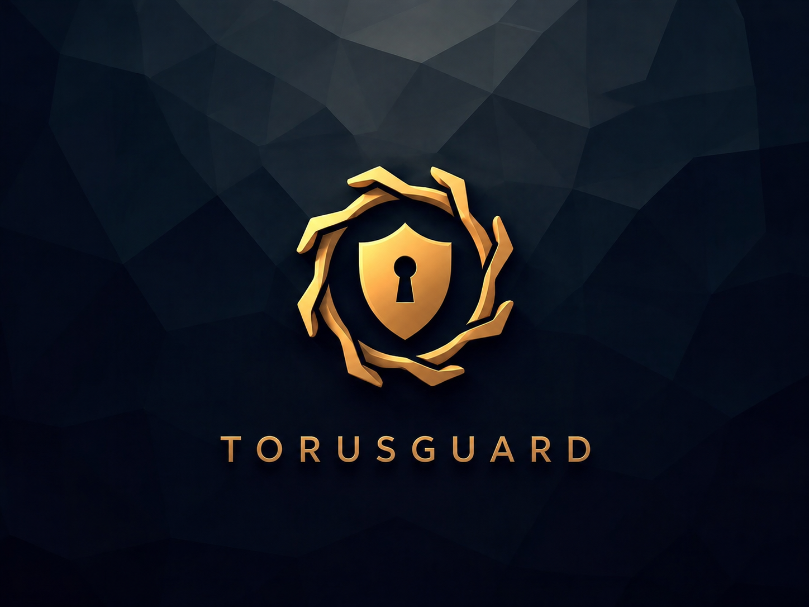

<div align="center">
  
</div>

# TorusGuard

**Security guardrails for AI-built web applications.**

TorusGuard is a Markdown-first, portable AI-agent skill that helps developers audit and harden AI-built web applications. It provides structured rules, references, and remediation workflows across frontend database isolation, secrets management, input validation, authentication, rate limits, SSRF, webhooks, and production deployment safety.

---

## Why This Exists

AI code generators accelerate product development, but they can easily introduce critical security oversights—such as client-side database queries, exposed API secrets, missing authorization checks, or unvalidated outbound requests. Security decisions still require structure, boundaries, and systematic verification. TorusGuard gives AI coding agents the context and guardrails needed to build and deploy securely.

### Core Principle: The Browser-Code Truth
> **If the browser receives it, users can inspect it.**  
> DevTools, Inspect Element, and the Sources tab cannot be blocked. TorusGuard enforces that database credentials, sensitive business logic, and authorization decisions must always remain on trusted server-side code.

---

## Key Features

- **Markdown-First & Agent-Portable:** Works out-of-the-box in Cursor, Antigravity, Claude Code, Cline, Codex, Gemini CLI, and other agent environments without requiring npm dependencies or compilation.
- **Framework-Aware Security Catalog:** 60+ structured security rules across secrets, database access, input validation, authentication, rate limits, SSRF, CSRF, webhooks, GraphQL, WebSockets, and supply-chain dependencies.
- **Multi-Ecosystem Support:** Deep, framework-idiomatic security guidance for JavaScript/TypeScript (Node.js, Express, React, Vite, Next.js) and Python (Django, DRF, FastAPI, Flask, SQLAlchemy).
- **Human-First Findings:** Generates clear, readable audit reports featuring severity levels, plain-English risk explanations, and concrete before/after code snippets.
- **Evidence-Confidence System:** Distinguishes verified code vulnerabilities from architecture-dependent manual review items.
- **Least-Invasive Hardening:** Modifies only code directly tied to verified findings while preserving business logic and application routes.

---

## Current Release: v0.4.0 (Python Platform Security)

TorusGuard v0.4.0 introduces tested framework-specific guidance for Python while maintaining framework-agnostic universal rules:

- **Django & DRF:** Production settings (`manage.py check --deploy`), CSRF middleware, ORM safety, ModelForm mass assignment, ViewSet queryset scoping, and throttling.
- **FastAPI & Pydantic:** Request schema validation (`extra="forbid"`), dependency-based auth, object ownership scoping, outbound SSRF filtering, and raw HMAC webhook validation.
- **Flask & Jinja:** Application factory configuration, session cookie security, Flask-WTF CSRF defense, and Werkzeug file upload safety.
- **SQLAlchemy:** Parameterized queries with `text(:param)` bindings, multi-tenant query scoping, and bulk update protection.
- **Python Supply Chain:** Virtual environment isolation, reproducible lockfiles (`poetry.lock`, `uv.lock`), `pip-audit` integration, and pinned GitHub Actions.

*Read the complete release notes in [docs/releases/v0.4.0.md](docs/releases/v0.4.0.md).*

---

## Supported Platforms & Frameworks

### 🐍 Python (v0.4.0)
* **[Django Guide](guides/python/django.md)** — Settings, CSRF, ORM queries, ModelForms, object ownership.
* **[Django REST Framework Guide](guides/python/django-rest-framework.md)** — Default permissions, ViewSets, serializers, throttles, pagination.
* **[FastAPI Guide](guides/python/fastapi.md)** — Pydantic v2 schemas, dependencies, outbound SSRF checks, HMAC webhooks.
* **[Flask Guide](guides/python/flask.md)** — Factory setup, session cookies, CSRFProtect, Werkzeug upload boundaries.
* **[SQLAlchemy Guide](guides/python/sqlalchemy.md)** — Parameterized `text()` bindings, query scoping, update allowlists.
* **[Python Dependencies & CI/CD](guides/python/python-dependencies.md)** — Reproducible lockfiles, `pip-audit`, GitHub Actions pinning.
* **[Python Rule Mapping Matrix](docs/python-rule-mapping.md)** — Framework implementation matrix for universal rule IDs.

### 🌐 JavaScript & TypeScript
* **[React + Vite Guide](guides/react-vite-security.md)** — Frontend environment variables, build artifact leakage, source maps.
* **[Next.js Guide](guides/nextjs-security.md)** — App Router / Pages Router security, Server Components, API routes.
* **[Node.js + Express Guide](guides/express-security.md)** — Middleware hardening, CORS, Helmet, session cookies, rate limiting.
* **[Supabase Guide](guides/supabase-security.md)** — Row-Level Security (RLS), service role key isolation, database policies.
* **[Firebase Guide](guides/firebase-security.md)** — Firestore Security Rules, client SDK boundaries, privileged admin tasks.

---

## Quick Start

### 1. Installation
Install TorusGuard into your AI coding tool using the open `skills` CLI:

```bash
npx skills add https://github.com/githubmofo/TorusGuard --skill "torusguard"
```

### 2. Workflow
Once installed, interact with your AI assistant in chat using the `/torusguard` command:

1. **Initialize Project Security Baseline:**
   ```text
   /torusguard init
   ```
2. **Audit Codebase (Read-Only Scan):**
   ```text
   /torusguard audit
   ```
3. **Harden & Apply Fixes:**
   ```text
   /torusguard harden
   ```
4. **Pre-Flight Deployment Verification:**
   ```text
   /torusguard verify
   ```

---

## Core Commands

| Command | Purpose | Modifies Code? |
|---|---|:---:|
| `/torusguard init` | Generates a project `SECURITY.md` and readable threat model. | ❌ Docs only |
| `/torusguard audit` | Scans repository against TorusGuard rules and outputs a structured report. | ❌ No |
| `/torusguard harden` | Applies least-invasive, safe fixes for confirmed findings from the audit report. | ✅ Yes |
| `/torusguard check <area>` | Audits a single rule category (e.g., `django`, `fastapi`, `auth`, `ssrf`). | ❌ No |
| `/torusguard verify` | Runs a production pre-flight deployment verification checklist. | ❌ No |

**Supported Check Areas:** `secrets`, `database`, `input`, `auth`, `rate-limit`, `client`, `platform`, `ssrf`, `business-logic`, `csrf`, `webhook`, `graphql`, `websocket`, `supply-chain`, `cache`, `django`, `drf`, `fastapi`, `flask`, `sqlalchemy`.

---

## Validation Summary

TorusGuard has been locally validated against educational fixtures and real-world architectures:

1. **[OWASP NodeGoat](docs/validation/nodegoat-v0.3.0-validation.md):** An intentionally vulnerable Node.js / Express / MongoDB training application.
2. **[Django Reference](docs/validation/django-v0.4.0-validation.md):** Validation of settings, IDOR, ModelForms, and caching.
3. **[DRF API Reference](docs/validation/drf-v0.4.0-validation.md):** ViewSet scoping, serializer mass assignment, throttling, and pagination caps.
4. **[FastAPI Reference](docs/validation/fastapi-v0.4.0-validation.md):** Pydantic schemas, outbound SSRF filtering, and HMAC webhook verification.
5. **[Flask Reference](docs/validation/flask-v0.4.0-validation.md):** Secret keys, CSRF protection, and file upload boundaries.
6. **[Cross-Platform Rule Parity](docs/validation/cross-platform-rule-parity.md):** Architectural comparison across Node.js and Python ecosystems.
7. **[Real-World Validation Records](docs/validation/real-world/README.md):** Maintainer-authorized codebase evaluations across Django, FastAPI, Flask, and Monorepo architectures.

### Evidence-Confidence Classification
TorusGuard classifies every audit finding by confidence level:
- **`Confirmed`:** Directly observed in source code or configuration.
- **`Likely`:** Strong static indicators; requires runtime or deployment environment confirmation.
- **`Manual Review`:** Architectural or business-context decisions that static analysis cannot reliably determine.
- **`Informational`:** Hardening advice and defensive best practices.

*Read the complete validation summary in [docs/validation/README.md](docs/validation/README.md).*

---

## What TorusGuard Is Not

To maintain technical honesty and clear boundaries:
- **Not an automated vulnerability scanner:** TorusGuard is a contextual guidance framework for developers and AI agents. It does not replace dynamic application security testing (DAST) or static binary analyzers.
- **Not a penetration-testing replacement:** It elevates baseline security hygiene but cannot replace authorized professional penetration testing.
- **Not an "unhackable" guarantee:** No tool can guarantee 100% security.
- **Not a client-side DRM:** Browser-delivered JavaScript cannot be hidden from DevTools; security must reside on the backend.

---

## Project Structure Overview

```text
TorusGuard/
├── skills/torusguard/       # Portable skill instructions and reference modules
├── rules/                   # 60+ documented security rules across 14 categories
├── templates/               # Standardized templates (SECURITY, audit, pre-flight)
├── guides/                  # Stack-specific implementation guides (Node.js & Python)
├── examples/                # Educational vulnerable & hardened reference applications
├── docs/                    
│   ├── releases/            # Release notes (v0.2.0, v0.3.0, v0.4.0)
│   ├── python-rule-mapping.md # Universal rule mapping across Python stacks
│   ├── validation/          # Official validation reports & real-world records
│   ├── roadmap.md           # Project roadmap & milestones
│   └── demo.md              # Sample audit walkthrough & finding format
└── tests/                   # Test fixtures and rule validation matrices
```

---

## Roadmap

- **v0.1.0 (Released):** Initial core skill and reference modules.
- **v0.2.0 (Released):** Baseline 25-rule catalog, templates, guides, and reference apps.
- **v0.3.0 (Released):** Advanced Web and API Security (SSRF, Webhooks, GraphQL, WebSockets, Cache).
- **v0.4.0 (Released):** Python Platform Security (Django, DRF, FastAPI, Flask, SQLAlchemy, Dependencies).
- **v0.5.0 (Next):** Serverless & Edge Compute Security (Cloudflare Workers, Vercel Edge, AWS Lambda).
- **v1.0.0 (Planned):** Full rule freeze, automated catalog linter, and multi-framework expansion.

*See [docs/roadmap.md](docs/roadmap.md) for full milestone details.*

---

## Contributing

Contributions are welcome! You can help by proposing new security rules, improving existing guidance, reporting false positives, or adding framework implementation guides.

Please review [CONTRIBUTING.md](CONTRIBUTING.md) and our [Code of Conduct](CODE_OF_CONDUCT.md) before submitting an issue or pull request.

---

## Security

If you discover a security issue within the TorusGuard repository or its skill definitions, please review our [Security Policy](SECURITY.md) for private responsible disclosure instructions. Do not file public GitHub issues for security vulnerabilities.

---

## License

TorusGuard is licensed under the [MIT License](LICENSE).  
Copyright (c) 2026 Jenish Lad.
