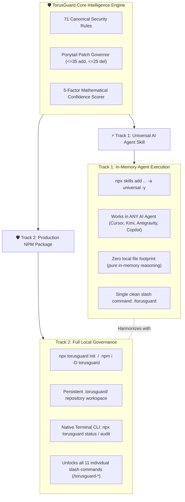
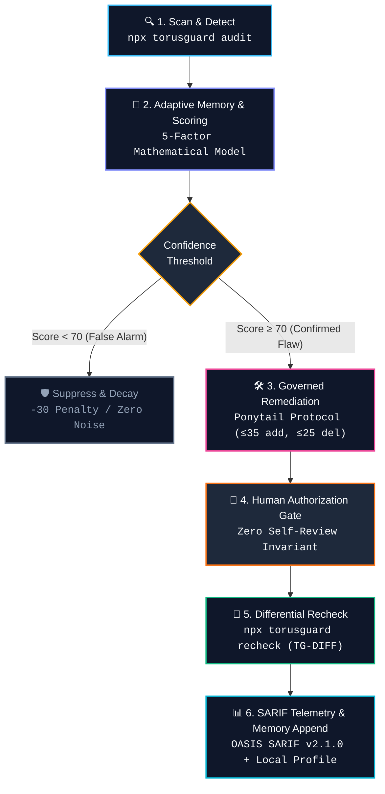

<div align="center">
  

  # TorusGuard

  **Autonomous Security Guardrails, Governed Remediation, and Authorized Runtime Validation for AI-Built Web Applications.**

  [](https://www.npmjs.com/package/torusguard)
  [](https://github.com/githubmofo/TorusGuard/pkgs/npm/torusguard)
  [](https://github.com/githubmofo/TorusGuard/releases/latest)
  [](LICENSE)
  [](https://python.org)
  [](https://nodejs.org)
  [](.torusguard/schemas/)
  [](.torusguard/.manifest.json)
  [](docs/architecture/SECURITY_ARCHITECTURE.md)
</div>

---

## 💡 Executive Summary

Modern AI coding agents generate full-stack web applications at unprecedented velocity. However, they consistently introduce critical security anti-patterns: leaking service-role credentials to browser bundles, omitting multi-tenant query boundaries, disabling CSRF defenses, or granting unconstrained tool permissions.

**TorusGuard** is an autonomous application security co-pilot specifically engineered for AI-built software. It integrates natively into your development environment (Antigravity, Cursor, Claude Code, VS Code Copilot, Kimi, Windsurf, Cline) to deliver:

1. **Deterministic Static Auditing:** Scan Python and TypeScript source code using 71 specialized security rules across 11 families.
2. **Authorized Runtime Validation:** Execute bounded, non-destructive HTTP probes to eliminate false alarms and confirm real exploitability.
3. **Governed Minimal Remediation:** Generate surgical, reviewable patches constrained by the **Ponytail Protocol** ($\le 35$ additions, $\le 25$ deletions) to eliminate unintended regressions.
4. **Open Industry Standards:** Emit OASIS SARIF v2.1.0 telemetry with stable AST line-shift invariant hashes for native GitHub Code Scanning integration.

### 🌐 The Core Invariant: The Browser-Code Truth
> **"If the browser receives it, users can inspect it."**  
> Frontend environment variables, JavaScript network bundles, and React Server Action payloads cannot conceal secrets. TorusGuard strictly enforces that database credentials, private API keys, and authorization barriers remain exclusively on trusted server boundaries.

---

## ⚡ Dual-Track Distribution Architecture

TorusGuard features a decoupled **Dual-Track Architecture** allowing teams to choose between zero-setup in-memory agent intelligence and full repository governance:



### Track Comparison Matrix

| Capability | ⚡ Track 1: Universal AI Agent Skill | 🛡️ Track 2: Production NPM Package |
| :--- | :--- | :--- |
| **Primary Command** | `npx skills add https://github.com/githubmofo/TorusGuard -a universal -y` | `npx torusguard init` or `npm install -D torusguard` |
| **Supported Agents** | All AI Agents (Antigravity, Cursor, Claude Code, Copilot, Kimi, Windsurf) | Any Node/Python repository, GitHub Actions CI/CD, Antigravity, Cursor |
| **Disk Footprint** | In-memory agent context (`.agents/skills/torusguard/` only) | Complete local workspace (`.torusguard/` with config, rules, schemas, runs) |
| **Slash Commands** | Single master dispatcher: `/torusguard` | Full 11-command palette: `/torusguard-audit`, `/torusguard-apply`, etc. |
| **Terminal CLI** | None (AI chat-driven) | Native terminal runner: `npx torusguard status`, `npx torusguard audit` |
| **Prerequisites** | None (pure AI agent execution) | Node.js 18+ (and Python 3.10+ for native verification scripts) |
| **Best For** | Instant zero-setup security advice in chat | Production repositories, team compliance, CI/CD SARIF exports |

---

## 🚀 Installation & Quick Start

### Track 1: Universal AI Agent Skill (Zero Setup)
Install directly into any AI assistant adhering to the Open Agent Skills standard:
```bash
# Recommended one-liner (silent, zero-prompts, targets all IDE agents):
npx skills add https://github.com/githubmofo/TorusGuard -a universal -y
```
* **`-a universal`**: Automatically registers the skill for Antigravity, Cursor, Gemini CLI, Claude Code, VS Code Copilot, and Kimi without prompt friction.
* **`-y`**: Bypasses interactive confirmation prompts and completes in **under 2 seconds**.
* Once installed, simply type `/torusguard` in chat or ask: *"Audit this component for security flaws"*.

### Track 2: Production NPM Package (Full Governance)
Scaffold your repository with local configuration, offline scripts, and granular workflows:
```bash
# Direct runner (recommended):
npx torusguard init

# Or install as a development dependency:
npm install -D torusguard
```
* Generates the `.torusguard/` workspace directory.
* Populates your IDE command palette with all 11 individual `/torusguard-*` workflows.
* Run instant terminal checks anytime:
  ```bash
  npx torusguard status
  npx torusguard audit
  ```

### Standalone Python Installer (Alternative)
For Python-only environments, Docker containers, or air-gapped CI/CD runners:
```bash
# From cloned repository:
python install.py

# Or via remote one-liner:
curl -sSL https://raw.githubusercontent.com/githubmofo/TorusGuard/main/install.py | python
```

---

## 🔄 Autonomous Security Governance Flow

TorusGuard executes an automated, auditable closed-loop lifecycle that eliminates false alarms, prevents code destruction, and guarantees zero security regressions:



### Lifecycle Stage Breakdown

| Stage | Command | Core Activity | Invariant Guarantee |
| :---: | :--- | :--- | :--- |
| **1. Scan** | `npx torusguard audit`<br>*(or `/torusguard audit`)* | AST & regex scanning across Python & TypeScript. | Clusters duplicate alerts by root-cause identity. |
| **2. Score** | `npx torusguard verify`<br>*(or `/torusguard verify`)* | Evaluates findings via 5-factor mathematical scoring (0–100). | Suppresses false alarms (`-30` penalty) before alerting developers. |
| **3. Harden** | `/torusguard harden` | Packages a 4-artifact self-contained Remediation Bundle. | Produces framework-idiomatic fixes and rollback snapshots. |
| **4. Apply** | `/torusguard apply` | Applies patch with automated pre-apply file snapshots. | **Ponytail Protocol strictly bounded:** $\le 35$ additions, $\le 25$ deletions. |
| **5. Recheck** | `npx torusguard recheck`<br>*(or `/torusguard recheck`)* | Re-scans strictly modified files + Content-Aware Diff Guard. | Zero regression tolerance; blocks bypass markers (`# nosec`). |
| **6. Report** | `npx torusguard report`<br>*(or `/torusguard report`)* | Generates Markdown summary and OASIS SARIF v2.1.0 telemetry. | Appends run metadata to local persistent memory engine. |

---

## 🧠 Adaptive Security Memory Engine (v1.0.0 GA)

> **"Stateless security scanners forget every fix. TorusGuard learns your codebase."**

Traditional security tools repeat identical false alarms on every run. TorusGuard v1.0.0 introduces a **local-first, persistent intelligence engine** (`.torusguard/memory/`) that records every audit finding, developer remediation, and false-positive suppression directly inside your repository.

```
┌───────────────────────────────────────────────────────────────────┐
│                      Developer / AI Agent                         │
└──────────────┬─────────────────────────────────────▲──────────────┘
               │ (Executes Audit / Retest / Fix)     │ (Context <= 2k tok)
               ▼                                     │
┌───────────────────────────────────────────────────────────────────┐
│                       .torusguard/memory/                         │
│                                                                   │
│   ┌─────────────────┐             ┌───────────────────────────┐   │
│   │ events/*.json   │ ──distill──►│ patterns.json             │   │
│   │ (Raw Events)    │             │ (Multi-File Intelligence) │   │
│   └─────────────────┘             └─────────────┬─────────────┘   │
│                                                 │                 │
│   ┌─────────────────┐             ┌─────────────▼─────────────┐   │
│   │ decay.json      │             │ context.json              │   │
│   │ (90-Day TTL)    │             │ (Structured JSON Cards)   │   │
│   └─────────────────┘             └───────────────────────────┘   │
│                                                                   │
│   ┌───────────────────────────────────────────────────────────┐   │
│   │ profile.json (Project Security DNA: MTTR, Stack, Rules)   │   │
│   └───────────────────────────────────────────────────────────┘   │
└───────────────────────────────────────────────────────────────────┘
```

### 4-Tier Memory Hierarchy
1. **Tier 1: Append-Only Event Log (`events/`):** Logs 6 atomic lifecycle events (`finding_detected`, `remediation_applied`, `recheck_passed`, `recheck_regressed`, `false_positive_marked`, `manual_override`).
2. **Tier 2: Pattern Store (`patterns.json`):** Tracks recurring flaw frequencies, multi-file blast radius, and amplifies confidence up to 98% for validated fixes.
3. **Tier 3: Pre-Computed Context Cards (`context.json`):** Formats condensed, structured JSON intelligence cards within a **strict 2,000-token budget** for instant, hallucination-free injection into AI coding prompts.
4. **Tier 4: Project Security DNA (`profile.json`):** Maintains repository security posture, framework alignment, and mean-time-to-remediate (MTTR).

### Bank-Grade Local Privacy (Zero Data Leakage)
* **100% Local-First:** All intelligence is computed locally via standard-library Python without external API calls or telemetry upload.
* **Double Git Isolation:** Protected in root `.gitignore` and enforced via an internal `.torusguard/memory/.gitignore` (`*`).
* **Clean NPM Packaging:** Explicitly excluded from npm distribution tarballs (`0` memory files packed).

### Memory CLI Commands
```bash
# View active memory health, event counts, and learned patterns:
npx torusguard memory status

# Force immediate distillation of loose events into patterns and context:
npx torusguard memory distill

# Display pre-computed JSON cards ready for AI agent prompt injection:
npx torusguard memory context

# Mark a recurring false positive to suppress future alerts (-30 penalty):
npx torusguard memory suppress TG-SEC-002 src/tests/mock_auth.py

# Export or import portable memory bundles for team sharing:
npx torusguard memory export ./team-security-memory.json
npx torusguard memory import ./team-security-memory.json
```

---

## 🛡️ Core Security Invariants & Guardrails

### 1. The Ponytail Protocol (Minimal Patch Churn Bounds)
Unbounded AI code generators frequently rewrite entire files, corrupting adjacent business logic, stripping comments, or introducing syntax errors. TorusGuard strictly enforces the **Ponytail Protocol**:
* **$\le 35$ Additions** per remediation patch.
* **$\le 25$ Deletions** per remediation patch.
* **Single Responsibility:** Every patch resolves exactly one root-cause cluster without side effects.

### 2. Auditable Mathematical Confidence Scoring (0–100)
Every finding is scored before alerting developers or AI agents:
$$\text{Score} = (w_d \cdot D) + (w_e \cdot E) + (w_c \cdot C_{ast}) + \text{MemoryBoost} - P_{fp} - P_{drift}$$
* **$D$ (Detection Determinism, 30%):** Exact syntax AST pattern match vs speculative regex.
* **$E$ (Runtime Evidence, 25%):** Confirmed authorized HTTP exploitability response status.
* **$C_{ast}$ (AST Contextuality, 25%):** Direct assignment in critical execution path vs commented code.
* **$\text{MemoryBoost}$ (+10 to +15):** Amplified confidence for recurring patterns or known regressions.
* **$P_{fp}$ (False Positive Penalty, -20 to -30):** Applied when safe wrappers or user suppression rules exist.
* **$P_{drift}$ (Line Drift Penalty, up to -10):** Penalty when surrounding code context has mutated.

### 3. Stable Line-Shift Invariant Fingerprinting (`primaryLocationLineHash`)
Traditional scanners lose track of vulnerabilities when code lines shift above or below a finding. TorusGuard computes a stable SHA-256 hash across enclosing function AST scope and syntactic tokens. Findings maintain permanent tracking identity across commits and refactors.

### 4. Content-Aware Diff Line Scanner (`diff_guard.py`)
Intercepts risky patterns in unified diffs before code merges:
* **`TG-DIFF-001` (Bypass Markers):** Flags `# nosec`, `// bypass auth`, or disabled SSL (`verify=False`).
* **`TG-DIFF-002` (Credential Ingestion):** Intercepts live JWTs, Bearer tokens, or API keys in additions.
* **`TG-DIFF-003` (Tenant Stripping):** Blocks deletions that remove tenant isolation filters (`.filter(tenant=...)`).
* **`TG-DIFF-004` (Regression on Fixed Finding):** Blocks modifications that re-introduce previously fixed security flaws.

---

## 📋 Comprehensive Command & Workflow Reference

TorusGuard offers unified parity across both natural-language AI chat and terminal CLI:

| CLI Command | AI Slash Command | Primary Purpose | Code Changed? |
| :--- | :--- | :--- | :---: |
| `npx torusguard init` | `/torusguard init` | Profiles repository stack, discovers frameworks, and enables matching rules. | Yes (`.torusguard/`) |
| `npx torusguard status` | `/torusguard status` | Displays active security posture, rule catalog, and memory engine health. | No |
| `npx torusguard audit` | `/torusguard audit` | Executes static AST security scan and clusters repeated alerts by root cause. | No |
| `npx torusguard verify` | `/torusguard verify` | Computes 5-factor confidence score (0–100) and executes safe runtime checks. | No |
| *N/A (AI Chat)* | `/torusguard harden` | Formulates surgical Remediation Bundles bounded by Ponytail limits. | No |
| *N/A (AI Chat)* | `/torusguard apply` | Applies governed patches with automated pre-apply rollback snapshots. | **Yes (Patch)** |
| `npx torusguard recheck` | `/torusguard recheck` | Differential re-audit strictly on modified files to verify fix closure. | No |
| `npx torusguard report` | `/torusguard report` | Generates executive Markdown summary and exports OASIS SARIF v2.1.0 telemetry. | No |
| `npx torusguard memory` | `/torusguard memory` | Inspects, distills, suppresses, exports, or compacts persistent memory context. | Yes (`memory/`) |
| *N/A (AI Chat)* | `/torusguard full` | Orchestrates the entire 7-stage security cycle in one coordinated sequence. | **Yes (Governed)** |

---

## 🛡️ The 11 Rule Families (71 Canonical Security Rules)

TorusGuard enforces 71 production-grade rules across modern Python and TypeScript web architectures:

| Family | Focus Domain | Key Invariants Enforced |
| :--- | :--- | :--- |
| **`TG-SEC`** | Secrets & Credentials | Blocks exposed API keys, private keys, Supabase service roles, and hardcoded secrets. |
| **`TG-DB`** | Databases & ORM | Enforces parameterized queries; mandates multi-tenant isolation filters (`.filter(tenant=...)`). |
| **`TG-INPUT`** | Input Validation | Validates Pydantic/Zod boundaries; blocks path traversal and unsanitized command execution. |
| **`TG-AUTH`** | Authentication & RBAC | Requires server-side route guards, session TTLs, stops mass assignment, and prevents IDOR. |
| **`TG-CLIENT`** | Client Bundle Leaks | Intercepts server-side environment variables (`DATABASE_URL`, `STRIPE_SECRET`) in browser code. |
| **`TG-DIFF`** | Diff & PR Safety | Flags bypass comments (`# nosec`), disabled TLS, tenant filter deletion, and regressions. |
| **`TG-AGENT`** | AI Agent & MCP Tools | Enforces prompt injection boundary delimiters, sandboxes MCP tools, and restricts destructive actions. |
| **`TG-EDGE`** | Serverless & Edge | Prevents global memory leakage in V8 isolates (Cloudflare Workers) and cold-start state bleed in Lambda. |
| **`TG-SUPPLY`** | CI/CD & Supply Chain | Enforces GitHub Action SHA pinning, validates Docker secrets, and flags vulnerable dependencies. |
| **`TG-SSRF`** | Outbound Networking | Enforces HMAC verification on incoming webhooks, prevents SSRF, and blocks internal IP ranges. |
| **`TG-BIZ`** | Business Logic | Protects multi-step financial transactions, prevents race conditions, and guards numeric rounding. |

---

## 👥 Multi-Agent Authority Separation (Zero Self-Review)

To eliminate AI confirmation bias, security responsibilities are strictly separated across **5 formal roles**:

```
┌────────────────────────────────────────────────────────────────────────┐
│                        Human Authorization Gate                        │
└───────────────────────────────────▲────────────────────────────────────┘
                                    │ (Zero-Regress Sign-Off)
┌───────────────────────────────────┴────────────────────────────────────┐
│ ⚖️ Reviewer (.torusguard/agents/reviewer.md)                          │
│ Evaluates diff bounds & verifies fix closure independently             │
└───────────────────────────────────▲────────────────────────────────────┘
                                    │ (Proposes Minimal Patch)
┌───────────────────────────────────┴────────────────────────────────────┐
│ 🛠️ Remediator (.torusguard/agents/remediator.md)                       │
│ Formulates Ponytail-compliant patches (CANNOT APPROVE ITS OWN PATCH)   │
└───────────────────────────────────▲────────────────────────────────────┘
                                    │ (Validated Findings)
┌───────────────────────────────────┴────────────────────────────────────┐
│ 🧪 Validator (.torusguard/agents/validator.md)                         │
│ Executes authorized runtime HTTP probes and 5-factor scoring           │
└───────────────────────────────────▲────────────────────────────────────┘
                                    │ (Static AST Findings)
┌───────────────────────────────────┴────────────────────────────────────┐
│ 🔎 Auditor (.torusguard/agents/auditor.md)                             │
│ Performs deterministic static scanning and root-cause clustering       │
└───────────────────────────────────▲────────────────────────────────────┘
                                    │ (Discovered Stack Profile)
┌───────────────────────────────────┴────────────────────────────────────┐
│ 🔍 Profiler (.torusguard/agents/profiler.md)                           │
│ Detects frameworks, ORMs, and packages (FastAPI, Django, Next.js, etc.)│
└────────────────────────────────────────────────────────────────────────┘
```

* **Zero Self-Review Guarantee:** The agent that writes the patch (`Remediator`) is cryptographically forbidden from approving its own PR or merge.
* **Human Gate:** High-impact modifications always require developer sign-off.

---

## 🏢 Monorepo Sub-Scope Orchestration

TorusGuard natively discovers sub-projects in modern monorepos (Turborepo, pnpm workspaces, npm/yarn workspaces):
* Profiles backend services (FastAPI/Django) and frontend applications (Next.js/React) independently.
* Scan a specific workspace package:
  ```bash
  npx torusguard audit --target apps/api
  ```

---

## 🚀 GitHub Actions CI/CD Integration

Integrate TorusGuard directly into GitHub Actions to scan pull requests and export OASIS SARIF v2.1.0 to GitHub Advanced Security:

```yaml
name: TorusGuard Security Scan

on:
  push:
    branches: [main]
  pull_request:
    branches: [main]

jobs:
  security-audit:
    runs-on: ubuntu-latest
    steps:
      - name: Checkout Code
        uses: actions/checkout@v4

      - name: Setup Node.js
        uses: actions/setup-node@v4
        with:
          node-version: 18

      - name: Setup Python
        uses: actions/setup-python@v5
        with:
          python-version: '3.11'

      - name: Initialize TorusGuard Workspace
        run: npx torusguard init --force

      - name: Execute Security Audit
        run: npx torusguard audit

      - name: Generate SARIF Telemetry
        run: npx torusguard report

      - name: Upload SARIF to GitHub Code Scanning
        uses: github/codeql-action/upload-sarif@v3
        with:
          sarif_file: .torusguard/runs/latest/report.sarif
        if: always()
```

---

## 🧪 Rigorous Quality Verification (12/12 Test Suites Passed)

TorusGuard enforces strict testing standards with **100% pass rate** across 12 comprehensive validation suites:

| Test Suite | Scope & Target | Status |
| :--- | :--- | :---: |
| [`validate_v1_0_0_memory.py`](file:///c:/Users/Admin/Desktop/TorusGuard/harness/validate_v1_0_0_memory.py) | Scaffolding, 6 event types, distillation, token budgets, decay, export/import, diff guard | ✅ **PASS (11/11)** |
| [`runner.py`](file:///c:/Users/Admin/Desktop/TorusGuard/harness/runner.py) | 71 rules, formal schemas, confidence model, differential fixtures, SARIF v2.1.0 | ✅ **PASS (75/75)** |
| [`validate_v0_9_2_dual_track.py`](file:///c:/Users/Admin/Desktop/TorusGuard/harness/validate_v0_9_2_dual_track.py) | Dual-track distribution, standalone skill, strict token budgets (1,000–1,500) | ✅ **PASS** |
| [`validate_v0_9_2_diff_and_monorepo.py`](file:///c:/Users/Admin/Desktop/TorusGuard/harness/validate_v0_9_2_diff_and_monorepo.py) | Content-aware diff line scanner & monorepo boundary detector | ✅ **PASS** |
| [`validate_v0_9_2_workflows_and_skills.py`](file:///c:/Users/Admin/Desktop/TorusGuard/harness/validate_v0_9_2_workflows_and_skills.py) | 11 workflows, 12 specialist skills, payload mirror synchronization | ✅ **PASS** |
| [`validate_v0_9_1_installer.py`](file:///c:/Users/Admin/Desktop/TorusGuard/harness/validate_v0_9_1_installer.py) | Autonomous bootstrapping, framework detection, and standalone installer | ✅ **PASS** |
| [`validate_v0_9_0_skills.py`](file:///c:/Users/Admin/Desktop/TorusGuard/harness/validate_v0_9_0_skills.py) | Skill structure, YAML frontmatter validation, strict line budgets | ✅ **PASS** |
| [`validate_v0_7_0_runtime.py`](file:///c:/Users/Admin/Desktop/TorusGuard/harness/validate_v0_7_0_runtime.py) | Authorized runtime HTTP validation, safety gates, replay engine | ✅ **PASS** |
| [`manifest_builder.py --check`](file:///c:/Users/Admin/Desktop/TorusGuard/.torusguard/scripts/manifest_builder.py) | Cryptographic SHA-256 integrity verification across all 98 templates | ✅ **PASS (98/98)** |
| [`validate_v0_8_0_part1.py`](file:///c:/Users/Admin/Desktop/TorusGuard/harness/validate_v0_8_0_part1.py) | Config validation, schemas, active rules | ✅ **PASS** |
| [`validate_v0_8_0_part2.py`](file:///c:/Users/Admin/Desktop/TorusGuard/harness/validate_v0_8_0_part2.py) | 5 agents, 11 workflows, 4 templates | ✅ **PASS** |
| [`validate_v0_8_0_part3.py`](file:///c:/Users/Admin/Desktop/TorusGuard/harness/validate_v0_8_0_part3.py) | Python runtime scripts, 10 framework hardening guides | ✅ **PASS** |

---

## 📄 License & Community

TorusGuard is open-source software licensed under the [MIT License](LICENSE).

* **Author:** Jenish Lad ([@githubmofo](https://github.com/githubmofo))
* **Repository:** [https://github.com/githubmofo/TorusGuard](https://github.com/githubmofo/TorusGuard)
* **NPM Package:** [https://www.npmjs.com/package/torusguard](https://www.npmjs.com/package/torusguard)
* **GitHub Packages:** [https://github.com/githubmofo/TorusGuard/pkgs/npm/torusguard](https://github.com/githubmofo/TorusGuard/pkgs/npm/torusguard)
* **Bug Tracker:** [https://github.com/githubmofo/TorusGuard/issues](https://github.com/githubmofo/TorusGuard/issues)
* **Security Policy:** [SECURITY.md](SECURITY.md)
* **Contributing Guidelines:** [CONTRIBUTING.md](CONTRIBUTING.md)
* **Maintainer Hygiene:** [MAINTAINERS.md](MAINTAINERS.md)

