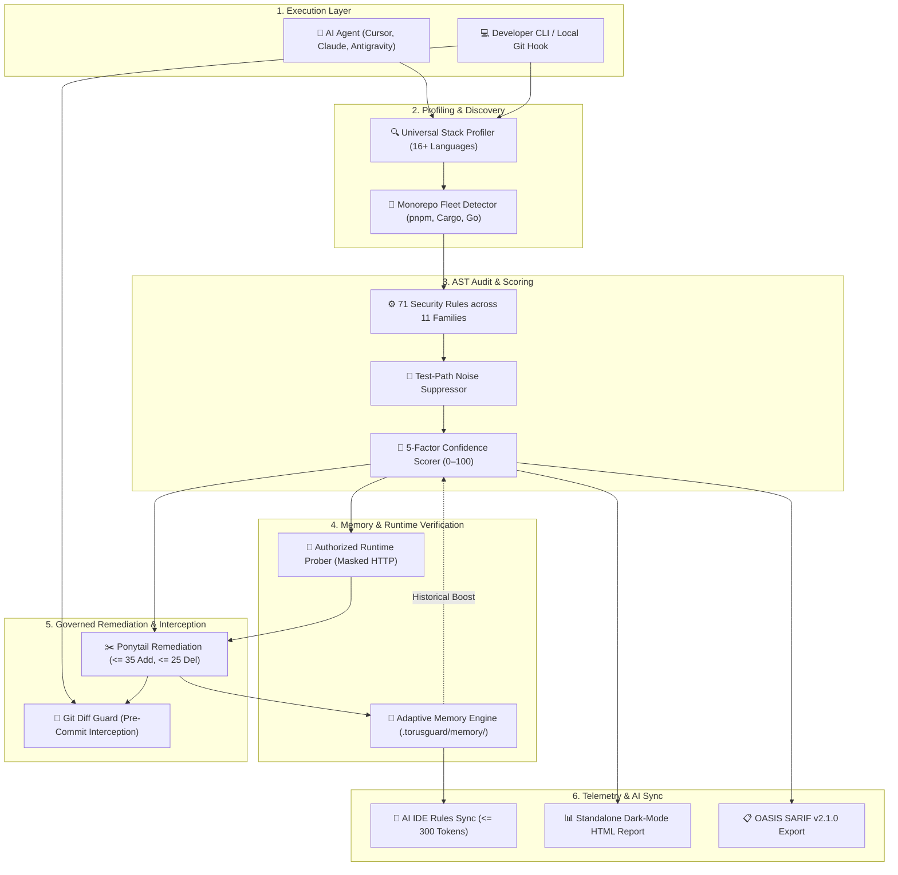
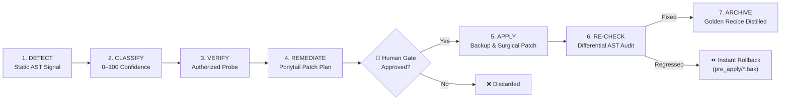
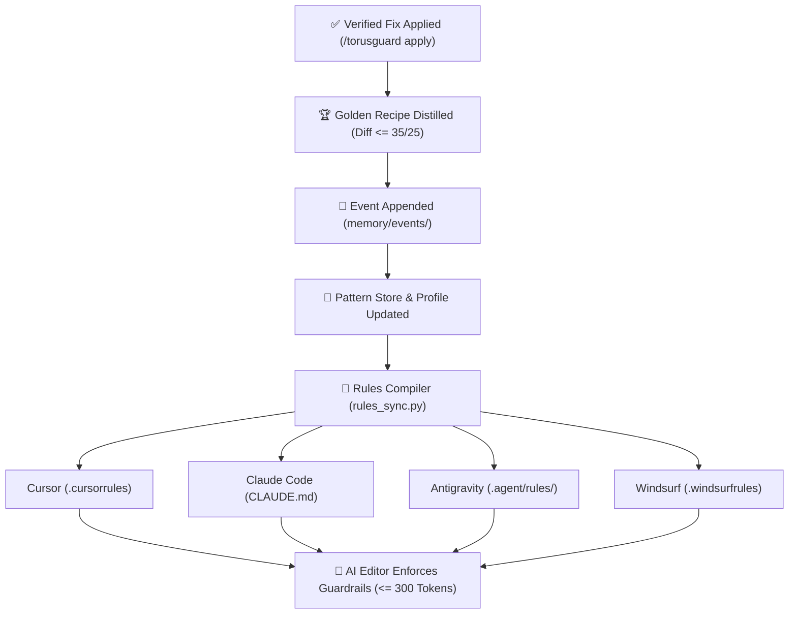
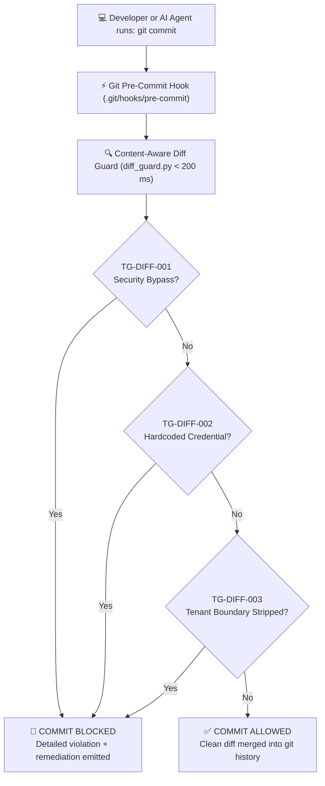

<div align="center">
  

  # TorusGuard

  **Autonomous Security Guardrails, Governed Remediation, and Authorized Runtime Validation for AI-Built Web Applications.**

  [](https://www.npmjs.com/package/torusguard)
  [](https://github.com/githubmofo/TorusGuard/pkgs/npm/torusguard)
  [](https://github.com/githubmofo/TorusGuard/releases/latest)
  [](LICENSE)
  [](https://python.org)
  [](https://nodejs.org)
  [](.torusguard/schemas/)
  [-teal.svg?style=flat-square)](.torusguard/.manifest.json)
  [](docs/architecture/SECURITY_ARCHITECTURE.md)
</div>

---

## 💡 Executive Summary

AI coding assistants generate application code at superhuman speeds. However, they routinely hallucinate critical security boundaries: leaking database credentials into client bundles, omitting multi-tenant filters in ORM queries, stripping CSRF protections, or granting unconstrained tool permissions to autonomous agents.

**TorusGuard** is an autonomous application security co-pilot and governed remediation engine built specifically for AI-written code. Operating natively within developer IDEs (Cursor, Claude Code, Antigravity, Windsurf, VS Code Copilot) and CI workflows, it deterministically audits, runtime-verifies, and surgically patches vulnerabilities without destructive full-file rewrites.

### 🌐 The Core Invariant: The Browser-Code Truth
> **"If the browser receives it, users can inspect it."**  
> Frontend environment variables, JavaScript network bundles, and React Server Action payloads cannot conceal secrets. TorusGuard strictly enforces that database credentials, service role keys, private API secrets, and tenant boundaries remain exclusively on trusted server runtimes.

---

## ⚔️ Why TorusGuard? (Traditional SAST vs. AI Coding Agents)

| Capability | Traditional SAST (SonarQube, Snyk) | Raw AI Coding Agents | TorusGuard Engine |
|---|:---:|:---:|:---:|
| **Target Code Base** | Human-written legacy code | Fast, high-churn AI generations | **AI-built full-stack applications** |
| **Remediation Model** | Issue tickets & PDF reports | Destructive full-file rewrites | **Ponytail Protocol** ($\le 35$ additions, $\le 25$ deletions) |
| **Learning Feedback** | Static rules, zero memory | Forgets fixes across prompts | **Adaptive Security Memory** & Golden Recipes |
| **IDE Integration** | Heavy background language servers | Bloated prompt context | **AI IDE Rules Auto-Sync** ($\le 300$ tokens) |
| **Commit Interception** | Slow server-side webhooks | None (pushes broken code) | **Git Pre-Commit Diff Guard** ($< 200\text{ ms}$) |
| **Privacy & Telemetry** | Cloud code upload / SaaS | Third-party cloud LLMs | **100% Local, Zero-Egress Guarantee** |

---

## 🏛️ System Architecture & Visual Flowcharts

### 1. End-to-End Governance Pipeline
The complete operational pipeline from developer prompt down to telemetry and IDE rule synchronization:



---

### 2. The 7-Stage Finding Lifecycle
Every finding follows a strict closed-loop state machine with an unskippable **Human Gate** and rollback backup before disk modifications:



---

### 3. Adaptive Memory & AI Rules Sync Loop
Verified patches are converted into Golden Fix Recipes and injected back into your AI editor's prompt instructions:



---

### 4. Git Pre-Commit Interception (Diff Guard)
Blocks security bypasses, exposed credentials, and tenant boundary removals in $< 200\text{ ms}$ before code enters git history:



---

## ⚡ Core Subsystems (At a Glance)

```text
┌────────────────────────────────────────────────────────────────────────────────────────┐
│                                 TORUSGUARD SUBSYSTEMS                                  │
├──────────────────────────┬──────────────────────────┬──────────────────────────────────┤
│ 🔍 Detection & Profiling │ 🧠 Adaptive Intelligence │ 🛡️ Governance & Developer Flow   │
├──────────────────────────┼──────────────────────────┼──────────────────────────────────┤
│ • 16+ Languages Profiled │ • 0–100 Confidence Model │ • Ponytail Protocol (<= 35/25)   │
│ • Monorepo Fleet Map     │ • Persistent Event Store │ • Pre-Apply Byte Snapshots (.bak)│
│ • 71 AST Security Rules  │ • Golden Recipe Learning │ • Pre-Commit Diff Hook (<200 ms) │
│ • Test-Path Suppression  │ • 90-Day Auto TTL Decay  │ • AI Rules Auto-Sync (<= 300 tok)│
└──────────────────────────┴──────────────────────────┴──────────────────────────────────┘
```

- **Universal Profiler & Monorepo Detector:** Discovers manifests across 16+ languages (Go, Rust, Java, C#, PHP, Python, TS) and isolates nested packages (pnpm, Cargo, Gradle, Go work).
- **Context-Aware Static Auditing:** Evaluates 71 rules across 11 families (`TG-AUTH`, `TG-DB`, `TG-INPUT`, `TG-SEC`, `TG-AGENT`, etc.). Suppresses test mocks automatically via `is_test_path()`.
- **Adaptive Memory Engine:** Distills verified Before/After fixes into Golden Recipes. Proximity scoring injects targeted advice into a compact card ($\le 2,000$ tokens).
- **Ponytail Governed Remediation:** Restricts code fixes to $\le 35$ additions and $\le 25$ deletions. Automatically saves byte-for-byte `.bak` backups for instant rollbacks.
- **Pre-Commit Diff Guard:** 1-command installer (`diff-guard --install-hook`) blocks bypasses (`InsecureSkipVerify`, `[AllowAnonymous]`, `csrf().disable()`, `unsafe`) before git commit.
- **AI IDE Rules Auto-Sync:** Compiles project security invariants into Cursor, Claude Code, Antigravity, and Windsurf within a strict $\le 300$ token overhead ceiling.
- **Visual HTML Posture Dashboard:** Generates a 100% self-contained, offline-ready dark-mode report with animated SVG score gauges and interactive diff viewers.

---

## 🌐 Polyglot Ecosystem & Framework Matrix

| Language / Stack | Manifests & Ecosystem | Supported Frameworks | Data Layers / ORMs | Intercepted Bypasses (`TG-DIFF`) |
|---|---|---|---|---|
| **Python** | `pyproject.toml`, `requirements.txt` | FastAPI, Django, Flask, DRF | SQLAlchemy, Django ORM, Tortoise | Raw SQL formatting, unescaped templates |
| **TypeScript / JS** | `package.json` | Next.js, Express, NestJS, Nuxt | Prisma, Drizzle, TypeORM, Mongoose | Client-side secrets, tenant deletion |
| **Go** | `go.mod` | Gin, Fiber, Echo, Chi | GORM, Ent, SQLx | `InsecureSkipVerify: true`, GORM tenant drop |
| **Rust** | `Cargo.toml` | Actix-web, Axum, Rocket | Diesel, SeaORM, SQLx | Unvetted `unsafe {`, unverified TLS |
| **Java** | `pom.xml`, `build.gradle` | Spring Boot, Quarkus, Micronaut | Hibernate, JPA, MyBatis, jOOQ | `csrf().disable()`, `permitAll()` |
| **C# (.NET)** | `*.csproj`, `*.sln` | ASP.NET Core, Blazor | Entity Framework Core, Dapper | `[AllowAnonymous]`, LINQ tenant deletion |
| **PHP** | `composer.json` | Laravel, Symfony, Slim | Eloquent, Doctrine | `CURLOPT_SSL_VERIFYPEER => false` |
| **Ruby** | `Gemfile` | Ruby on Rails, Sinatra | ActiveRecord, Sequel | Raw unescaped SQL fragments |
| **Kotlin** | `build.gradle.kts` | Spring Boot, Ktor | Exposed, Hibernate | Unauthenticated route decorators |
| **Elixir** | `mix.exs` | Phoenix | Ecto | Unfiltered changeset mutations |
| **Dart** | `pubspec.yaml` | Flutter, Shelf | Drift | Permissive HTTP certificate overrides |
| **C / C++** | `CMakeLists.txt`, `Makefile` | Crow, Drogon, Oat++ | Raw SQLite, libpq | Unbounded buffers, raw pointer leaks |

---

## 🚀 60-Second Quickstart

### Method A: Via Node.js / NPX (Zero Setup)
```bash
# 1. Initialize TorusGuard in your workspace
npx torusguard init

# 2. Run static security audit
npx torusguard audit

# 3. Generate visual dark-mode HTML dashboard
npx torusguard report --html

# 4. Install Git Pre-Commit Diff Guard Hook (blocks dangerous commits)
npx torusguard diff-guard --install-hook

# 5. Synchronize prompt guardrails across AI editors (<= 300 tokens)
npx torusguard rules sync
```

### Method B: Via Pure Python 3.10+ (Standard Library)
```bash
# 1. Initialize workspace
python .torusguard/scripts/bootstrap.py --workspace .

# 2. Run static audit
python .torusguard/scripts/finding_scorer.py --dir .

# 3. Install Pre-Commit Diff Guard
python .torusguard/scripts/diff_guard.py --install-hook

# 4. Sync AI IDE rules
python .torusguard/scripts/rules_sync.py --workspace . --format all
```

---

## 💻 CLI Command Reference

| Command | Subcommands & Flags | Description |
|---|---|---|
| `torusguard init` | `[--stack <name>] [--profile <type>]` | Scaffolds `.torusguard/` with active security rules and workflows. |
| `torusguard audit` | `[--scope <path>] [--format md\|json]` | Audits source code against active rules and emits run folder. |
| `torusguard verify` | `[--id <finding_id>]` | Probes authorized endpoints with automated credential masking. |
| `torusguard harden` | `[--id <finding_id>]` | Generates 4-artifact Ponytail patch plans ($\le 35$ additions, $\le 25$ deletions). |
| `torusguard apply` | `[--id <finding_id>] [--dry-run]` | Saves pre-apply `.bak` snapshots and applies surgical patch to disk. |
| `torusguard recheck`| `[--id <finding_id>]` | Differentially re-evaluates AST sinks over modified scopes. |
| `torusguard report` | `[--sarif] [--html] [--out <path>]` | Exports OASIS SARIF v2.1.0 or single-file visual HTML posture report. |
| `torusguard status` | `[--json]` | Displays stack detection, active rule count, memory metrics, and run history. |
| `torusguard diff-guard`| `[--install-hook] [--diff <file>]` | Scans git diff for bypasses (`TG-DIFF-001..004`) or installs pre-commit hook. |
| `torusguard rules sync`| `[--format all\|cursor\|claude\|agent\|windsurf]` | Compiles project rules into AI IDE configs within $\le 300$ prompt tokens. |
| `torusguard memory` | `status \| context \| export \| learn` | Inspects adaptive memory, generates proximity cards, or exports team packs. |

---

## 🤖 AI IDE & Agent Setup

TorusGuard injects non-destructive comment fences so your personal instructions remain untouched:

```markdown
<!-- TORUSGUARD-SECURITY-GUARDRAILS:START -->
## TorusGuard Security Invariants
- Browser-Code Truth: Never expose database credentials or private keys in client code.
- Multi-Tenant Isolation: Always include tenantId/orgId filters on queries.
- CSRF Protection: Enforce CSRF validation on all state-changing routes.
<!-- TORUSGUARD-SECURITY-GUARDRAILS:END -->
```

- **Cursor (`.cursorrules`):** Run `npx torusguard rules sync --format cursor`.
- **Claude Code (`CLAUDE.md`):** Run `npx torusguard rules sync --format claude`.
- **Antigravity (`.agent/rules/torusguard.md`):** Run `npx torusguard rules sync --format agent`.
- **Windsurf (`.windsurfrules`):** Run `npx torusguard rules sync --format windsurf`.
- **VS Code Copilot & Cline:** Add `SKILL.md` to your skill directory for zero-footprint cognitive guidance.

---

## 🛡️ The Ponytail Protocol & Rollback Guarantees

AI coding models often destroy working applications by attempting full-file rewrites to fix minor issues. TorusGuard enforces the **Ponytail Protocol**:

- **Strict Churn Limits:** Every fix is capped at $\le 35$ additions and $\le 25$ deletions.
- **Full-File Rewrite Ban:** Large destructive edits are rejected by the patch engine.
- **Rollback Snapshot Guarantee:** Before any file is modified, a byte-for-byte snapshot is saved to `pre_apply/<file>.bak`.
- **Instant Rollback:** Restoring an original file takes 1 command (`cp pre_apply/<file>.bak <file>`).

---

## 🔒 Zero-Telemetry Local Privacy Guarantee

TorusGuard operates under an uncompromising **Local Execution Guarantee**:
- **Zero Network Egress:** No source code, AST trees, credentials, or audit findings leave your machine.
- **Pure Local Execution:** 100% Python standard library and local Node.js. No background daemons or cloud SaaS accounts.
- **Automatic Secret Redaction:** Live API keys, JWTs, AWS credentials, and passwords are automatically masked before writing reports.
- **Sanitized Team Export:** `npx torusguard memory export --sanitized` strips developer usernames and local paths before sharing.

For security policies and responsible disclosure, please refer to [SECURITY.md](SECURITY.md).

---

## 📄 License & Community

TorusGuard is open-source software licensed under the [MIT License](LICENSE).

- **Documentation:** Architecture guides and specifications in [docs/](docs/).
- **Changelog:** Release milestones and updates in [CHANGELOG.md](CHANGELOG.md).
- **Security Policy:** Vulnerability reporting in [SECURITY.md](SECURITY.md).
- **Contributions:** Pull requests and discussions are welcomed via [CONTRIBUTING.md](CONTRIBUTING.md).
