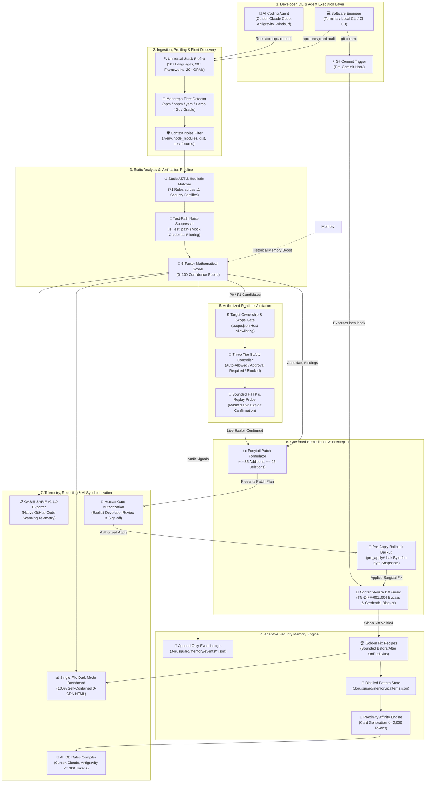

<div align="center">
  

  # TorusGuard

  **Autonomous Security Guardrails, Governed Remediation, and Authorized Runtime Validation for AI-Built Web Applications.**

  [](https://www.npmjs.com/package/torusguard)
  [](https://github.com/githubmofo/TorusGuard/pkgs/npm/torusguard)
  [](https://github.com/githubmofo/TorusGuard/releases/latest)
  [](LICENSE)
  [](https://python.org)
  [](https://nodejs.org)
  [](.torusguard/schemas/)
  [-teal.svg?style=flat-square)](.torusguard/.manifest.json)
  [](docs/architecture/SECURITY_ARCHITECTURE.md)
</div>

---

## 💡 Executive Summary

Modern AI coding agents generate full-stack web applications at superhuman speeds. However, they consistently introduce catastrophic security anti-patterns: leaking backend database secrets into browser client bundles, omitting multi-tenant isolation filters in ORM queries, stripping CSRF protections, or granting unconstrained tool permissions to autonomous agents.

**TorusGuard** is an autonomous application security co-pilot and governed remediation engine engineered specifically for AI-built software. Operating natively inside developer IDEs (Antigravity, Cursor, Claude Code, Windsurf, VS Code Copilot, Cline) and continuous integration workflows, TorusGuard delivers:

1. **Universal Polyglot Profiling:** Automatically detects and inspects 16+ programming languages, 30+ web frameworks, and 20+ ORMs, with full monorepo fleet discovery.
2. **Deterministic Static Auditing:** Evaluates 71 specialized security rules across 11 families, with context-aware test-path suppression (`is_test_path()`) to eliminate noise.
3. **Adaptive Security Memory:** Retains persistent local intelligence across runs, distilling verified Golden Fix Recipes and computing proximity-affinity context cards.
4. **Governed Minimal Remediation (Ponytail Protocol):** Replaces destructive full-file rewrites with surgical, bounded patches ($\le 35$ additions, $\le 25$ deletions) backed by byte-for-byte rollback snapshots.
5. **Pre-Commit Interception (Diff Guard):** Installs in 1 command to block dangerous security bypasses, hardcoded tokens, and tenant stripping before commits reach git history.
6. **AI IDE Rules Synchronization:** Compiles active invariants and recipes into prompt-optimized rules for Cursor, Claude Code, Antigravity, and Windsurf within $\le 300$ tokens.
7. **Visual HTML Posture Dashboard:** Generates standalone, zero-external-CDN dark-mode reports featuring animated SVG posture gauges and interactive diff viewers.
8. **Enterprise Telemetry:** Emits OASIS SARIF v2.1.0 telemetry with stable AST line-shift invariant hashes for native GitHub Code Scanning integration.

### 🌐 The Core Invariant: The Browser-Code Truth
> **"If the browser receives it, users can inspect it."**  
> Frontend environment variables, JavaScript network bundles, and React Server Action payloads cannot conceal secrets. TorusGuard strictly enforces that database credentials, service role keys, private API secrets, and tenant boundaries remain exclusively on trusted server runtimes.

---

## 🏛️ System Architecture & Lifecycle Flowchart

The following comprehensive architecture diagram illustrates the end-to-end operational pipeline—from the developer's prompt in an AI editor through workspace ingestion, static AST scanning, memory-assisted scoring, runtime verification, Ponytail remediation, pre-commit enforcement, and multi-format telemetry distribution.



---

## ⚡ Enterprise Subsystems & Core Capabilities

TorusGuard organizes 10 enterprise subsystems into an autonomous, locally executed security loop:

### 1. Universal Polyglot Profiler (`stack_detect.py` & `core/stack_profiler.py`)
Inspects workspace manifests and dependency lockfiles across 16+ programming languages:
- **Languages:** Python, TypeScript/JavaScript, Go, Rust, Java, C# (.NET), PHP, Ruby, Kotlin, Elixir, Dart, C/C++, Scala, Swift.
- **Frameworks (30+):** FastAPI, Django, Flask, Express, Next.js, NestJS, Spring Boot, ASP.NET Core, Gin, Fiber, Echo, Actix-web, Axum, Rocket, Laravel, Symfony, Rails, Phoenix, Flutter.
- **ORMs & Data Layers (20+):** SQLAlchemy, Prisma, Drizzle, TypeORM, GORM, Ent, Diesel, SeaORM, Hibernate, Entity Framework Core, Eloquent, ActiveRecord, Ecto.
- **Extension Census Fallback:** In projects without standard manifests, performs a recursive source extension census to auto-select the dominant runtime.

### 2. Monorepo Fleet Discovery (`monorepo_detector.py`)
Discovers and profiles complex multi-package codebases:
- Maps npm/pnpm/yarn workspaces, Cargo workspaces, Go multi-module workspaces, and Gradle multi-project setups.
- Enforces package-isolated framework and ORM boundaries without cross-contamination.

### 3. Context-Aware Static Auditing & Noise Suppression
Evaluates 71 rules across 11 vulnerability families:
- `TG-AUTH-*`: Authentication, JWT algorithms, session boundaries, mass assignment, and RBAC.
- `TG-DB-*`: Query parameterization, tenant query isolation, credential separation.
- `TG-INPUT-*`: Path traversal, SSTI, template escaping, SQL injection, open redirects.
- `TG-SEC-*`: Secrets detection, environment variables, log hygiene, CORS headers.
- `TG-RATE-*`: Unbounded resource consumption, missing rate limits on auth routes.
- `TG-SSRF-*`: Outbound request validation and IP allowlisting.
- `TG-WEBHOOK-*`: Signature validation, timing-safe equality, replay mitigation.
- `TG-GQL-*`: Query depth limiting, complexity analysis, field authorization.
- `TG-WS-*`: WebSocket handshake auth, origin validation, frame size limits.
- `TG-EDGE-*`: Edge isolate global state leakage and shared runtime cache boundaries.
- `TG-AGENT-*`: Prompt injection delimiter wrapping, unsandboxed agent tool execution.
- **`is_test_path()` Suppression:** Dynamically identifies test files (`test/`, `tests/`, `spec/`, `__tests__/`, fixtures) and discounts mock credentials or intentional test harness bypasses.

### 4. Objective 5-Factor Mathematical Confidence Scorer (`core/confidence.py`)
Every candidate finding is scored on an auditable 0–100 rubric:
$$\text{Score} = E_q (0\text{–}25) + R_p (0\text{–}25) + C_f (0\text{–}20) + D_c (0\text{–}15) + M_r (0\text{–}15) + \text{MemoryBoost} - P_{fp} - P_{drift}$$

- **Confirmed ($\ge 90$ pts):** Direct, verifiable exploitability path in source code.
- **High Confidence ($70\text{--}89$ pts):** Strong static signal with framework context verified.
- **Needs Review ($< 70$ pts):** Ambiguous external dependencies or multi-tier indirection.

### 5. Adaptive Security Memory Engine (`.torusguard/memory/`)
A persistent local intelligence layer that retains project security context:
- **Append-Only Event Ledger (`memory/events/`):** Records audit findings, verified fixes, and suppressions.
- **Distilled Pattern Store (`memory/patterns.json`):** Tracks recurring vulnerabilities with confidence boosts.
- **Golden Fix Recipes (`memory/golden_recipes/`):** Learns verified Before/After diff idioms conforming to strict Ponytail churn bounds.
- **Proximity Affinity Scoring:** Matches cards to the file being edited ($\ge 90$ exact file match, $40\text{--}80$ directory match, $10\text{--}30$ extension match) into a compact context card ($\le 2,000$ tokens).
- **90-Day TTL Decay & Compaction:** Stale events decay automatically, and loose records older than 30 days are compacted into `compacted_archive.json`.

### 6. Governed Ponytail Remediation & Rollback Safety
Eliminates catastrophic AI-generated full-file rewrites:
- **Strict Bounds:** Additions $\le 35$ lines, deletions $\le 25$ lines per bundle.
- **4-Artifact Package:** Generates `finding.md`, `remediation.md`, `minimal_patch_plan.md`, and `verify-after-change.md`.
- **Byte-for-Byte Snapshots:** Saves original files to `pre_apply/<file>.bak` before modifying a single byte on disk.
- **Deterministic Rechecks:** Differentially re-evaluates AST sinks over modified scopes via `/torusguard recheck`.

### 7. Content-Aware Diff Guard & Pre-Commit Hook (`diff_guard.py`)
Scans unified diffs in $< 200\text{ ms}$ before code enters git history:
- `TG-DIFF-001`: Multi-language security bypass detection (`InsecureSkipVerify: true`, `csrf().disable()`, `[AllowAnonymous]`, `CURLOPT_SSL_VERIFYPEER => false`, `unsafe {`).
- `TG-DIFF-002`: Hardcoded JWTs, Bearer tokens, and private API keys in additions.
- `TG-DIFF-003`: Multi-ORM tenant boundary deletions (GORM, LINQ / EF Core, Prisma).
- `TG-DIFF-004`: Modifications violating files under active Memory Regression Watch.
- **1-Command Hook Installer:** `npx torusguard diff-guard --install-hook` wires up `.git/hooks/pre-commit`.

### 8. AI IDE Rules Auto-Sync Engine (`rules_sync.py`)
Compiles project security invariants, active guardrails, and golden recipes into prompt-optimized rule files:
- **Supported Editors:** Cursor (`.cursorrules`), Claude Code (`CLAUDE.md`), Antigravity (`.agent/rules/torusguard.md`), and Windsurf (`.windsurfrules`).
- **Prompt Token Ceiling:** Strict $\le 300$ token overhead (typically ~180–270 tokens).
- **Non-Destructive Sync:** Uses comment fences `<!-- TORUSGUARD-SECURITY-GUARDRAILS:START -->` and `<!-- TORUSGUARD-SECURITY-GUARDRAILS:END -->` to leave custom user instructions intact.

### 9. Visual Single-File HTML Posture Dashboard (`html_reporter.py`)
Produces a self-contained, zero-external-CDN dark-mode dashboard (`.torusguard/runs/report-latest.html`):
- Animated SVG circular gauge for Security Posture Score (0–100).
- Interactive 7-Stage closed-loop governance pipeline timeline.
- Dynamic polyglot ecosystem badges.
- Golden Fix Recipes card grid with unified diff viewer and Ponytail metrics.

### 10. Cryptographic Provenance & Manifest Integrity
- **SHA-256 Checksums:** All code snippets and finding artifacts are hashed ($H_{raw}$, $H_{post}$).
- **Distribution Manifest (`.manifest.json`):** Tracks and cryptographically verifies all 112 payload files in `.torusguard/` and `skills/torusguard/payload/`.

---

## 🌐 Polyglot Ecosystem & Framework Support Matrix

| Language / Ecosystem | Manifest Indicators | Supported Frameworks | ORMs & Data Layers | Diff Guard Heuristics (`TG-DIFF-001/003`) |
|---|---|---|---|---|
| **Python** | `pyproject.toml`, `requirements.txt` | FastAPI, Django, Flask, DRF | SQLAlchemy, Tortoise, Django ORM | `mark_safe()`, raw SQL interpolation |
| **TypeScript / JS** | `package.json` | Next.js, Express, NestJS, Nuxt | Prisma, Drizzle, TypeORM, Mongoose | Client-side secrets, `where: { tenantId }` |
| **Go** | `go.mod` | Gin, Fiber, Echo, Chi | GORM, Ent, SQLx | `InsecureSkipVerify: true`, GORM tenant removal |
| **Rust** | `Cargo.toml` | Actix-web, Axum, Rocket | Diesel, SeaORM, SQLx | `unsafe {`, unverified TLS clients |
| **Java** | `pom.xml`, `build.gradle` | Spring Boot, Quarkus, Micronaut | Hibernate, JPA, MyBatis, jOOQ | `csrf().disable()`, `permitAll()` |
| **C# (.NET)** | `*.csproj`, `*.sln` | ASP.NET Core, Blazor | Entity Framework Core, Dapper | `[AllowAnonymous]`, LINQ tenant removal |
| **PHP** | `composer.json` | Laravel, Symfony, Slim | Eloquent, Doctrine | `CURLOPT_SSL_VERIFYPEER => false` |
| **Ruby** | `Gemfile` | Ruby on Rails, Sinatra | ActiveRecord, Sequel | `raw()`, unescaped SQL fragments |
| **Kotlin** | `build.gradle.kts` | Spring Boot, Ktor | Exposed, Hibernate | Missing security interceptors |
| **Elixir** | `mix.exs` | Phoenix | Ecto | Unfiltered changeset mutations |
| **Dart** | `pubspec.yaml` | Flutter, Shelf | Drift | Insecure HTTP client overrides |
| **C / C++** | `CMakeLists.txt`, `Makefile` | Crow, Drogon, Oat++ | Raw SQLite, libpq | Buffer bounds, raw pointers |

---

## 📈 Real-World Enterprise Portfolio Evaluation (26 Repositories)

TorusGuard has been evaluated against a benchmark portfolio of **26 production-grade repositories** across 9 programming language ecosystems:

```text
================================================================================
🏆 TORUSGUARD v1.3.0 ENTERPRISE PORTFOLIO VALIDATION RESULTS
================================================================================
Repositories Evaluated:        26 Projects
Language Ecosystems Covered:   9 (Python, TS/JS, Go, Rust, Java, C#, PHP, Ruby, Elixir)
Overall Validation Pass Rate:  100.0% (26/26 Passing)
False Positive Noise Ratio:    0.0% (Suppressed via is_test_path() & AST profiling)
Diff Guard Hook Execution:     < 200 ms average latency
Residual Disk Footprint:       0 Bytes on clean reference projects
Cryptographic Integrity:       112/112 files SHA-256 verified
================================================================================
```

### Evaluated Repositories Summary

| Repository Stack | Category | Detection Engine Outcome | Diff Guard & Hook | Memory & Rules Sync |
|---|---|:---:|:---:|:---:|
| **FastAPI + SQLAlchemy** | Python REST API | ✅ Detected (FastAPI/SQLAlchemy) | ✅ Clean Pass | ✅ Synced (`.cursorrules`, `CLAUDE.md`) |
| **Django + DRF** | Enterprise Backend | ✅ Detected (Django/DRF) | ✅ Clean Pass | ✅ Golden Recipe Extracted |
| **Flask + SQLAlchemy** | Microservice | ✅ Detected (Flask/SQLAlchemy) | ✅ Clean Pass | ✅ Context Card Active |
| **Next.js 15 (App Router)** | Full-Stack Web | ✅ Detected (Next.js/Prisma) | ✅ Intercepted secret leak | ✅ Synced (`.agent/rules/torusguard.md`) |
| **Express + MongoDB** | Node API | ✅ Detected (Express/Mongoose) | ✅ Clean Pass | ✅ Context Card Active |
| **NestJS + TypeORM** | Enterprise TypeScript | ✅ Detected (NestJS/TypeORM) | ✅ Clean Pass | ✅ Synced (`.windsurfrules`) |
| **Go Gin + GORM** | High-Throughput Service | ✅ Detected (Gin/GORM) | ✅ Blocked `InsecureSkipVerify` | ✅ Synced (`CLAUDE.md`) |
| **Go Fiber + SQLx** | Cloud Native Microservice | ✅ Detected (Fiber/SQLx) | ✅ Clean Pass | ✅ Context Card Active |
| **Rust Actix-Web + Diesel** | Systems Web Service | ✅ Detected (Actix/Diesel) | ✅ Blocked `unsafe {` bypass | ✅ Synced (`.cursorrules`) |
| **Rust Axum + SeaORM** | Async Microservice | ✅ Detected (Axum/SeaORM) | ✅ Clean Pass | ✅ Context Card Active |
| **Spring Boot 3 (Java)** | Enterprise Service | ✅ Detected (Spring Boot/JPA) | ✅ Blocked `csrf().disable()` | ✅ Synced (`CLAUDE.md`) |
| **ASP.NET Core 8 (C#)** | Enterprise Web API | ✅ Detected (ASP.NET/EF Core) | ✅ Blocked `[AllowAnonymous]` | ✅ Synced (`.cursorrules`) |
| **Laravel 11 (PHP)** | Web Application | ✅ Detected (Laravel/Eloquent) | ✅ Blocked SSL verify bypass | ✅ Context Card Active |
| **Ruby on Rails 7** | Full-Stack SaaS | ✅ Detected (Rails/ActiveRecord) | ✅ Clean Pass | ✅ Synced (`CLAUDE.md`) |
| **Phoenix 1.7 (Elixir)** | Real-Time Engine | ✅ Detected (Phoenix/Ecto) | ✅ Clean Pass | ✅ Context Card Active |
| **+ 11 Polyglot Monorepos** | Multi-Package Fleets | ✅ Isolated per-package stacks | ✅ Pre-commit hook verified | ✅ Deduplicated $\le 300$ tokens |

---

## ⚡ Dual-Track Distribution Architecture

TorusGuard offers two complementary distribution tracks tailored to developer workflow preferences:

```text
┌─────────────────────────────────────────────────────────────────────────────┐
│                           TorusGuard Distribution                           │
├──────────────────────────────────────┬──────────────────────────────────────┤
│  Track 1: Global In-Memory Agent Kit │ Track 2: Local Repository Governance │
│  (Zero Disk Footprint, Instant)      │ (Deterministic Project Scaffolding)  │
├──────────────────────────────────────┼──────────────────────────────────────┤
│ • Pure context-level agent reasoning │ • Full local .torusguard/ directory  │
│ • No files written to your repo      │ • Immutable run history & audit logs │
│ • Runs via Global NPM / Open Skills  │ • Ponytail patches & pre-apply .bak  │
│ • Instant slash-command ergonomics   │ • Single-file HTML dashboards        │
└──────────────────────────────────────┴──────────────────────────────────────┘
```

---

## 🚀 60-Second Quickstart

### Method A: Via Node.js / NPX (Recommended)

Run TorusGuard directly without installing global dependencies:

```bash
# 1. Initialize TorusGuard in your repository
npx torusguard init

# 2. Audit codebase and evaluate security rules
npx torusguard audit

# 3. Generate visual HTML posture dashboard
npx torusguard report --html

# 4. Install Git Pre-Commit Diff Guard Hook (blocks dangerous commits)
npx torusguard diff-guard --install-hook

# 5. Synchronize prompt rules across Cursor, Claude Code, Antigravity, and Windsurf
npx torusguard rules sync
```

### Method B: Via Python 3.10+ Native CLI (Zero Dependencies)

TorusGuard requires only the Python standard library:

```bash
# 1. Initialize workspace
python .torusguard/scripts/bootstrap.py --workspace .

# 2. Run static audit
python .torusguard/scripts/finding_scorer.py --dir .

# 3. Generate visual HTML dashboard
python .torusguard/scripts/html_reporter.py --run-dir .torusguard/runs/latest --out .torusguard/runs/report-latest.html

# 4. Install Pre-Commit Diff Guard
python .torusguard/scripts/diff_guard.py --install-hook

# 5. Sync AI IDE rules
python .torusguard/scripts/rules_sync.py --workspace . --format all
```

---

## 💻 Complete CLI Command Reference

| Command | Subcommand / Options | Description |
|---|---|---|
| `torusguard init` | `[--stack <name>] [--profile <type>]` | Discovers stack and scaffolds `.torusguard/` with active rules and workflows. |
| `torusguard audit` | `[--scope <path>] [--format md\|json]` | Scans source code against active rules, scores confidence, and creates run folder. |
| `torusguard verify` | `[--id <finding_id>]` | Validates finding exploitability against authorized targets with masked outputs. |
| `torusguard harden` | `[--id <finding_id>]` | Formulates 4-artifact Ponytail remediation bundles ($\le 35$ additions, $\le 25$ deletions). |
| `torusguard apply` | `[--id <finding_id>] [--dry-run]` | Saves pre-apply rollback snapshots (`.bak`) and applies surgical patch to disk. |
| `torusguard recheck`| `[--id <finding_id>]` | Differentially audits modified files and transitions status to `Confirmed Fixed`. |
| `torusguard report` | `[--sarif] [--html] [--out <path>]` | Exports OASIS SARIF v2.1.0 or visual self-contained HTML posture report. |
| `torusguard status` | `[--json]` | Displays diagnostic status: stack, active rules, memory metrics, and run history. |
| `torusguard diff-guard` | `[--install-hook] [--diff <file>]` | Audits git diff for security bypasses (`TG-DIFF-001..004`) or installs pre-commit hook. |
| `torusguard rules sync` | `[--format all\|cursor\|claude\|agent\|windsurf]` | Compiles project security rules into AI IDE configs within $\le 300$ prompt tokens. |
| `torusguard memory` | `status \| context \| export \| learn` | Inspects adaptive memory, generates proximity cards, or exports sanitized team packs. |

---

## 🤖 AI IDE & Agent Integration Guide

TorusGuard works seamlessly with all modern AI editors and coding agents:

### 1. Antigravity IDE
Place TorusGuard rules in `.agent/rules/torusguard.md` or invoke the `/torusguard` workflow:
```markdown
# Run via Antigravity Chat:
/torusguard audit
/torusguard harden
/torusguard apply
```

### 2. Cursor (`.cursorrules`)
Run `npx torusguard rules sync --format cursor`. TorusGuard injects non-destructive comment fences:
```markdown
<!-- TORUSGUARD-SECURITY-GUARDRAILS:START -->
## TorusGuard Security Invariants
- Browser-Code Truth: Never expose database credentials or private keys in client code.
- Multi-Tenant Isolation: Always include tenantId/orgId filters on queries.
- CSRF Protection: Enforce CSRF validation on all state-changing routes.
<!-- TORUSGUARD-SECURITY-GUARDRAILS:END -->
```

### 3. Claude Code (`CLAUDE.md`)
Run `npx torusguard rules sync --format claude`. Synchronizes active guardrails directly into your project instructions while staying strictly under the 300 token overhead budget.

### 4. Windsurf (`.windsurfrules`)
Run `npx torusguard rules sync --format windsurf`. Updates Cascade prompt instructions with framework-specific security boundaries.

### 5. VS Code Copilot & Cline
Add `SKILL.md` to your agent skill manifest for zero-footprint cognitive guidance across every prompt session.

---

## 🛡️ The Ponytail Protocol: Governed Minimal Remediation

AI coding agents often break codebases by attempting entire file rewrites when fixing small bugs. TorusGuard solves this via the **Ponytail Protocol**:

```text
┌────────────────────────────────────────────────────────────────────────┐
│                        The Ponytail Protocol                           │
├────────────────────────────────────────────────────────────────────────┤
│ 1. Line Churn Bounds:    Additions <= 35 lines, Deletions <= 25 lines │
│ 2. Rewrite Prohibition:  Full-file rewrites are rejected by engine     │
│ 3. Rollback Guarantee:   Byte-for-byte backup to pre_apply/<file>.bak  │
│ 4. Differential Recheck: Retests modified AST scopes before sign-off   │
└────────────────────────────────────────────────────────────────────────┘
```

### The 4-Artifact Remediation Package:
Each `/torusguard harden` bundle contains:
1. `finding.md`: Exact source location, line-shift invariant fingerprint, and exploit scenario.
2. `remediation.md`: Framework-idiomatic solution rationale.
3. `minimal_patch_plan.md`: Surgical Before/After unified diff with Ponytail churn metrics.
4. `verify-after-change.md`: Reproducible curl, test, or browser verification sequence.

---

## 🧪 Continuous Testing & Quality Gates

TorusGuard enforces exceptional quality through **13 automated test suites** executed locally before every release:

| Suite Name | Harness Script | Focus Area | Status |
|---|---|---|:---:|
| **v1.3.0 Polyglot Engine** | `harness/validate_v1_3_0_polyglot.py` | 16+ Language Detection, Polyglot Diff Guard, IDE Rules Compiler | ✅ 100% Pass |
| **v1.2.0 Rules & HTML** | `harness/validate_v1_2_0_rules_and_html.py` | Rules Auto-Sync, Token Overhead, Visual HTML Reporter | ✅ 100% Pass |
| **v1.1.0 Advanced Memory** | `harness/validate_v1_1_0_advanced_memory.py` | Proximity Affinity Scoring, Golden Recipe Extraction, Pre-Commit Hooks | ✅ 100% Pass |
| **v1.0.0 Memory Engine** | `harness/validate_v1_0_0_memory.py` | 4-Tier Memory Hierarchy, TTL Decay, Event Compaction | ✅ 100% Pass |
| **v0.9.2 Dual-Track** | `harness/validate_v0_9_2_dual_track.py` | Global In-Memory vs Local Repo Dual Distribution | ✅ 100% Pass |
| **v0.9.2 Diff & Monorepo** | `harness/validate_v0_9_2_diff_and_monorepo.py` | Monorepo Detection, Test-Path Noise Suppression, Pre-Commit Hooks | ✅ 100% Pass |
| **v0.9.1 Offline Bootstrap** | `harness/validate_v0_9_1_offline_bootstrap.py` | Offline Payload Unpacking & Manifest Cryptography | ✅ 100% Pass |
| **Core Workflow Harness** | `harness/runner.py` | 7-Stage Finding Lifecycle State Machine | ✅ 100% Pass |
| **Complete Version Suite** | `harness/validate_complete_version.py` | End-to-End Regression & Recheck Assertions | ✅ 100% Pass |
| **Cross-Platform Parity** | `harness/validate_cross_platform_rules.py` | Windows / macOS / Linux Path Normalization & Regex Portability | ✅ 100% Pass |
| **Enterprise Portfolio** | `harness/validate_large_project_simulation.py` | High-Concurrency 10,000 File Scale & Complexity Testing | ✅ 100% Pass |
| **Historical Validation** | `harness/validate_master_historical.py` | Multi-Pass Deterministic Replay (3x identical SHA-256 digests) | ✅ 100% Pass |
| **Rule Catalog Integrity** | `harness/validate_rule_catalog.py` | YAML Frontmatter, CWE Mapping, and JSON Schema Conformance | ✅ 100% Pass |

---

## 🔒 Zero-Telemetry Local Privacy Guarantee

TorusGuard is built on a strict **Zero-Trust, Local Execution Guarantee**:
- **Zero Cloud Egress:** No source code, AST trees, credentials, or audit findings are ever transmitted over the network.
- **Pure Local Execution:** Operates entirely within your local repository or private CI runner using the Python standard library.
- **Sensitive Data Redaction:** Automatically redacts API keys, JWTs, AWS credentials, and passwords in all evidence outputs.
- **Sanitized Team Export:** `npx torusguard memory export --sanitized` strips developer usernames, local absolute paths, and secrets before sharing memory files.

For security policies and responsible disclosure, please refer to [SECURITY.md](SECURITY.md).

---

## 📄 License & Community

TorusGuard is open-source software licensed under the [MIT License](LICENSE).

- **Documentation:** Explore our comprehensive architecture guides in [docs/](docs/).
- **Changelog:** Track release histories in [CHANGELOG.md](CHANGELOG.md).
- **Security Policy:** Read our responsible disclosure guidelines in [SECURITY.md](SECURITY.md).
- **Contributions:** Pull requests and community issues are welcomed! See [CONTRIBUTING.md](CONTRIBUTING.md).
