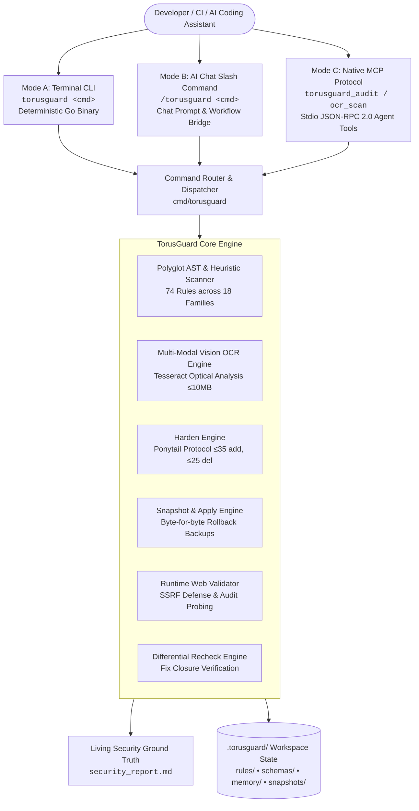

<p align="center">
  
</p>

<h1 align="center">TorusGuard</h1>

<p align="center">
  <strong>The Hybrid Governance Security Engine for AI-built web applications.</strong><br>
  <em>Pairs the intelligence of your AI Agent with a deterministic Go CLI to enforce strict security boundaries and patch limits.</em>
</p>

<p align="center">
  <a href="LICENSE"></a>
  <a href="https://github.com/githubmofo/TorusGuard/releases"></a>
  <a href="https://www.npmjs.com/package/torusguard"></a>
  
  
  
  
</p>

<p align="center">
  
  
  
  
  
</p>

<p align="center">
  
  
  
  
  
  
</p>

---

## Table of Contents

- [What Is TorusGuard?](#what-is-torusguard)
- [Features](#-features)
- [Autonomous Architecture](#-autonomous-architecture)
- [Prerequisites](#-prerequisites)
- [Installation](#-installation)
- [Usage](#-usage)
- [Commands](#-commands)
- [Project Structure](#-project-structure)
- [Security Rules (74 Rules, 18 Families)](#-security-rules-74-rules-18-families)
- [AI Agent Integration](#-ai-agent-integration)
- [Verified Test Suite & Benchmarks](#-verified-test-suite--mass-benchmarks)
- [Non-Negotiable Invariants](#-non-negotiable-invariants)
- [Contributing](#-contributing)
- [License](#-license)
- [Documentation](#-documentation)

---

## What Is TorusGuard?

TorusGuard is a **zero-dependency, single-binary security engine** that scans, hardens, and validates AI-generated codebases. It enforces 74 security rules across 18 architectural families and works in two complementary modes:

- **CLI Mode (Go Binary)** — A deterministic scanner and enforcer that runs in your terminal or CI/CD pipeline.
- **AI Agent Mode** — Integrates natively with Antigravity, Cursor, Claude Code, Windsurf, VS Code, and other AI coding assistants via slash commands.

TorusGuard ensures that the code your AI assistant writes is secure *before* it reaches production.

---

## ✨ Features

- **74 Security Rules** across 18 families (Secrets, Auth, SQL Injection, SSRF, CSRF, GraphQL, Supply Chain, and more)
- **Heuristic AST Scanner** — Polyglot static analysis for Go, JavaScript, TypeScript, and Python
- **Ponytail Protocol** — Surgical patch bounds (≤35 additions, ≤25 deletions) to prevent full-file rewrites
- **Pre-Apply Snapshots** — Automatic `.bak` rollback snapshots before every code modification
- **SARIF v2.1.0 Export** — Standards-compliant output for GitHub Advanced Security, VS Code, and other SARIF consumers
- **Dark-Mode HTML Reports** — Single-file visual posture dashboards
- **Golden Fix Recipes** — Persistent memory of verified security patterns for reuse
- **SSRF Defense** — Built-in private IP blocking and AWS metadata protection in the web validator
- **Fail-Closed Cryptography** — No fallback tokens; panics on entropy failure
- **DoS Resilience** — 10,000-file scan limit and 5-minute context timeout to prevent resource exhaustion
- **16+ Language Stack Detection** — Go, Rust, Java, C#, PHP, Ruby, Kotlin, Elixir, Dart, Swift, Python, TypeScript, and more
- **Multi-Modal Vision OCR** — Scans architecture diagrams, mockups, and screenshots (`.png`, `.jpg`, `.webp`) via Tesseract OCR to detect leaked keys, tokens, and credentials
- **Native MCP Server (Model Context Protocol)** — Exposes standard JSON-RPC 2.0 stdio tools and resources for direct agent integration
- **Tri-Mode Parity** — Terminal CLI, AI Chat slash commands, and Native MCP Tools share identical governance workflows

---

## 🧪 Proven Compatibility

TorusGuard’s static scanner and enforcement binary have been rigorously tested and confirmed compatible across **20 major technology stacks and frameworks**:

| Ecosystem | Tested Frameworks & Runtimes |
|-----------|------------------------------|
| **JavaScript / TypeScript** | React, Next.js, Express, Vue, Angular, SvelteKit, NestJS |
| **Python** | Django, Flask, FastAPI, raw Python scripts |
| **Go** | Gin |
| **Java / C# (.NET)** | Spring Boot, ASP.NET Core, .NET Core Middleware |
| **Ruby** | Ruby on Rails, Sinatra |
| **PHP** | Laravel, Symfony |
| **Rust** | Actix Web |

---

## 🏗️ Autonomous Architecture

TorusGuard uses a **tri-track architecture** where intelligence, deterministic enforcement, and agent tool execution are cleanly separated across three unified operational modes:



> 🌐 **Interactive Architecture Visualizations:**
> - [**System Architecture Diagram** (HTML)](docs/architecture/torusguard-architecture.html) — Dynamic zoomable/pannable pipeline with dark/light themes, live view switching (Tri-Mode Ingress, AST Engine, Multi-Modal Vision OCR, Ponytail Bounds, Fail-Closed Recovery), and SVG/PNG export.
> - [**Governed Remediation Workflow** (HTML)](docs/architecture/torusguard-governance.workflow.html) — Step-by-step visual trace of the 7-stage remediation loop, safety gates, and automatic rollback path.

**Key design decisions:**
- **Tri-Mode Parity:** The CLI (Mode A), Chat Slash Commands (Mode B), and Native MCP Tools (Mode C) share the exact same underlying governance and validation rules.
- **Multi-Modal Vision OCR:** Images, architecture diagrams, and screenshots are automatically scanned for leaked secrets using Tesseract OCR, bounded by strict 10MB memory safety limits.
- **Deterministic Enforcement:** The **Go binary** handles all deterministic operations (AST scanning, bounds checking, snapshotting, reporting).
- **AI Intelligence:** The **AI agent** handles intelligence-requiring tasks (patch generation, root-cause analysis, remediation formulation).
- **Living Ground Truth:** All modes synchronize with `security_report.md` to prevent finding drift or hallucination.
- **Zero-Bypass Guardrails:** Neither human nor AI can bypass Ponytail Protocol bounds (≤35 additions, ≤25 deletions) or the Human Gate before modifying code.


---

## 📋 Prerequisites

- **Go 1.25+** (to build from source)
- **Git** (for `git apply` patch operations)
- **Node.js 18+** (for npm package installation)

---

## 🚀 Installation

### Option 1: npm (Primary)

```bash
npm install -g torusguard
```

Or use directly without installing:

```bash
npx torusguard init
```

<a href="https://www.npmjs.com/package/torusguard">
  
</a>

### Option 2: Build from Source (Recommended for Contributors)

```bash
git clone https://github.com/githubmofo/TorusGuard.git
cd TorusGuard
go build -o torusguard ./cmd/torusguard
```

### Option 3: Go Install

```bash
go install github.com/torusguard/torusguard/cmd/torusguard@latest
```

---

## 💻 Usage

### Quick Start

```bash
# Initialize TorusGuard in your project
torusguard init

# Run a full security audit
torusguard audit

# Check workspace posture
torusguard status

# Generate an HTML report
torusguard report --html

# Generate a SARIF report
torusguard report --sarif
```

### Remediation Workflow

```bash
# Validate a candidate patch against Ponytail bounds
torusguard harden fix.patch

# Apply the patch with rollback snapshot (requires --yes for Human Gate)
torusguard apply --yes fix.patch

# Verify the fix was applied correctly
torusguard recheck

# Roll back if something went wrong
torusguard rollback
```

### Runtime Validation

```bash
# Generate authorization token for runtime probing
torusguard authorize

# Probe a running application for security headers
torusguard web-validate

# Send bounded inert payloads to test input handling
torusguard exploit-check
```

---

## 🔧 Commands

| Command          | Description                                                    |
| :--------------- | :------------------------------------------------------------- |
| `init`           | Scaffold `.torusguard/` workspace, detect stack, activate rules |
| `status`         | Diagnostic overview of posture, stack, and active rules         |
| `audit`          | Static heuristic security scan against active TG-* rules       |
| `verify`         | Live disk line match audit and evidence sufficiency check       |
| `harden`         | Validate patches against Ponytail Protocol bounds              |
| `apply`          | Apply patches with pre-apply `.bak` rollback snapshots         |
| `rollback`       | Instant restoration from pre-apply snapshots                   |
| `recheck`        | Differential re-scan on modified files                         |
| `report`         | Generate HTML (`--html`) or SARIF (`--sarif`) posture reports  |
| `recipes`        | Manage the Golden Fix recipe library                           |
| `authorize`      | Generate cryptographic auth tokens for runtime probing         |
| `web-validate`   | Authorized HTTP probing with `X-TorusGuard-Audit` headers      |
| `ocr-scan`       | Run Tesseract OCR secret scan on images/diagrams (<10MB)       |
| `mcp`            | Run native Model Context Protocol (MCP) server over stdio      |
| `update`         | Self-update the TorusGuard engine                              |
| `help`           | Show interactive command guide                                 |

---

## 📁 Project Structure

```
TorusGuard/
├── cmd/torusguard/       # CLI entry point, command router & MCP server
│   ├── main.go           # CLI command router
│   └── mcp.go            # Model Context Protocol (MCP) JSON-RPC 2.0 stdio server
├── internal/
│   ├── apply/            # Patch application + pre-apply snapshot engine
│   ├── harden/           # Ponytail Protocol bounds enforcement
│   ├── memory/           # Golden Fix recipe persistence
│   ├── recheck/          # Differential re-scan engine
│   ├── report/           # SARIF v2.1.0 + dark-mode HTML generators
│   ├── rules/            # TG-* rule catalog loader
│   ├── scanner/          # Heuristic polyglot security scanner + Tesseract OCR
│   │   ├── scanner.go    # Polyglot code AST & heuristic scanner
│   │   └── ocr.go        # Multi-modal Vision OCR secret detection
│   ├── termui/           # 75-column terminal UI formatting
│   ├── validate/         # authorize / web-validate / exploit-check / verify
│   └── workspace/        # init + polyglot stack detection
├── .torusguard/          # Generated workspace state
│   ├── rules/            # Active security rule definitions
│   ├── schemas/          # JSON schemas for findings, recipes, etc.
│   ├── memory/           # Persistent security context
│   └── snapshots/        # Pre-apply rollback backups
├── docs/                 # Architecture and usage documentation
├── bin/                  # npm package CLI wrapper
├── go.mod                # Go module (github.com/torusguard/torusguard)
└── package.json          # npm package definition
```

---

## 🔒 Security Rules (74 Rules, 18 Families)

| Family         | Domain                           | Rules | Core Invariant                                           |
| :------------- | :------------------------------- | :---: | :------------------------------------------------------- |
| `TG-SEC`       | Core Secrets & API Tokens        |   7   | Zero hardcoded API keys or JWT secrets in source          |
| `TG-AUTH`      | Authentication & Sessions        |   8   | Timing-safe compares, strong hashing, algorithm verify    |
| `TG-DB`        | Database Isolation & Injection   |   4   | Parameterized queries and tenant partition scoping        |
| `TG-INPUT`     | Input Sanitization & Traversal   |   6   | Strict path sanitization, safe DOM assignments            |
| `TG-RATE`      | Rate Limiting & Resources        |   3   | Rate-limiting on auth endpoints, payload size bounds      |
| `TG-AGENT`     | AI Agent & LLM Injection         |   4   | Structural prompt isolation, tool call schema validation  |
| `TG-SSRF`      | Server-Side Request Forgery      |   4   | Hostname whitelisting, private IP range blocking          |
| `TG-WEBHOOK`   | Inbound Webhook Verification     |   4   | HMAC-SHA256 signature verification, replay prevention     |
| `TG-WS`        | WebSocket & Real-Time            |   4   | Origin verification, handshake auth, frame size limits    |
| `TG-CSRF`      | Cross-Site Request Forgery       |   2   | SameSite cookies, anti-CSRF token verification            |
| `TG-GQL`       | GraphQL Safety                   |   4   | Query depth limiting, introspection suppression           |
| `TG-SUPPLY`    | Supply Chain & Dependencies      |   6   | Lockfile integrity, known CVE audits                      |
| `TG-BIZ`       | Business Logic & Workflows       |   4   | Negative amount validation, transaction locks             |
| `TG-CACHE`     | Cache Poisoning & Timing         |   3   | Cache-control headers, unkeyed header sanitization        |
| `TG-CLIENT`    | Client Bundle & Frontend         |   2   | Zero private env vars in client bundles                   |
| `TG-PLATFORM`  | Server Hardening & Headers       |   4   | Helmet headers, debug suppression, cookie secure flags    |
| `TG-DIFF`      | Polyglot Bypass & Churn          |   3   | Block `# nosec`, `InsecureSkipVerify`, churn bounds       |
| `TG-EDGE`      | Edge Computing & Serverless      |   2   | Subrequest fan-out limits, execution timeouts             |

---

## 🤖 AI Agent Integration

TorusGuard works natively inside AI coding assistants. Add the configuration file to your project root and your AI agent automatically enforces TorusGuard security invariants.

### Supported Agents

| Agent                | Configuration File    | Status |
| :------------------- | :-------------------- | :----- |
| Antigravity (Gemini) | `AGENTS.md`           | ✅ Full support |
| Claude Code          | `CLAUDE.md`           | ✅ Full support |
| Cursor               | `.cursorrules`        | ✅ Full support |
| Windsurf             | `.windsurfrules`      | ✅ Full support |
| VS Code Copilot      | `AGENTS.md`           | ✅ Full support |
| Kimi                 | `SKILL.md`            | ✅ Full support |

### Slash Commands (AI Chat Mode)

```
/torusguard init          # Initialize workspace
/torusguard audit         # Run security + OCR scan; sync security_report.md
/torusguard ocr-scan      # Scan diagram or image assets for leaked credentials
/torusguard harden        # Formulate remediation patches
/torusguard apply         # Apply patches with Human Gate
/torusguard recheck       # Verify fix closure
/torusguard report        # Generate posture report
/torusguard status        # Check posture overview
/torusguard full          # End-to-end 7-stage pipeline
```

### Native MCP Tools (Agent Toolkit Mode)

When configured with `.agents/mcp_config.json` or `mcp_config.json`, AI coding agents gain native tool calling:

- `torusguard_audit`: Deep static AST scan + Vision OCR; writes `security_report.md`
- `torusguard_ocr_scan`: Dedicated image credential analysis via Tesseract (5-10MB bounds)
- `torusguard_harden`: Validates remediation diff against Ponytail Protocol bounds
- `torusguard_recheck`: Differential re-scan confirming fix closure
- `torusguard_status`: Workspace posture and tech stack inspection
- `torusguard://security_report`: MCP Resource reading the living security report

---

## 🧪 Verified Test Suite & Mass Benchmarks

TorusGuard undergoes rigorous automated multi-tier testing across polyglot stacks, multi-modal vision assets, and agent communication protocols:

| Testing Tier | Scope & Target Stacks | Pass Rate | Verified Capabilities |
| :--- | :--- | :---: | :--- |
| **Go Engine & Unit Tests** | `cmd/torusguard`, `internal/scanner`, `internal/*` | **100% Passing** | Deterministic AST matching, 74 rule patterns, JSON-RPC 2.0 MCP protocol. |
| **Mass Polyglot Benchmarks** | **20 Enterprise Tech Stacks** (Go, Python, Java, Node, Rust, PHP, C#, Ruby, Svelte, Vue, Angular) | **20/20 Passed** | Framework auto-profiling, heuristic AST analysis, finding deduplication. |
| **Tri-Mode & Vision E2E** | **16 Diverse Framework Repos** (React, Next.js, Express, Django, FastAPI, Spring Boot, etc.) | **16/16 Passed** | Mode A (CLI) + Mode B (Slash Commands) + Mode C (Native MCP Tools) + Multi-Modal Vision OCR. |
| **Multi-Modal Vision OCR** | Diagram & Image assets (`.png`, `.jpg`, etc.) via Tesseract v5.4.0 | **100% Recall** | Secrets detection (`TG-SEC-001` - `TG-SEC-007`), 10MB DoS bounding, OCR character substitution tolerance. |
| **Ponytail Churn Limits** | Surgical patch validation across all 74 rules | **Bounded** | Line bounds (≤35 additions, ≤25 deletions), zero-bypass verification (`TG-DIFF-001`). |

All test environments are completely sandboxed, verified with byte-for-byte assertions, and cleaned up automatically.

---

## 🛡️ Non-Negotiable Invariants

1. **Browser-Code Truth:** Never expose secrets in frontend bundles.
2. **Multi-Tenant Isolation:** Always scope DB lookups by tenant/user ownership.
3. **Ponytail Churn Bounds:** Patches ≤35 additions, ≤25 deletions. No full-file rewrites.
4. **Zero Security Bypasses:** Never insert `# nosec`, `verify=False`, `InsecureSkipVerify: true`.
5. **Snapshots Before Edits:** Mandatory `.bak` backup before every modification.
6. **Fail-Closed Cryptography:** Panic on entropy failure. No fallback tokens.
7. **SSRF Boundary Enforcement:** Block private IPs and cloud metadata before probing.
8. **DoS Resilience:** 10,000-file max, 5-minute timeout.

---

## 🤝 Contributing

1. Fork the repository
2. Create a feature branch: `git checkout -b feat/your-feature`
3. Commit changes: `git commit -m "feat: add your feature"`
4. Push to branch: `git push origin feat/your-feature`
5. Open a Pull Request

See [CONTRIBUTING.md](CONTRIBUTING.md) for detailed guidelines and [CODE_OF_CONDUCT.md](CODE_OF_CONDUCT.md) for community standards.

---

## 📄 License

[MIT](LICENSE) © 2026 Jenish Lad

---

## 📚 Documentation

| Document                                                  | Description                              |
| :-------------------------------------------------------- | :--------------------------------------- |
| [Architecture](docs/architecture/ARCHITECTURE.md)         | System design and module relationships   |
| [Security Architecture](docs/architecture/SECURITY_ARCHITECTURE.md) | Threat model and security design |
| [Detection Engine](docs/architecture/DETECTION_ENGINE.md) | Scanner internals and rule matching      |
| [API Specification](docs/architecture/API_SPECIFICATION.md) | CLI argument specification             |
| [Security Philosophy](docs/overview/security-philosophy.md) | Core design principles               |
| [Testing Playbook](docs/usage/testing-playbook.md)        | Testing guide and CI integration         |
| [Demo Guide](docs/demo.md)                                | Quick start and full lifecycle demo      |
| [Roadmap](docs/roadmap.md)                                | Feature roadmap and release planning     |
| [SECURITY.md](SECURITY.md)                                | Vulnerability disclosure policy          |
| [CHANGELOG.md](CHANGELOG.md)                              | Version history and release notes        |
