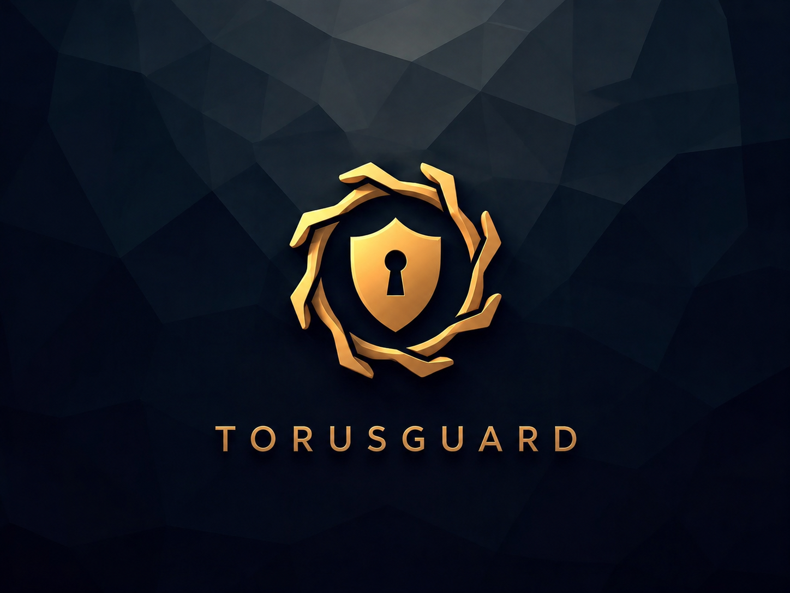

<p align="center">
  
</p>

<h1 align="center">TorusGuard</h1>

<p align="center">
  <strong>The Hybrid Governance Security Engine for AI-built web applications.</strong><br>
  <em>Pairs the intelligence of your AI Agent with a deterministic Go CLI to enforce strict security boundaries and patch limits.</em>
</p>

<p align="center">
  <a href="LICENSE"></a>
  <a href="https://github.com/githubmofo/TorusGuard/releases"></a>
  <a href="https://www.npmjs.com/package/torusguard"></a>
  
  
  
  
</p>

<p align="center">
  
  
  <a href="docs/validation/unseen-repos-tri-mode-validation-report.md"></a>
  
  
  
</p>

<p align="center">
  
  
  
  
  
  
</p>

---

## Table of Contents

- [What Is TorusGuard?](#what-is-torusguard)
- [Features](#-features)
- [Autonomous Architecture & Workflow](#-autonomous-architecture--workflow)
- [Prerequisites](#-prerequisites)
- [Installation](#-installation)
- [Usage](#-usage)
- [Commands](#-commands)
- [Project Structure](#-project-structure)
- [Security Invariants & Rule Governance](#-security-invariants--rule-governance)
- [AI Agent Integration](#-ai-agent-integration)
- [Verified Test Suite & Benchmarks](#-verified-test-suite--mass-benchmarks)
- [Non-Negotiable Invariants](#-non-negotiable-invariants)
- [Contributing](#-contributing)
- [License](#-license)
- [Documentation](#-documentation)

---

## What Is TorusGuard?

TorusGuard is a **zero-dependency, single-binary security engine** that scans, hardens, and validates AI-generated codebases. It enforces 88 security rules across 22 architectural families and works across three unified operational modes (**Tri-Mode Parity**):

- **Mode A: Terminal CLI (Go Binary)** — A deterministic scanner and enforcer that runs in your terminal or CI/CD pipeline (`torusguard <command>`).
- **Mode B: AI Chat Slash Commands** — Integrates natively with Antigravity, Cursor, Claude Code, Windsurf, VS Code, and other AI coding assistants via slash commands (`/torusguard <command>`).
- **Mode C: Native MCP Tools** — Stdio Model Context Protocol (JSON-RPC 2.0) interface exposing autonomous security tools and living resources directly to AI agents.

TorusGuard ensures that the code your AI assistant writes is secure *before* it reaches production.

---

## ✨ Features

- **88 Security Rules** across 22 families (Secrets, Auth, SQL Injection, Deserialization, Open Redirects, SSRF, CSRF, GraphQL, Supply Chain, Containers, Git History, ReDoS, AI & RAG, and more)
- **Taint Analysis & Interprocedural Dataflow Engine** — Cross-file, interprocedural taint flow tracking from untrusted sources to critical sinks across imports, modules, and call graphs
- **7-Signal Calibrated Confidence Scorer** — Evidence-chain calibration combining rule severity, taint confirmation, taint depth, sanitizer absence, framework context, multi-line evidence, and persistent memory
- **First-Principles Security Suite** — Built-in native scanners for Dockerfile/Compose privilege bounds, Git commit log secret mining, exponential regex backtracking, and cross-tenant vector isolation
- **Polyglot Parser & AST Walker** — Tree-sitter powered AST traversal with unified CST nodes and symbol resolution across Go, JavaScript, TypeScript, and Python
- **Incremental Hash Cache & Parallel Scanning** — SHA-256 mtime incremental scan caching, process-pool parallelization, and continuous file-watcher debounce
- **Line-Level Reflection Module** — Semantic patch synthesis (`find_snippet` / `replace_snippet`) that accurately replaces exact code blocks without brittle line-number offsets
- **1/9th Token Bounded Context Extraction** — AST context extraction (±3 lines) via `scanner.ExtractContext` to keep review prompts hyper-efficient and prevent context saturation
- **Ponytail Protocol** — Surgical patch bounds (≤35 additions, ≤25 deletions) to prevent full-file rewrites
- **Pre-Apply Snapshots** — Automatic `.bak` rollback snapshots before every code modification
- **SARIF v2.1.0 Export** — Standards-compliant output for GitHub Advanced Security, VS Code, and other SARIF consumers
- **Dark-Mode HTML Reports** — Single-file visual posture dashboards
- **Golden Fix Recipes** — Persistent memory of verified security patterns for reuse
- **SSRF Defense** — Built-in private IP blocking and AWS metadata protection in the web validator
- **Fail-Closed Cryptography** — No fallback tokens; panics on entropy failure
- **DoS Resilience** — 10,000-file scan limit and 5-minute context timeout to prevent resource exhaustion
- **16+ Language Stack Detection** — Go, Rust, Java, C#, PHP, Ruby, Kotlin, Elixir, Dart, Swift, Python, TypeScript, and more
- **Multi-Modal Vision OCR** — Scans architecture diagrams, mockups, and screenshots (`.png`, `.jpg`, `.webp`) via Tesseract OCR to detect leaked keys, tokens, and credentials
- **Native MCP Server (Model Context Protocol)** — Exposes standard JSON-RPC 2.0 stdio tools and resources for direct agent integration
- **Tri-Mode Parity** — Terminal CLI, AI Chat slash commands, and Native MCP Tools share identical governance workflows

---

## 🧪 Proven Compatibility

TorusGuard’s static scanner and enforcement binary have been rigorously tested and confirmed compatible across **20 major technology stacks and frameworks**:

| Ecosystem | Tested Frameworks & Runtimes |
|-----------|------------------------------|
| **JavaScript / TypeScript** | React, Next.js, Express, Vue, Angular, SvelteKit, NestJS |
| **Python** | Django, Flask, FastAPI, raw Python scripts |
| **Go** | Gin |
| **Java / C# (.NET)** | Spring Boot, ASP.NET Core, .NET Core Middleware |
| **Ruby** | Ruby on Rails, Sinatra |
| **PHP** | Laravel, Symfony |
| **Rust** | Actix Web |

---

## 🏗️ Autonomous Architecture & Workflow

TorusGuard uses a **tri-track architecture** where intelligence, deterministic enforcement, and agent tool execution are cleanly separated across three unified operational modes:


```mermaid
flowchart TD
    %% =========================================================================
    %% STAGE 1: TRI-MODE INGRESS GATEWAY
    %% =========================================================================
    subgraph IngressGateway["1. Unified Tri-Mode Ingress Gateway"]
        direction LR
        CLI["<b>Mode A: Terminal CLI</b><br/><code>torusguard &lt;cmd&gt;</code><br/>25 Deterministic Commands"]
        Chat["<b>Mode B: AI Chat Commands</b><br/><code>/torusguard &lt;cmd&gt;</code><br/>Cursor &bull; Claude &bull; Windsurf"]
        MCP["<b>Mode C: Native MCP Server</b><br/><code>torusguard_*</code> (13 Tools &bull; 2 Resources)<br/>Stdio JSON-RPC 2.0 Protocol"]
    end

    %% =========================================================================
    %% STAGE 2: CORE DISPATCHER & RUNTIME KERNEL
    %% =========================================================================
    Kernel["<b>TorusGuard Core Dispatcher &amp; Runtime Kernel</b><br/><code>cmd/torusguard</code> (Single Standalone Go Binary)<br/>Command Parsing &bull; Flag Evaluation (<code>--yes</code>, <code>--html</code>, <code>--rules</code>) &bull; Sandbox Isolation"]

    CLI -->|"Terminal Exec"| Kernel
    Chat -->|"Slash Bridge"| Kernel
    MCP -->|"Agent Tool Call"| Kernel

    %% =========================================================================
    %% STAGE 3: DETECTION & MULTI-MODAL SUITE
    %% =========================================================================
    subgraph DetectionSuite["2. Polyglot Static AST &amp; Multi-Modal Detection Suite"]
        direction TB
        subgraph StaticGroup["Static Code &amp; Dependency Analysis"]
            direction LR
            AST["<b>Polyglot AST &amp; Taint Engine</b><br/>Tree-sitter &bull; 88 Rules across 22 Families<br/>Go &bull; TS/JS &bull; Python &bull; Java &bull; C# &bull; Rust"]
            TGQL["<b>TG-QL Declarative AST DSL</b><br/>Custom YAML Pattern Queries<br/>Syntax Trees &bull; Taint Sinks &bull; Constraints"]
            Reach["<b>Reachability &amp; OpenVEX</b><br/>Callgraph Traversal &bull; Reachable CVEs<br/>Zero Ineffective Dependency Alerts"]
        end
        subgraph DeepGroup["Forensics, RegEx &amp; Vision OCR"]
            direction LR
            OCR["<b>Multi-Modal Vision OCR Engine</b><br/>Tesseract v5.4.0 &bull; Leaked Secrets<br/>Architecture Diagrams &bull; Screenshots"]
            ReDoS["<b>Thompson NFA ReDoS Engine</b><br/>Polynomial &amp; Exponential Exploder<br/>Catastrophic Backtracking Loops"]
            GitMine["<b>Git History &amp; Container Audit</b><br/>Commit Packfile Secret Mining<br/>Dockerfile Non-Root Enforcement"]
        end
    end

    Kernel -->|"Scan Code &amp; Dependencies"| StaticGroup
    Kernel -->|"Analyze Visuals &amp; Commits"| DeepGroup

    %% =========================================================================
    %% STAGE 4: CONSENSUS DELIBERATION & TRIAGE
    %% =========================================================================
    subgraph DeliberationTriage["3. Deliberation Tournament &amp; Evidence Triage"]
        direction TB
        Tournament["<b>3-Perspective Deliberation Tournament</b><br/>Vulnerability Hunter vs. Devil's Advocate / Sanitizer Verifier vs. Ponytail Remediator<br/>Eliminates False Positives &bull; Calibrated Confidence Scoring (0-100%)"]
        PRGate{"<b>Differential PR Diff Gate</b><br/><code>torusguard review</code><br/>Incremental Git Diff Changes?"}
        Tournament --> PRGate
    end

    StaticGroup -->|"Raw AST Findings"| Tournament
    DeepGroup -->|"Extracted Secrets &amp; Complexities"| Tournament

    %% =========================================================================
    %% STAGE 5: GOVERNED REMEDIATION & PONYTAIL LOOP
    %% =========================================================================
    subgraph GovernedRemediation["4. Governed Remediation Loop &amp; Safety Guardrails (Ponytail Protocol)"]
        direction TB
        
        Harden["<b>Surgical Patch Formulation</b><br/>Semantic Line Snippet Replacement<br/>Strict Line Budget: &le;35 Additions &bull; &le;25 Deletions"]
        
        BoundsCheck{"<b>Ponytail Bounds Check</b><br/>Exceeds 35 Add / 25 Del?"}
        RejectDiff["<b>Diff Rejected</b><br/>Excess Churn Detected<br/>Prompt AI for Minimal Snippet"]
        
        SnapshotStore[("<b>Pre-Apply Snapshot Store</b><br/><code>.torusguard/snapshots/&lt;run_id&gt;/</code><br/>Byte-for-Byte Rollback Backup")]
        
        HumanGate{"<b>Human Gate Authorization</b><br/>Explicit <code>--yes</code> or Interactive Confirmation"}
        UserAbort["<b>Operation Aborted</b><br/>Zero Files Touched &bull; Safe Exit"]
        
        ApplyPatch["<b>Atomic Patch Application</b><br/>Apply Unified Surgical Diff to Disk"]
        
        RecheckGate{"<b>Differential Recheck Engine</b><br/><code>torusguard recheck</code><br/>Fix Closed with Zero Regressions?"}
        RollbackExec["<b>Auto-Rollback Triggered!</b><br/>Instant Restoration from Snapshot<br/>Quarantine Candidate Patch"]
        
        Harden --> BoundsCheck
        BoundsCheck -->|"Violation"| RejectDiff
        RejectDiff -.->|"Re-prompt AI"| Harden
        BoundsCheck -->|"Pass (Within Bounds)"| SnapshotStore
        SnapshotStore --> HumanGate
        HumanGate -->|"Denied"| UserAbort
        HumanGate -->|"Approved"| ApplyPatch
        ApplyPatch --> RecheckGate
        RecheckGate -->|"Regressions"| RollbackExec
        RollbackExec -.->|"Restore Clean State"| SnapshotStore
    end

    PRGate -->|"Target Findings"| Harden

    %% =========================================================================
    %% STAGE 6: LIVING SECURITY LEDGER & ENTERPRISE OUTPUTS
    %% =========================================================================
    subgraph EnterpriseDeliverables["5. Living Security Ledger &amp; Enterprise Deliverables"]
        direction TB
        Ledger[("<b>Living Security Ledger</b><br/><code>security_report.md</code><br/>Synchronized Single Source of Truth &bull; Status: RESOLVED 🟢")]
        
        subgraph DeliverableOutputs["Executive Reports &amp; Verified Memory"]
            direction LR
            ThreatModel["<b>STRIDE Threat Model</b><br/><code>SECURITY_THREAT_MODEL.md</code><br/>DFD Architecture Diagrams"]
            SARIF["<b>OASIS SARIF v2.1.0</b><br/>GitHub Advanced Security<br/>CI/CD Security Center"]
            HTMLReport["<b>Executive Dashboard</b><br/>Single-File HTML Report<br/>Interactive Posture Heatmap"]
            GoldenRecipes[("<b>Golden Fix Memory</b><br/><code>.torusguard/recipes/</code><br/>Verified Distilled Fixes")]
        end

        Ledger --> DeliverableOutputs
    end

    RecheckGate -->|"Fix Confirmed (Clean Closure)"| Ledger

    %% =========================================================================
    %% STYLING AND THEME (Modern Dark Cyber Palette)
    %% =========================================================================
    classDef ingressStyle fill:#0f172a,stroke:#38bdf8,stroke-width:2px,color:#f8fafc;
    classDef routerStyle fill:#1e1b4b,stroke:#6366f1,stroke-width:2px,color:#f8fafc;
    classDef scannerStyle fill:#022c22,stroke:#10b981,stroke-width:2px,color:#f8fafc;
    classDef tourneyStyle fill:#2e1065,stroke:#a855f7,stroke-width:2px,color:#f8fafc;
    classDef gateStyle fill:#451a03,stroke:#f59e0b,stroke-width:2px,color:#fef3c7;
    classDef rejectStyle fill:#450a0a,stroke:#ef4444,stroke-width:2px,color:#fee2e2;
    classDef actionStyle fill:#064e3b,stroke:#34d399,stroke-width:2px,color:#f8fafc;
    classDef dbStyle fill:#1e293b,stroke:#94a3b8,stroke-width:2px,color:#f8fafc;
    classDef ledgerStyle fill:#172554,stroke:#3b82f6,stroke-width:2px,color:#eff6ff;
    classDef outputStyle fill:#042f2e,stroke:#14b8a6,stroke-width:2px,color:#f0fdfa;

    class CLI,Chat,MCP ingressStyle;
    class Kernel routerStyle;
    class AST,TGQL,Reach,OCR,ReDoS,GitMine scannerStyle;
    class Tournament tourneyStyle;
    class PRGate,BoundsCheck,HumanGate,RecheckGate gateStyle;
    class RejectDiff,UserAbort,RollbackExec rejectStyle;
    class Harden,ApplyPatch actionStyle;
    class SnapshotStore,GoldenRecipes dbStyle;
    class Ledger ledgerStyle;
    class ThreatModel,SARIF,HTMLReport outputStyle;
```

> 🌐 **Interactive Architecture Visualizations:**
> - [**System Architecture Diagram** (HTML)](docs/architecture/torusguard-architecture.html) — Dynamic zoomable/pannable pipeline with dark/light themes, live view switching (Tri-Mode Ingress, AST Engine, Multi-Modal Vision OCR, Ponytail Bounds, Fail-Closed Recovery), and SVG/PNG export.
> - [**Governed Remediation Workflow** (HTML)](docs/architecture/torusguard-governance.workflow.html) — Step-by-step visual trace of the 7-stage remediation loop, safety gates, and automatic rollback path.

**Key design decisions:**
- **Tri-Mode Parity:** The CLI (Mode A), Chat Slash Commands (Mode B), and Native MCP Tools (Mode C) share the exact same underlying governance and validation rules.
- **Multi-Modal Vision OCR:** Images, architecture diagrams, and screenshots are automatically scanned for leaked secrets using Tesseract OCR, bounded by strict 10MB memory safety limits.
- **Deterministic Enforcement:** The **Go binary** handles all deterministic operations (AST scanning, bounds checking, snapshotting, reporting).
- **AI Intelligence:** The **AI agent** handles intelligence-requiring tasks (patch generation, root-cause analysis, remediation formulation).
- **Living Ground Truth:** All modes synchronize with `security_report.md` to prevent finding drift or hallucination.
- **Zero-Bypass Guardrails:** Neither human nor AI can bypass Ponytail Protocol bounds (≤35 additions, ≤25 deletions) or the Human Gate before modifying code.


---

## 📋 Prerequisites

- **Go 1.25+** (to build from source)
- **Git** (for `git apply` patch operations)
- **Node.js 18+** (for npm package installation)

---

## 🚀 Installation & How to Use (3 Options)

TorusGuard can be run without installation via `npx`, installed globally or locally via `npm`, compiled from source with `go build`, or installed via `go install`.

| Option | Method | Best For | Dedicated Guide |
| :--- | :--- | :--- | :--- |
| **Option 1** | **npm & npx** | Node.js developers, zero-install CLI, CI/CD | 📖 [Option 1 Guide](docs/usage/option-1-npm.md) |
| **Option 2** | **Build from Source** | Contributors, custom rules, Go development | 📖 [Option 2 Guide](docs/usage/option-2-source.md) |
| **Option 3** | **Go Install** | Go projects, single-binary, zero Node.js/npm | 📖 [Option 3 Guide](docs/usage/option-3-go-install.md) |

---

### Option 1: npm (Primary)

#### Method A: Direct NPX Zero-Install (Recommended)
Run directly without installing any packages globally or locally:

```bash
npx torusguard init
```

*Tip: Use `npx torusguard@latest init` to guarantee the freshest release.*

#### Method B: Global Installation
```bash
npm install -g torusguard
torusguard init
```

#### Method C: Local Project Installation
```bash
npm install -D torusguard
```

> 💡 **Using TorusGuard after `npm install torusguard`:**  
> TorusGuard is a CLI security engine, not an importable JavaScript library. When installed locally, the binary resides in `node_modules/.bin/torusguard`.  
> You can run it via:  
> - `npx torusguard init` *(npx automatically uses your local `node_modules` binary)*  
> - Adding `"security:audit": "torusguard audit"` to your `package.json` scripts (`npm run security:audit`)  
> - Direct path: `./node_modules/.bin/torusguard audit`  

<a href="https://www.npmjs.com/package/torusguard">
  
</a>

👉 **[Read the Full Option 1 (npm & npx) Dedicated Guide →](docs/usage/option-1-npm.md)**

---

### Option 2: Build from Source (Recommended for Contributors)

```bash
git clone https://github.com/githubmofo/TorusGuard.git
cd TorusGuard
go build -o torusguard ./cmd/torusguard
```

On Windows:
```powershell
go build -o torusguard.exe ./cmd/torusguard
```

Run directly:
```bash
./torusguard init
./torusguard audit
```

👉 **[Read the Full Option 2 (Build from Source) Dedicated Guide →](docs/usage/option-2-source.md)**

---

### Option 3: Go Install

Install directly into `$GOPATH/bin`:

```bash
go install github.com/githubmofo/TorusGuard/cmd/torusguard@latest
```

Verify and run:
```bash
torusguard --version
torusguard init
```

👉 **[Read the Full Option 3 (Go Install) Dedicated Guide →](docs/usage/option-3-go-install.md)**

---

## 💻 Usage

### Quick Start

```bash
# Initialize TorusGuard in your project
torusguard init

# Run a full security audit
torusguard audit

# Check workspace posture
torusguard status

# Generate an HTML report
torusguard report --html

# Generate a SARIF report
torusguard report --sarif
```

### Remediation Workflow

```bash
# Validate a candidate patch against Ponytail bounds
torusguard harden fix.patch

# Apply the patch with rollback snapshot (requires --yes for Human Gate)
torusguard apply --yes fix.patch

# Verify the fix was applied correctly
torusguard recheck

# Roll back if something went wrong
torusguard rollback
```

### Runtime Validation

```bash
# Generate authorization token for runtime probing
torusguard authorize

# Probe a running application for security headers
torusguard web-validate

# Send bounded inert payloads to test input handling
torusguard exploit-check
```

---

## 🔧 Commands

| Command          | Description                                                    |
| :--------------- | :------------------------------------------------------------- |
| `init`           | Scaffold `.torusguard/` workspace, detect stack, activate rules |
| `status`         | Diagnostic overview of posture, stack, and active rules         |
| `audit`          | Static heuristic security scan against active TG-* rules       |
| `review`         | Differential PR and Git diff incremental security review       |
| `threatmodel`    | Synthesize architectural STRIDE threat model & Mermaid DFDs     |
| `benchmark`      | Run SecurityReviewBench precision & recall evaluation suite    |
| `verify`         | Live disk line match audit and evidence sufficiency check       |
| `harden`         | Validate patches against Ponytail Protocol bounds              |
| `apply`          | Apply patches with pre-apply `.bak` rollback snapshots         |
| `rollback`       | Instant restoration from pre-apply snapshots                   |
| `recheck`        | Differential re-scan on modified files                         |
| `report`         | Generate HTML (`--html`) or SARIF (`--sarif`) posture reports  |
| `recipes`        | Manage the Golden Fix recipe library                           |
| `authorize`      | Generate cryptographic auth tokens for runtime probing         |
| `web-validate`   | Authorized HTTP probing with `X-TorusGuard-Audit` headers      |
| `exploit-check`  | Bounded single-step exploitability confirmation                |
| `ocr-scan`       | Run Tesseract OCR secret scan on images/diagrams (<10MB)       |
| `container`      | Audit Dockerfile, compose, and container configurations        |
| `git-mine`       | Mine git commit history for leaked secrets & creds             |
| `redos`          | Analyze regex patterns for catastrophic backtracking           |
| `ai-guard`       | Scan AI/LLM code for prompt injection & RAG flaws              |
| `mcp`            | Run native Model Context Protocol (MCP) server over stdio      |
| `full`           | Master 7-stage closed-loop security governance pipeline        |
| `update`         | Self-update the TorusGuard engine                              |
| `help`           | Show interactive command guide                                 |

---

## 📁 Project Structure

```
TorusGuard/
├── cmd/torusguard/       # CLI entry point, command router & MCP server
│   ├── main.go           # CLI command router
│   └── mcp.go            # Model Context Protocol (MCP) JSON-RPC 2.0 stdio server
├── internal/
│   ├── apply/            # Patch application + pre-apply snapshot engine
│   ├── harden/           # Ponytail Protocol bounds enforcement & line-level reflection
│   │   ├── patch.go      # Ponytail Protocol bounds verification
│   │   └── reflection.go # Line-level reflection & semantic replacement
│   ├── memory/           # Golden Fix recipe persistence
│   ├── recheck/          # Differential re-scan engine
│   ├── report/           # SARIF v2.1.0 + dark-mode HTML generators
│   ├── rules/            # TG-* rule catalog loader
│   ├── scanner/          # Heuristic polyglot security scanner + Tesseract OCR
│   │   ├── scanner.go    # Polyglot code AST & heuristic scanner
│   │   └── ocr.go        # Multi-modal Vision OCR secret detection
│   ├── termui/           # 75-column terminal UI formatting
│   ├── validate/         # authorize / web-validate / exploit-check / verify
│   └── workspace/        # init + polyglot stack detection
├── .torusguard/          # Generated workspace state
│   ├── rules/            # Active security rule definitions
│   ├── schemas/          # JSON schemas for findings, recipes, etc.
│   ├── memory/           # Persistent security context
│   └── snapshots/        # Pre-apply rollback backups
├── docs/                 # Architecture and usage documentation
├── bin/                  # npm package CLI wrapper
├── go.mod                # Go module (github.com/torusguard/torusguard)
└── package.json          # npm package definition
```

---

## 🔒 Security Invariants & Rule Governance

TorusGuard enforces **88 security invariants across 22 architectural families** covering Secrets, Authentication, Multi-Tenant Database Isolation, Input Sanitization, Rate Limiting, AI Agent Prompt Injection, SSRF, Webhooks, WebSockets, CSRF, GraphQL, Supply Chain, Business Logic, Cache Poisoning, Client Bundles, Platform Headers, Polyglot Bypasses, Edge Timeouts, Container & Docker Safety, Git History Secret Mining, Regular Expression Backtracking (ReDoS), and Vector Database RAG Isolation.

> 📘 **Full Rules Catalog & Invariants:**  
> The complete rulebook with formal invariant definitions, severity scores, and testing signatures is maintained in [`AGENTS.md`](AGENTS.md) and the [`rules/`](rules/) directory.  
> You can also explore verified Golden Fix patterns anytime via `torusguard recipes` or stream the live catalog over MCP via `torusguard://rules_catalog`.

---

## 🤖 AI Agent Integration

TorusGuard works natively inside AI coding assistants. Add the configuration file to your project root and your AI agent automatically enforces TorusGuard security invariants.

### Supported Agents

| Agent                | Configuration File    | Status |
| :------------------- | :-------------------- | :----- |
| Antigravity (Gemini) | `AGENTS.md`           | ✅ Full support |
| Claude Code          | `CLAUDE.md`           | ✅ Full support |
| Cursor               | `.cursorrules`        | ✅ Full support |
| Windsurf             | `.windsurfrules`      | ✅ Full support |
| VS Code Copilot      | `AGENTS.md`           | ✅ Full support |
| Kimi                 | `SKILL.md`            | ✅ Full support |

### Slash Commands (AI Chat Mode)

```
/torusguard init          # Initialize workspace
/torusguard audit         # Run security + OCR scan; sync security_report.md
/torusguard ocr-scan      # Scan diagram or image assets for leaked credentials
/torusguard harden        # Formulate remediation patches
/torusguard apply         # Apply patches with Human Gate
/torusguard recheck       # Verify fix closure
/torusguard report        # Generate posture report
/torusguard status        # Check posture overview
/torusguard full          # End-to-end 7-stage pipeline
```

### Native MCP Tools (Agent Toolkit Mode)

When configured with `.agents/mcp_config.json` or `mcp_config.json`, AI coding agents gain native tool calling (13 Tools & 2 Resources):

- `torusguard_audit`: Deep static AST scan + Vision OCR; writes `security_report.md`
- `torusguard_ocr_scan`: Dedicated image credential analysis via Tesseract (5-10MB bounds)
- `torusguard_container`: Audits container files for root execution, docker socket exposure, and privileged mode
- `torusguard_git_mine`: Mines git commit history and config for leaked credentials and tokens
- `torusguard_redos`: Analyzes regex patterns for catastrophic exponential backtracking
- `torusguard_ai_guard`: Audits AI agent prompt templates, tool registries, and vector database queries
- `torusguard_verify`: Asserts evidence sufficiency & line-shift invariant fingerprint matches
- `torusguard_harden`: Validates remediation diff against Ponytail Protocol bounds
- `torusguard_recheck`: Differential re-scan confirming fix closure
- `torusguard_review`: Differential PR and Git diff incremental review; gate decisions
- `torusguard_threatmodel`: Synthesizes STRIDE threat model & Mermaid DFDs (`SECURITY_THREAT_MODEL.md`)
- `torusguard_benchmark`: Runs SecurityReviewBench self-evaluating precision & recall suite
- `torusguard_status`: Workspace posture and tech stack inspection
- `torusguard://security_report`: MCP Resource reading the living security report
- `torusguard://rules_catalog`: MCP Resource exploring verified rules catalog & Golden Fix patterns

---

## 🧪 Verified Test Suite & Mass Benchmarks

TorusGuard undergoes rigorous automated multi-tier testing across polyglot stacks, multi-modal vision assets, and agent communication protocols:

| Testing Tier | Scope & Target Stacks | Pass Rate | Verified Capabilities |
| :--- | :--- | :---: | :--- |
| **Go Engine & Unit Tests** | `cmd/torusguard`, `internal/scanner`, `internal/*` | **100% Passing** | Deterministic AST matching, 88 canonical rule patterns, JSON-RPC 2.0 MCP protocol (133/133 harness tests passing). |
| **Mass Polyglot Benchmarks** | **20 Enterprise Tech Stacks** (Go, Python, Java, Node, Rust, PHP, C#, Ruby, Svelte, Vue, Angular) | **20/20 Passed** | Framework auto-profiling, heuristic AST analysis, finding deduplication. |
| **Unseen Tri-Mode Validation** | **6 Unseen Framework Ecosystems** (SvelteKit 2 + Bun, FastAPI AI RAG, DevOps Git Mine, OCR Asset Suite, Kotlin Ktor, Laravel 11) | **6/6 Passed (100%)** | Mode A (CLI) + Mode B (Slash Commands) + Mode C (Native MCP Tools) across 18/18 canonical skills with automated sandbox cleanup. |
| **Tri-Mode & Vision E2E** | **16 Diverse Framework Repos** (React, Next.js, Express, Django, FastAPI, Spring Boot, etc.) | **16/16 Passed** | Mode A (CLI) + Mode B (Slash Commands) + Mode C (Native MCP Tools) + Multi-Modal Vision OCR. |
| **Multi-Modal Vision OCR** | Diagram & Image assets (`.png`, `.jpg`, `.webp`) via Tesseract v5.4.0 | **100% Recall** | Secrets detection (`TG-SEC-001` - `TG-SEC-007`), 10MB DoS bounding, OCR character substitution tolerance. |
| **Ponytail Churn Limits** | Surgical patch validation across all 88 rules | **Bounded** | Line bounds (≤35 additions, ≤25 deletions), zero-bypass verification (`TG-DIFF-001`). |

All test environments are completely sandboxed, verified with byte-for-byte assertions, and cleaned up automatically.

---

## 🛡️ Non-Negotiable Invariants

1. **Browser-Code Truth:** Never expose secrets in frontend bundles.
2. **Multi-Tenant Isolation:** Always scope DB lookups by tenant/user ownership.
3. **Ponytail Churn Bounds:** Patches ≤35 additions, ≤25 deletions. No full-file rewrites.
4. **Zero Security Bypasses:** Never insert `# nosec`, `verify=False`, `InsecureSkipVerify: true`.
5. **Snapshots Before Edits:** Mandatory `.bak` backup before every modification.
6. **Fail-Closed Cryptography:** Panic on entropy failure. No fallback tokens.
7. **SSRF Boundary Enforcement:** Block private IPs and cloud metadata before probing.
8. **DoS Resilience:** 10,000-file max, 5-minute timeout.

---

## 🤝 Contributing

1. Fork the repository
2. Create a feature branch: `git checkout -b feat/your-feature`
3. Commit changes: `git commit -m "feat: add your feature"`
4. Push to branch: `git push origin feat/your-feature`
5. Open a Pull Request

See [CONTRIBUTING.md](CONTRIBUTING.md) for detailed guidelines and [CODE_OF_CONDUCT.md](CODE_OF_CONDUCT.md) for community standards.

---

## 📄 License

[MIT](LICENSE) © 2026 Jenish Lad

---

## 📚 Documentation

| Document                                                  | Description                              |
| :-------------------------------------------------------- | :--------------------------------------- |
| [Architecture](docs/architecture/ARCHITECTURE.md)         | System design and module relationships   |
| [Security Architecture](docs/architecture/SECURITY_ARCHITECTURE.md) | Threat model and security design |
| [Detection Engine](docs/architecture/DETECTION_ENGINE.md) | Scanner internals and rule matching      |
| [API Specification](docs/architecture/API_SPECIFICATION.md) | CLI argument specification             |
| [Security Philosophy](docs/overview/security-philosophy.md) | Core design principles               |
| [Testing Playbook](docs/usage/testing-playbook.md)        | Testing guide and CI integration         |
| [Demo Guide](docs/demo.md)                                | Quick start and full lifecycle demo      |
| [Roadmap](docs/roadmap.md)                                | Feature roadmap and release planning     |
| [Unseen Stacks Validation Report](docs/validation/unseen-repos-tri-mode-validation-report.md) | Tri-mode validation across 6 unseen ecosystems & vision OCR |
| [SECURITY.md](SECURITY.md)                                | Vulnerability disclosure policy          |
| [CHANGELOG.md](CHANGELOG.md)                              | Version history and release notes        |
