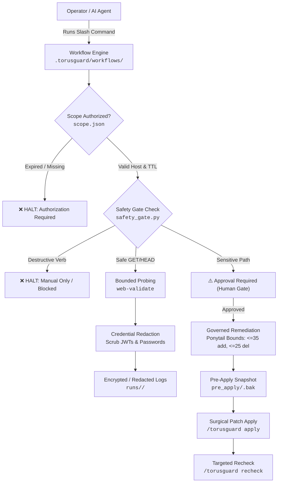

# Security Policy

## Reporting Security Vulnerabilities

The TorusGuard project takes security and safety seriously. If you believe you have discovered a vulnerability or security flaw in **TorusGuard itself** (such as unsafe skill instructions, template flaws, bootstrapper vulnerabilities, or repository infrastructure), please report it responsibly and privately.

**Do not file public GitHub issues, discussions, or pull requests for undisclosed security vulnerabilities.**

---

## What Belongs in a Security Report?

| Belongs in Private Security Disclosure | Belongs in Public GitHub Issues |
|---|---|
| 🔒 Flaws in TorusGuard skill instructions that cause unsafe code generation | 💡 Requesting a new security rule (`TG-...`) |
| 🔒 Insecure defaults in `templates/` or framework references | 🐛 Reporting a false positive or minor rule detection bug |
| 🔒 Credential leaks or malicious dependencies in the TorusGuard repository | ❓ General usage questions, installation help, or feature ideas |
| 🔒 Logic flaws in `safety_gate.py` that allow unauthorized network probes | ⚡ Proposing performance optimizations for AST scanners |

> **Note on Third-Party Applications & Educational Fixtures:**  
> - **External Codebases:** TorusGuard is an open-source guidance framework and automated skill kit. If you find a security vulnerability in an application audited with TorusGuard, please report it directly to the maintainers of that application following their private disclosure policy.  
> - **Educational Fixtures:** Files located in `examples/vulnerable-*/`, `examples/python/*-vuln/`, and `tests/fixtures/*/` are **intentionally vulnerable educational fixtures**. They are deliberately insecure by design for validation purposes and must never be deployed to production.

---

## How to Submit a Private Report

1. **Preferred Method:** Use [GitHub Private Vulnerability Reporting](https://github.com/githubmofo/TorusGuard/security/advisories/new).
2. **Alternative Method:** Contact the project maintainer directly via GitHub ([@githubmofo](https://github.com/githubmofo) / Jenish Lad).

### What to Include in Your Report
Please provide:
- A clear, concise description of the security issue.
- Affected files, workflows, skills, templates, or rule identifiers.
- Step-by-step reproduction instructions or code snippets.
- Assessment of potential security impact and blast radius.
- Any suggested remediations or mitigations.

---

## Response Commitments & Triage Targets

* **Initial Acknowledgment / Triage:** Within **24 to 48 hours**.
* **Status Update & Remediation Plan:** Within **5 days** of initial triage.
* **Coordinated Disclosure:** We adhere to standard coordinated disclosure principles. Once a fix is verified and released, a public security advisory will be published crediting the researcher (unless anonymity is requested).

---

## Supported Versions

Security updates and patches are actively maintained for the following release lines:

| Version Line | Supported? | Status |
|---|:---:|---|
| `v0.9.x` (`v0.9.2`) | ✅ Yes | **Current active release line** (Command-Engine Standard, Workspace Autonomy & Parity) |
| `v0.8.x` | ✅ Yes | Installable AI-Agent Security Skill Kit |
| `v0.7.x` | ✅ Yes | Authorized Runtime Validation & Bounded Exploitability Confirmation |
| `v0.6.x` | ⚠️ Best effort | Governed Remediation, Minimal Patching & Targeted Recheck System |
| `< v0.6.0` | ❌ No | Deprecated |

---

## Security Architecture & Enforcement Controls

### 1. Legal Scope & Authorization Gate (`.torusguard/config/scope.json`)
Before any live network traffic is generated, TorusGuard requires an explicit authorization record specifying:
- Whitelisted `target_host` (localhost, private IP, or confirmed staging domain).
- Permitted `allowed_prefixes` and strictly blocked `forbidden_paths`.
- Mandatory Time-To-Live (TTL) expiration (maximum 24 hours).
- Enforced by `.torusguard/scripts/safety_gate.py`.

### 2. Tiered Safety Review Gate (`safety_gate.py`)
Every runtime probe is evaluated through a strict 3-tier risk classification:
- **Auto-Allowed**: Non-sensitive read-only `GET`, `HEAD`, `OPTIONS` requests within authorized scope.
- **Approval Required**: Sensitive authentication endpoints (`/auth/login`, `/settings`) or state-changing `POST` verbs. Requires explicit human confirmation.
- **Manual Only / Blocked**: Destructive operations (`DELETE`, `DROP`), payment endpoints, or forbidden paths. Strictly blocked from automated execution.

### 3. Automated Credential Redaction (`.torusguard/scripts/run_manager.py`)
All captured network payloads, headers, and logs are automatically scrubbed prior to writing to disk:
- Bearer tokens masked: `Bearer [REDACTED_JWT_sha256:abcd...]`
- Cookies masked: `session_id=[REDACTED_COOKIE]`
- Passwords and secret keys masked: `[REDACTED_SECRET]`

### 4. Governed Remediation & The Ponytail Protocol
To prevent AI coding assistants from introducing subtle bugs, breaking architectures, or rewriting entire modules, TorusGuard enforces hard patch bounds:
- **Max Additions**: $\le 35$ lines per bundle.
- **Max Deletions**: $\le 25$ lines per bundle.
- **Zero Full-File Rewrites**: Only the exact vulnerable function is patched.
- **Rollback Guarantee**: A byte-for-byte backup is archived in `pre_apply/<file>.bak` before any code edit is written to disk.

---

## Continuous Validation & Release Gate Policy

To guarantee that code changes never compromise security, safety, or backward compatibility, TorusGuard mandates a **100% pass rate across 9 automated test suites (381 test assertions)** prior to any release tag:

1. **Workflows & Skills Suite (`harness/validate_v0_9_2_workflows_and_skills.py`):**
   - Asserts 100% YAML frontmatter compliance and required sections across all 11 workflows and 13 skills.
   - Verifies 1:1 cross-bindings and context line budgets ($\le 300$ lines).
2. **Cryptographic Manifest Verifier (`.torusguard/scripts/manifest_builder.py --check`):**
   - Cryptographically verifies all 88 workspace files against SHA-256 integrity signatures.
3. **Autonomous Installer Suite (`harness/validate_v0_9_1_installer.py`):**
   - Simulates clean-room installation via `npx skills add` and standalone `install.py`.
4. **Granular Skills Suite (`harness/validate_v0_9_0_skills.py`):**
   - Validates specialist skill frontmatter, routing table integrity, and script bindings.
5. **Runtime Validation & Safety Suite (`harness/validate_v0_7_0_runtime.py`):**
   - Asserts legal scope gating, TTL expiration, safety gate tiers, token redaction, and role handoffs.
6. **Core Validation Harness (`harness/runner.py`):**
   - Verifies 10 JSON schemas, 64 rule definitions, 5-factor confidence scoring, and 3-pass deterministic replay.
7. **Workspace Foundation Suites (`harness/validate_v0_8_0_part1.py`, `part2.py`, `part3.py`):**
   - Asserts template structures, reference guides, and script execution sanity.

### Blocking Release Criteria
A proposed release is **strictly blocked** if any of the following occur:
- ❌ Any failure in legal scope enforcement or out-of-scope host blocking.
- ❌ Any regression in patch governance bounds or bypass of sensitive-path review escalation.
- ❌ Any failure in secret redaction leading to unmasked Bearer tokens or credentials in logs.
- ❌ Any non-deterministic variation in replay trace reproduction.
- ❌ Any checksum discrepancy in `.manifest.json`.

---

## Maintainer Security Checklist

All repository maintainers must comply with the operational security standards detailed in [`MAINTAINERS.md`](MAINTAINERS.md):
- **Accounts:** Hardware 2FA/MFA enforced (FIDO2/WebAuthn); zero shared maintainer credentials.
- **Branches:** Strict branch protection on `main`; PR review required on core engine, rule catalogs, and safety gates.
- **Dependencies:** Reproducible lockfiles required; continuous scanning for dependency CVEs via `pip-audit`.
- **Secrets:** CI secret scanning enabled; zero credentials permitted in commit history.
- **Integrity:** SHA-256 manifest regenerated and verified before any release.
- **Signing:** All release git tags and release assets must be cryptographically signed with maintainer GPG keys.
