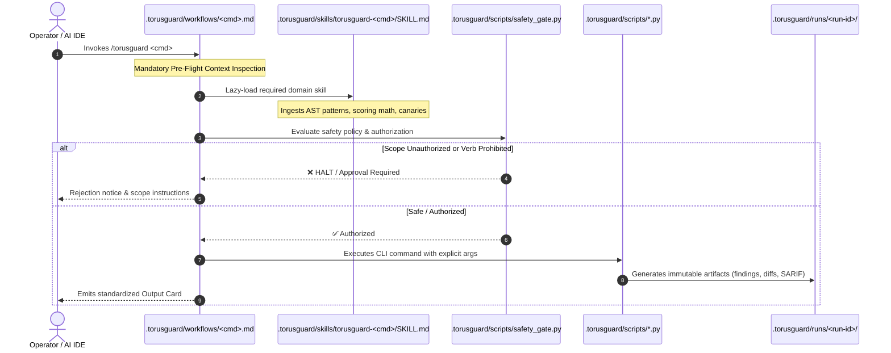

# TorusGuard v0.9.2 Command-Engine Architecture

**Version:** 0.9.2  
**Date:** September 2, 2026  
**Status:** Official Architectural Specification  

---

## 1. Executive Architecture Summary

TorusGuard v0.9.2 decouples interactive user intentions (Slash Commands & Workflows) from specialized domain knowledge (Specialist Skills). This architecture guarantees:
1. **Interactive Determinism:** Operators and AI agents execute standardized, phase-by-phase playbooks with explicit failure recovery rules.
2. **Context Window Efficiency:** Rather than loading a monolithic 2,000-line security manual, each command lazy-loads a compact ($\le 125$ lines) specialist skill.
3. **Zero-Hallucination Boundaries:** Explicit pre-flight checks, strict hallucination guards, and the Ponytail Protocol ($\le 35$ additions, $\le 25$ deletions) prevent runaway AI code generation.

---

## 2. Dual-Layer Execution Flowchart



---

## 3. Two-Way Binding Matrix

Every workflow in `.torusguard/workflows/` binds bidirectionally to its specialist skill in `skills/` and `.torusguard/skills/`:

| Slash Command | Interactive Workflow (`.torusguard/workflows/`) | Specialist Skill (`skills/`) | Specialist Agent | Lifecycle Phase |
| :--- | :--- | :--- | :---: | :--- |
| `/torusguard init` | `init.md` | `torusguard-init` | `profiler` | Phase 0 (Baseline Discovery) |
| `/torusguard authorize` | `authorize.md` | `torusguard-authorize` | `reviewer` | Phase 1 (Scope & Safety Gate) |
| `/torusguard audit` | `audit.md` | `torusguard-audit` | `auditor` | Phase 2 (Static AST Audit) |
| `/torusguard verify` | `verify.md` | `torusguard-verify` | `validator` | Phase 3a (Evidence Sufficiency) |
| `/torusguard web-validate` | `web-validate.md` | `torusguard-web-validate`| `validator` | Phase 3b (Authorized HTTP Probing) |
| `/torusguard exploit-check`| `exploit-check.md` | `torusguard-exploit-check`| `validator` | Phase 3c (Canary Exploit Check) |
| `/torusguard harden` | `harden.md` | `torusguard-harden` | `remediator` | Phase 4 (Remediation Bundles) |
| `/torusguard apply` | `apply.md` | `torusguard-apply` | `remediator` | Phase 5 (Governed Patch Apply) |
| `/torusguard recheck` | `recheck.md` | `torusguard-recheck` | `reviewer` | Phase 6 (Targeted Recheck) |
| `/torusguard report` | `report.md` | `torusguard-report` | `reviewer` | Phase 7 (Reporting & SARIF) |
| `/torusguard status` | `status.md` | `torusguard-status` | `reviewer` | System Diagnostics |
| `/torusguard full` | `audit.md` | `torusguard-full` | *All Roles* | End-to-End Orchestrator |

---

## 4. Context Budget Model

To preserve context window capacity for the target application's codebase, TorusGuard maintains strict token budgets:

```
Total Context Overhead per Command:
┌──────────────────────────────────────────────┐
│ Interactive Workflow (.md):   ~600 tokens    │
│ Specialist Skill (.md):       ~500 tokens    │
│ Bound Script Output (JSON):   ~400 tokens    │
├──────────────────────────────────────────────┤
│ TOTAL SYSTEM LOAD:           ~1,500 tokens   │
│ (Leaves 98.5%+ of 128k context for repo code)│
└──────────────────────────────────────────────┘
```

---

## 5. Automated Verification & Parity Assertions

The Command-Engine architecture is enforced by:
- `harness/validate_v0_9_2_workflows_and_skills.py`: Verifies frontmatter validity, line counts, required sections, script targets, and two-way cross-bindings.
- `.torusguard/scripts/manifest_builder.py --check`: Cryptographically validates that all 88 workspace files match SHA-256 integrity signatures.
